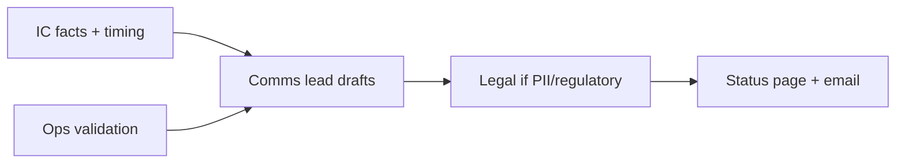

# Incident Communications

Technical mitigation without **credible external communication** erodes trust. Status pages, customer emails, and exec briefings need templates, owners, and cadence — parallel to IC(Incident Commander) technical work — [§6](06-incident-command.md).

> **Scope:** Status page policy, customer and executive templates, RACI(Responsible, Accountable, Consulted, Informed) for external comms. Command roles and severity → [§6](06-incident-command.md). Journey-based severity → [§1A](01A-critical-journeys-and-sev-catalog.md). DR(Disaster Recovery) customer messaging → [§12](12-disaster-recovery.md) · [§12A](12A-disaster-recovery-playbook.md).
>
> **Related:** Postmortem customer follow-up → [§7](07-postmortems.md) · Hypercare CX(Customer Experience) signals → [§10A](10A-hypercare-checklist.md) · Portal status link → [api-design §7A](../../api-design-and-protection/includes/07A-developer-portal.md)

---

## At a glance

| Channel | Audience | Update cadence (SEV1) |
|---------|----------|------------------------|
| **Status page** | Customers, partners | Every 15–30 min until stable |
| **Support macros / email** | Affected accounts | Initial within 30 min; follow major changes |
| **Exec brief** | Leadership | Initial ASAP; then hourly summary |
| **Internal Slack** | Company | Continuous; IC-owned summary |

**Rule of thumb:** **Comms lead** owns external words; **IC** owns facts and timing. Comms does not invent root cause.

---

## RACI for external comms

| Activity | R | A | C | I |
|----------|---|---|---|---|
| Declare customer-visible incident | IC | IC | Comms, Legal | Exec |
| Status page first post | Comms | IC | Ops, Support | Exec |
| Status page updates | Comms | IC | Ops | Support, Exec |
| Enterprise account calls | Support/AM | IC | Comms | Exec |
| Exec email / board note | Comms | Exec sponsor | IC, Legal | IC team |
| All-clear / resolved | Comms | IC | Ops | All |

**Comms lead** = trained role (often support lead or PMM); not “whoever is free.” Backup named in [§6](06-incident-command.md) roster.



---

## Status page

| Element | Guidance |
|---------|----------|
| **Components** | Match customer mental model (Login, API(Application Programming Interface), Webhooks) — [§1A](01A-critical-journeys-and-sev-catalog.md) |
| **States** | Investigating → Identified → Monitoring → Resolved |
| **Impact** | None / Minor / Major / Critical — align to SEV |
| **Subscribe** | RSS, email, webhook for partners |
| **History** | Postmortem link when ready — [§7](07-postmortems.md) |

| Do | Don't |
|----|-------|
| Acknowledge quickly even if cause unknown | Silent until fix shipped |
| State **customer impact**, not internal service names only | Paste stack traces |
| Give next update time | “We’ll update soon” forever |
| Mark resolved only after validation | Close when deploy starts |

---

## Customer update template

```text
Subject: [Investigating|Update|Resolved] — {Product} {Journey} disruption

What happened:
{One sentence user-visible impact — no jargon}

What we know:
{Facts IC confirmed — no unverified root cause}

What we're doing:
{Mitigation in plain language}

What you should do:
{Workaround, retry guidance, or "no action needed"}

Next update:
{Time UTC} or "within 30 minutes"
```

| SEV | Email? | In-app banner? |
|-----|--------|----------------|
| SEV1 | All affected + status | Yes |
| SEV2 | Status + major accounts | Optional |
| SEV3 | Status only | Rare |
| SEV4 | Internal | No |

Support macros should mirror status page language to avoid contradictions.

---

## Executive template

```text
SEV{N} — {Journey} — {Start time UTC}
Impact: {% users / $ at risk / regions}
Customer comms: {status page link} — last update {time}
Technical: {one-line mitigation state — IC approved}
Business: {orders blocked, SLA credit risk, regulatory}
Decision needed: {yes/no — what}
Next IC sync: {time}
```

Exec updates emphasize **decisions and business risk**, not log lines. IC approves technical accuracy before send.

---

## Cadence by severity

| SEV | Status page | Exec | Support |
|-----|-------------|------|---------|
| **SEV1** | 15–30 min | Hourly + decision points | War room + macros |
| **SEV2** | 30–60 min | Initial + if prolonged | Macros ready |
| **SEV3** | On material change | If customer asks | Ticket-led |
| **SEV4** | Usually none | No | Internal |

During DR failover, pre-approved **region-down boilerplate** — [§12A](12A-disaster-recovery-playbook.md).

---

## Operational checklist

- [ ] Status components = critical journeys
- [ ] Comms lead + backup on on-call roster
- [ ] Templates in shared doc; legal review for regulated industries
- [ ] Portal links to status page — [api-design §7A](../../api-design-and-protection/includes/07A-developer-portal.md)
- [ ] Post-incident: status history + postmortem customer summary — [§7](07-postmortems.md)

---

## Common mistakes

| Mistake | Fix |
|---------|-----|
| Engineers write customer posts | Comms lead + IC facts |
| “Fixed” before metrics green | Monitoring state on page |
| Different story in Slack vs status | Single IC-approved fact sheet |
| No next-update time | Always commit to cadence |
| Over-sharing root cause early | Impact-first; cause when verified |

---

## Pros and cons

| Approach | Pros | Cons |
|----------|------|------|
| **Dedicated status product** | Subscribe, history, components | Another system to drill |
| **Twitter-only updates** | Fast | No component history; unprofessional B2B(Business-to-Business) |
| **Silence until RCA(Root Cause Analysis)** | Avoids wrong cause | Trust damage during outage |
