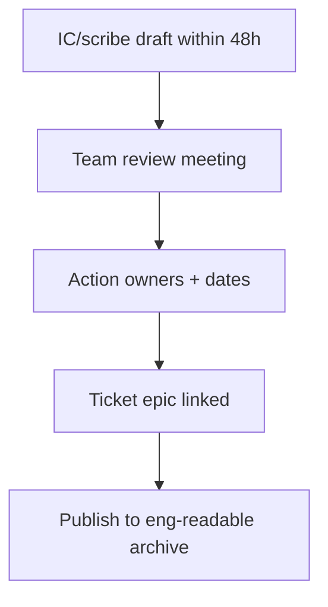

# Postmortems

A postmortem turns pain into system improvement. Blameless means **curious about incentives and design**, not “nobody is responsible for follow-ups.”

> **Related:** Incident command → [§6](06-incident-command.md) · Error budgets → [§2](02-error-budgets.md) · Game days → [§9](09-game-days-and-drills.md) · Runbooks → [RUNBOOK-TEMPLATE.md](../../RUNBOOK-TEMPLATE.md)

---

## At a glance

| Element | Purpose |
|---------|---------|
| **Timeline** | Shared facts, not memory |
| **Impact** | Users, revenue, duration, SLO(Service Level Objective) burn |
| **Contributing factors** | Conditions that made failure likely |
| **What went well** | Preserve good muscle |
| **Action items** | Owned, dated, tracked |
| **Lessons** | Share across teams |

**Rule of thumb:** If the only action is “be more careful,” the postmortem failed.

---

## Blameless in practice

| Blameless | Not blameless |
|-----------|---------------|
| “Alert threshold hid the burn for 40 min” | “Alice ignored the alert” |
| “No runbook for flag rollback” | “Bob should have known” |
| “Canary lacked business metric” | “QA missed it” |

People operate inside systems. Change the system: tests, alerts, permissions, checklists, staffing.

---

## When to write one

| Trigger | Postmortem? |
|---------|-------------|
| SEV1 | Always |
| SEV2 | Always (can be lighter) |
| SEV3 with surprise | Yes if learning value |
| Near-miss that almost SEV1 | Yes — high leverage |
| Pure vendor outage | Short: our detection/comms only |

---

## Template structure

| Section | Include |
|---------|---------|
| **Summary** | 5–10 lines: what, impact, fix |
| **Customer impact** | Who, how long, workarounds |
| **Timeline (UTC)** | Detect → mitigate → resolve |
| **Detection** | How we knew; time to page |
| **Root cause + factors** | 5 whys / causal graph — not one villain |
| **Why not worse** | Defenses that worked |
| **Action items** | P0/P1/P2 with owners |
| **Open questions** | Explicit unknowns |

---

## Follow-ups that stick

| Quality | Example |
|---------|---------|
| **Specific** | “Add checkout success burn alert with runbook link” |
| **Owned** | Named human + team |
| **Dated** | P0 ≤ 2 weeks for SEV1 |
| **Verified** | Demo in review or game day |
| **Budget-aware** | Reliability work counts when budget low ([§2](02-error-budgets.md)) |

Track overdue P0s in the same place as error-budget freezes — unfinished mitigations are how repeats happen.

---

## Meeting norms

| Do | Do not |
|----|--------|
| Read timeline together | Relitigate blame |
| Invite people who were there + one outsider | Make it a performance review |
| Decide actions live | End with “we’ll think of actions later” |
| Time-box to 45–60 min | Boil the ocean architecture redesign |

---

## Pros and cons

| Pros | Cons |
|------|------|
| Compounding reliability | Takes calendar time |
| Cross-team learning | Weak if actions rot |
| Improves runbooks and alerts | Can become ritual theater |

---

## Common mistakes

| Mistake | Fix |
|---------|-----|
| Waiting weeks to draft | Draft within 48h while fresh |
| Actions without owners | No owner → not an action |
| Only tech fixes | Include process, staffing, product trade-offs |
| Private docs | Searchable archive; redact secrets |
| Skipping near-misses | Schedule lightweight write-ups |