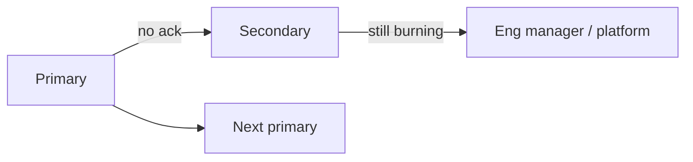

# On-Call Design

On-call is a product of staffing, tooling, and respect. A heroic rotation that burns people out is not a reliability strategy.

> **Related:** Alerting → [§5](05-alerting-and-paging.md) · Incident command → [§6](06-incident-command.md) · Runbooks → [RUNBOOK-TEMPLATE.md](../../RUNBOOK-TEMPLATE.md) · Platform boundaries → [cicd §8](../../cicd-and-environments/includes/08-platform-boundaries.md)

---

## At a glance

| Design choice | Prefer |
|---------------|--------|
| **Rotation size** | ≥ 5 for weekly primary; never 2 forever |
| **Shift length** | 7 days primary common; shorter if page-heavy |
| **Secondary** | Always defined; auto-escalate |
| **Handoff** | Written + live for hot issues |
| **Comp** | Time-off or pay per org policy — explicit |

**Rule of thumb:** If primary cannot take vacation without guilt, the rotation is too small or the pages are too noisy.

---

## Responsibilities

| Expectation | Detail |
|-------------|--------|
| **Ack SLA(Service Level Agreement)** | e.g. 5–15 minutes |
| **Mitigate** | Follow runbooks; escalate early |
| **Comms** | IC(Incident Commander) role when severity warrants ([§6](06-incident-command.md)) |
| **Follow-up** | File tickets; draft postmortem seeds |
| **Handoff** | Open pages, risks, deploys in flight |

On-call does **not** mean “implement every feature request at 2am.” Scope is restore service and document.

---

## Rotation patterns

| Pattern | When |
|---------|------|
| **Follow-the-sun** | Global team; hand off SEV cleanly |
| **Single primary + secondary** | Most product teams |
| **Layered (app → platform)** | Clear ownership of symptoms |
| **DevOps pair** | Newbie + veteran for first months |

---

## Readiness checklist

| Ready when | Evidence |
|------------|----------|
| Runbooks for top pages | Links from alerts |
| Access | Prod debug, deploy rollback, flag console |
| Dashboards | Golden board bookmarked |
| Escalation tree | Phone tree / PD policy tested |
| Shadow shift | Newcomers shadow before solo |

---

## Load and health metrics

| Metric | Healthy signal |
|--------|----------------|
| **Pages / week** | Sustainable; investigate if trending up |
| **Night pages** | Rare; else fix alerts or staffing |
| **Time to ack** | Within policy |
| **Interrupted sleep nights** | Track; compensate |
| **Toil ratio** | Automate repetitive mitigations |

Pair with alert noise reviews ([§5](05-alerting-and-paging.md)). Error-budget freezes should also reduce risky launches that create pages ([§2](02-error-budgets.md)).

---

## Handoff template

| Field | Example |
|-------|---------|
| **Open incidents** | None / link |
| **Watch items** | Elevated lag on topic X |
| **Deploys / flags** | Canary at 10% service Y |
| **Access issues** | None |
| **Contacts** | Platform on-call Alice |

---

## Common mistakes

| Mistake | Fix |
|---------|-----|
| Rotation of two forever | Hire/train or merge services |
| No secondary | Always configure escalate |
| Laptop-only access | Test mobile ack + VPN |
| Tribal knowledge | Runbooks + shadowing |
| Punishing who was on-call | Blameless postmortems ([§7](07-postmortems.md)) |
| Unlimited scope | Explicit “restore + document” charter |