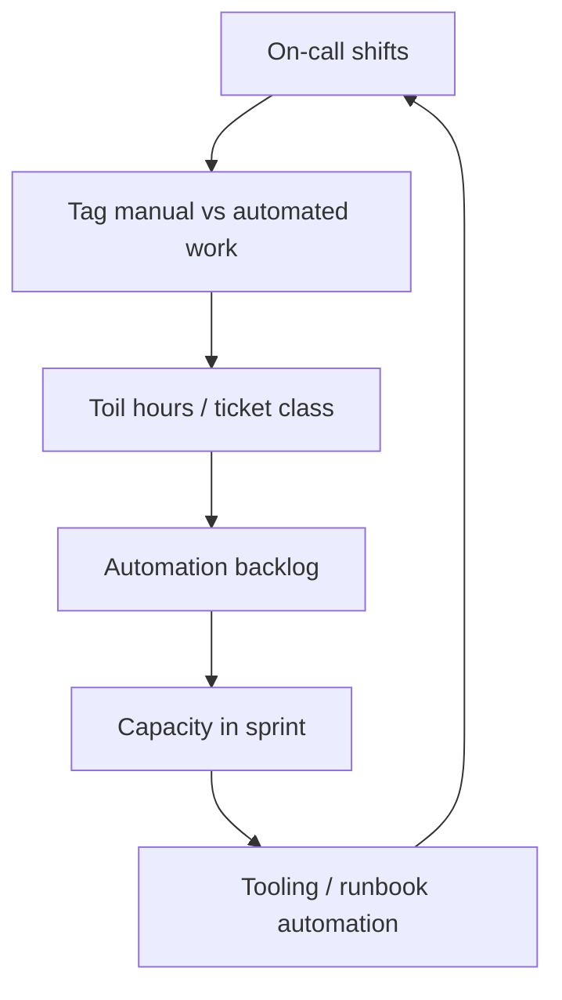

# Toil and Operational Load

Toil is **manual, repetitive, tactical work** that scales linearly with service growth and pulls engineers from project work. On-call design — [§8](08-on-call-design.md) — defines who responds; this section measures toil, prioritizes automation, and keeps operational load sustainable for SRE(Site Reliability Engineering) and product teams.

> **Scope:** Toil definition, measurement, automation backlog, and capacity budgeting. On-call rotations and paging → [§8](08-on-call-design.md). Alert noise → [§5](05-alerting-and-paging.md).
>
> **Related:** [§8 On-call design](08-on-call-design.md) · [§5 Alerting and paging](05-alerting-and-paging.md) · Runbooks → [RUNBOOK-TEMPLATE.md](../../RUNBOOK-TEMPLATE.md) · Platform paved road → [cicd §8A](../../cicd-and-environments/includes/08A-paved-road-catalog.md)

---

## At a glance

| Signal | Target |
|--------|--------|
| **Toil % of on-call time** | Track; trend down quarter over quarter |
| **Tickets per deploy** | Fall as automation lands |
| **Manual runbook steps** | Remove or script |
| **Repeat incidents** | Postmortem action → automation — [§7](07-postmortems.md) |
| **Automation backlog** | Prioritized like product backlog |
| **Capacity** | Explicit % sprint for ops work |

**Rule of thumb:** If the same **manual steps** appear in three incidents, the next fix is **code or a paved-road tool** — not another runbook paragraph.

---

## Toil vs engineering

| Toil (reduce) | Engineering (keep) |
|---------------|-------------------|
| Manual failover button mash | Building safer failover |
| Copy-paste log queries every page | Saved queries / dashboards — [§4A](04A-observability-platform.md) |
| Ticket-driven access grants | Self-serve IAM(Identity and Access Management) workflow |
| Restart pods by hand | HPA(Horizontal Pod Autoscaler) + probe fixes |
| Data fixes without guardrails | Idempotent repair jobs with audit |

Not every operational task is toil — **novel incident response** and **launch support** are legitimate.

---

## Measurement loop

| Metric | How |
|--------|-----|
| Toil hours | Weekly on-call retro tags |
| MTTR(Mean Time To Recovery) manual steps | Postmortem timelines — [§7](07-postmortems.md) |
| Pages per shift | Alert tuning — [§5](05-alerting-and-paging.md) |
| Runbook executions | Track manual vs automated |

---

## Automation backlog

| Priority | Candidate |
|----------|-------------|
| P0 | Steps that cause outage extension or data risk |
| P1 | Weekly repeats; >30 min each |
| P2 | Quarterly chores; good paved-road fit |
| Defer | One-offs; document only |

Pair with [cicd §8A](../../cicd-and-environments/includes/08A-paved-road-catalog.md) so teams don’t rebuild the same scripts.

---

## Sustainable on-call link

Toil drives **pager fatigue** — [§8](08-on-call-design.md):

| Practice | Effect |
|----------|--------|
| Fix top alert flappers | Fewer pages |
| Self-serve dashboards for partners | Fewer “what happened?” tickets |
| Automated rollback triggers | Shorter incidents — [deployment §13](../../deployment-strategies/includes/13-slo-rollback-triggers.md) |
| Rotation size ≥ 5 for weekly primary | Burnout guardrail |

Leaders protect **20–30% capacity** for ops/automation after major launches — hidden toil otherwise lands on nights and weekends.

---

## Common mistakes

| Mistake | Fix |
|---------|-----|
| Hero culture rewards manual saves | Celebrate automation that prevents pages |
| Runbooks grow without tooling | Each repeat → ticket to automate |
| Toil not measured | Tag on-call work monthly |
| Platform builds tools teams don’t adopt | Co-design with on-callers |
| Alerting left noisy — [§5](05-alerting-and-paging.md) | Flap fixes before hiring more on-call |
| Postmortem actions only docs | Time-boxed automation owners — [§7](07-postmortems.md) |
