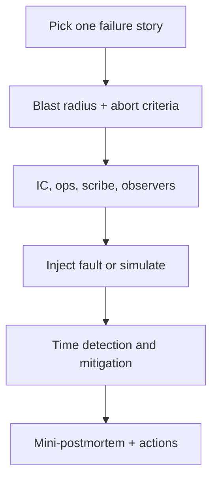

# Game Days and Drills

Reliability muscles atrophy without practice. Game days rehearse failure **before** customers force the lesson.

> **Related:** DB DR(Disaster Recovery) and credential drills → [database-connection §12](../../database-connection-and-security/includes/12-credential-rotation-and-dr.md) · Backup/PITR(Point-in-Time Recovery) → [postgresql-performance §16](../../postgresql-performance/includes/16-backup-restore-and-pitr.md) · Runbooks → [RUNBOOK-TEMPLATE.md](../../RUNBOOK-TEMPLATE.md) · Capacity failover tests → [§3](03-capacity-and-load-testing.md) · Postmortems → [§7](07-postmortems.md) · Release checklist → [deployment §14](../../deployment-strategies/includes/14-feature-to-prod-playbook.md)

---

## At a glance

| Drill type | Goal | Cadence |
|------------|------|---------|
| **Runbook dry-run** | Can on-call follow steps? | Monthly / new runbook |
| **Failover** | RTO(Recovery Time Objective)/RPO(Recovery Point Objective) real? | Quarterly |
| **Restore** | Backup actually restores | Monthly automated + quarterly human |
| **Incident tabletop** | Roles and comms | Quarterly |
| **Chaos / fault injection** | Automated resilience | After basics exist |

**Rule of thumb:** Untested DR is fiction. Schedule the drill when you schedule the backup job.

---

## Planning a game day

| Plan item | Example |
|-----------|---------|
| **Hypothesis** | “If primary DB fails, we fail over in <15 min” |
| **Environment** | Staging twin, or production with tight guardrails |
| **Abort** | Error budget critical; unexpected blast radius |
| **Success** | RTO met; runbook accurate; comms clear |
| **Observers** | Note gaps without taking over |

---

## Suggested scenarios

| Scenario | Links |
|----------|-------|
| Primary DB unavailable | [DB connection §12 DR](../../database-connection-and-security/includes/12-credential-rotation-and-dr.md) |
| Restore to PITR(Point-in-Time Recovery) timestamp | [PG §16](../../postgresql-performance/includes/16-backup-restore-and-pitr.md) |
| Bad deploy / canary burn | [deployment §13](../../deployment-strategies/includes/13-slo-rollback-triggers.md), [cicd §6](../../cicd-and-environments/includes/06-rollback-vs-forward-fix.md) |
| Feature flag kill switch | [deployment §7](../../deployment-strategies/includes/07-feature-flags.md) |
| Region or dependency loss | [HTS §13](../../high-throughput-systems/includes/13-multi-region-read-routing.md) |
| Kafka consumer lag storm | [apache-kafka §10](../../apache-kafka/includes/10-operations-dr-security-and-observability.md) |
| Secret rotation mid-traffic | [DB §12 rotation](../../database-connection-and-security/includes/12-credential-rotation-and-dr.md) |

Always update the linked runbook the same day you find a wrong step.

---

## Tabletop vs live

| Tabletop | Live / chaos |
|----------|--------------|
| Comms and decision practice | Real tooling and timing |
| Safe for SEV1 stories first | Needs strong abort + observability |
| Good for new ICs | Proves RTO/RPO numbers |

Start tabletop if the team has never run incident command; graduate to live failovers.

---

## Capturing results

| Output | Owner |
|--------|-------|
| Timing: detect / mitigate / recover | Scribe |
| Runbook diffs | Service TL |
| Alert gaps | On-call lead |
| Tickets | Same bar as postmortem P0/P1 ([§7](07-postmortems.md)) |
| Next drill date | Calendar |

---

## Common mistakes

| Mistake | Fix |
|---------|-----|
| Drill only in slides | Touch production-like systems |
| No abort criteria | Pre-agree stop conditions |
| Heroes improvise off-runbook | Treat deviation as a doc bug |
| Never retesting after fix | Re-drill critical paths |
| Surprising the whole company | Announce window; status hygiene |