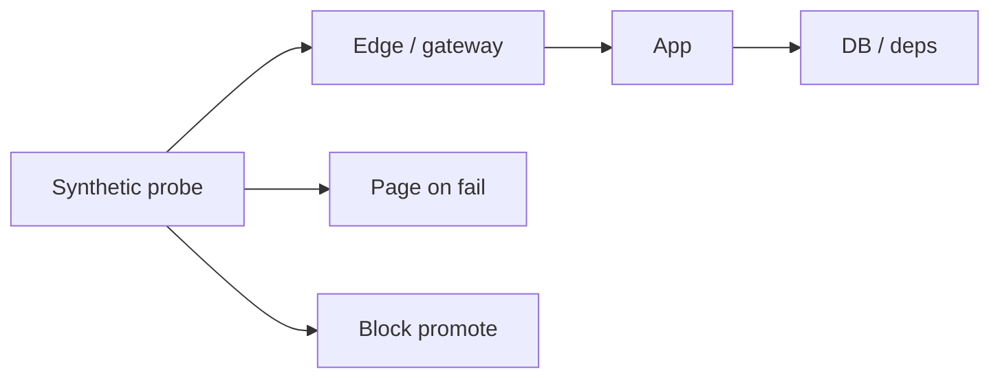

# Synthetic Monitoring

Synthetics are **proactive probes** that exercise critical journeys even when real traffic is quiet. They catch “nobody is shopping so metrics look fine” failures.

> **Related:** Observability practice → [§4](04-observability-practice.md) · Alerting → [§5](05-alerting-and-paging.md) · Deploy gates → [deployment §13](../../deployment-strategies/includes/13-slo-rollback-triggers.md) · CI(Continuous Integration) smoke → [cicd §1](../../cicd-and-environments/includes/01-ci-pipeline-design.md)

---

## At a glance

| Probe type | What it checks | Cadence |
|------------|----------------|---------|
| **Uptime HTTP(Hypertext Transfer Protocol)** | Status and latency of URL | 1–5 min |
| **API(Application Programming Interface) journey** | Auth → critical calls → assert | 1–5 min |
| **Browser journey** | Full UX path (checkout) | 5–15 min |
| **Post-deploy smoke** | Same checks gated on promote | Per deploy |
| **Multi-region** | Each edge / region independently | Match uptime |

**Rule of thumb:** One synthetic per **revenue or trust journey** beats fifty shallow ping checks.

---

## Where synthetics fit

| Use | Benefit |
|-----|---------|
| **Detection** | Pages when users are asleep |
| **Localization** | Fail in one region only → regional issue |
| **Deploy safety** | Smoke after canary / before next stage |
| **SLA(Service Level Agreement) evidence** | External view of availability |

Not a replacement for SLI(Service Level Indicator) from real traffic — synthetics are sparse and privileged. Pair both ([§1](01-sli-slo-sla.md)).

---

## Designing good probes

| Practice | Detail |
|----------|--------|
| **Critical path only** | Login, search, checkout, publish |
| **Assert behavior** | Status, JSON fields, latency budget |
| **Isolate identity** | Synthetic test user / API key; mark in logs |
| **Avoid side effects** | Prefer idempotent or cleanup steps |
| **Secrets** | From vault; rotate ([DB §12](../../database-connection-and-security/includes/12-credential-rotation-and-dr.md)) |
| **From outside** | Run from public vantage, not only cluster-local |

---

## Alerting synthetics

| Fail pattern | Response |
|--------------|----------|
| Single fail | Retry; do not page yet |
| N fails in M minutes | Page — treat as symptom ([§5](05-alerting-and-paging.md)) |
| One region of many | Regional incident / traffic shift |
| All regions | Global SEV path ([§6](06-incident-command.md)) |

Link every synthetic alert to a runbook section: “verify probe vs real SLI before large rollback.”

---

## CI vs production synthetics

| Layer | Role |
|-------|------|
| **CI** | Contract / smoke against ephemeral or staging ([cicd §1](../../cicd-and-environments/includes/01-ci-pipeline-design.md)) |
| **Pre-prod** | Full journey before promote ([cicd §2](../../cicd-and-environments/includes/02-cd-and-promotion.md)) |
| **Prod** | Continuous external truth |

Keep assertions versioned with the app when journeys change — flaky synthetics destroy trust.

---

## Pros and cons

| Pros | Cons |
|------|------|
| Catches silent outages | Cost and maintenance |
| Great deploy gate | False positives if env drift |
| Multi-region view | Can overload fragile staging |

---

## Common mistakes

| Mistake | Fix |
|---------|-----|
| Ping `/health` only | Journey assertions |
| Synthetic user in real billing | Isolated tenant / flag |
| Page on one flake | Retries + multi-fail |
| Ignoring probe latency SLO(Service Level Objective) | Track probe p99 separately |
| Secrets in probe scripts | Vault / CI secrets store |