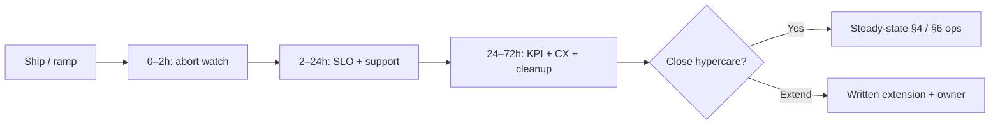

# Hypercare Checklist (First 72 Hours)

Structured watch after a user-facing PROD(Production) ramp — **tech SLOs and business / CX(Customer Experience) signals** — before calling the release done.

> **Scope:** First 24–72 h after canary/flag reaches steady traffic. Deploy mechanics and Gate 7 → [deployment §14](../../deployment-strategies/includes/14-feature-to-prod-playbook.md). Steady-state Cursor workflow → [cursor-workflows §6](../../cursor-workflows/includes/06-operate-and-learn.md). Synthetics design → [§10](10-synthetic-monitoring.md). Signal triage → [HTS §11](../../high-throughput-systems/includes/11-observability.md).
>
> **Related:** SLO(Service Level Objective) rollback → [deployment §13](../../deployment-strategies/includes/13-slo-rollback-triggers.md) · Error budgets → [§2](02-error-budgets.md) · Web Vitals → [fullstack §4](../../fullstack-bff-and-clients/includes/04-web-performance.md) · Debt / CX follow-ups → [tech-lead §5A](../../tech-lead-practice/includes/05A-debt-business-cx-balance.md)

---

## At a glance

| Window | Focus | Exit when |
|--------|-------|-----------|
| **0–2 h** | Abort readiness, version tags, smoke | No mystery errors; rollback path proven idle |
| **2–24 h** | RED(Rate, Errors, Duration)/USE(Utilization, Saturation, Errors) vs baseline; support spike | SLOs hold; no SEV pattern |
| **24–72 h** | Business KPI(Key Performance Indicator) + CX field data; cleanup plan | Hypercare closed or extended in writing |

**Rule of thumb:** If you only watch latency/errors, you will miss “technically fine, users hate it.” Pair SLI(Service Level Indicator)s with at least one **business KPI(Key Performance Indicator)** and one **CX** signal.

---

## Before traffic (Gate 6 ready)

- [ ] Version / flag / canary cohort tagged on metrics and logs
- [ ] Rollback or kill-switch owner named and reachable — [deployment §13](../../deployment-strategies/includes/13-slo-rollback-triggers.md)
- [ ] Dashboard: feature path vs baseline (errors, p99, saturation)
- [ ] Synthetics cover the new journey — [§10](10-synthetic-monitoring.md)
- [ ] Business KPI named (conversion, checkout success, activate rate, …)
- [ ] Support / feedback channel watched (ticket tag or Slack)

---

## Checklist by signal class

### Reliability (always)

| Check | Pass criteria | Link |
|-------|---------------|------|
| Error rate / success SLI | Within SLO or budget burn acceptable | [§1](01-sli-slo-sla.md) |
| Latency p95/p99 | No sustained breach vs baseline | [HTS §11](../../high-throughput-systems/includes/11-observability.md) |
| Saturation (CPU, pool, queue) | Headroom; no unbounded growth | [HTS §1](../../high-throughput-systems/includes/01-measurement-and-slo.md) |
| Dependency health | Breakers not flapping; lag OK | [resilience §13](../../resilience-patterns/includes/13-observability-for-resilience.md) |
| Alert noise | Pages actionable; gaps ticketed | [§5](05-alerting-and-paging.md) |

### Business KPI (user-facing features)

| Check | Pass criteria |
|-------|---------------|
| Primary funnel step | No drop vs pre-release cohort (same window) |
| Money / trust path (if any) | Success rate holds; no double-charge / auth spike |
| Adoption (if new surface) | Expected activation without support flood |

Pick **one** primary KPI before ship; argue from that number in abort debates.

### CX / client field data

| Check | Pass criteria | Link |
|-------|---------------|------|
| Web Vitals (LCP/INP(Interaction to Next Paint)/CLS(Cumulative Layout Shift)) if web | No field regression beyond budget | [fullstack §4](../../fullstack-bff-and-clients/includes/04-web-performance.md) |
| RUM(Real User Monitoring) errors | New JS/API(Application Programming Interface) error class absent or owned |
| Support / CSAT(Customer Satisfaction) spike | No unexplained surge tagged to the release |
| Degrade mode rate (if used) | Matches agreed contract; exit dated | [resilience §5](../../resilience-patterns/includes/05-load-shedding-and-degradation.md) |

### Delivery leftovers

| Check | Pass criteria | Link |
|-------|---------------|------|
| Canary / flag | Plan to 100% or permanent split documented | [deployment §7](../../deployment-strategies/includes/07-feature-flags.md) |
| Expand/contract / dual-write | Observation window dated | [deployment §12](../../deployment-strategies/includes/12-schema-migrations-and-deploy.md) |
| Runbook | Matches reality after first anomaly | [RUNBOOK-TEMPLATE](../../RUNBOOK-TEMPLATE.md) |

---

## Cadence (suggested)

| Time | Ritual |
|------|--------|
| **T+30 min** | Glance RED + synthetic; confirm tags |
| **T+2 h** | Abort decision: hold, rollback, or continue ramp |
| **T+24 h** | Written note: SLO, KPI, support, open issues |
| **T+72 h** | Close hypercare or extend; file debt/CX tickets — [tech-lead §5A](../../tech-lead-practice/includes/05A-debt-business-cx-balance.md) |

Cursor prompt pack → [cursor-workflows §6](../../cursor-workflows/includes/06-operate-and-learn.md).

---

## Abort / extend

| Condition | Action |
|-----------|--------|
| SLO burn or SEV pattern | Rollback / kill switch; freeze related ships — [§2](02-error-budgets.md) |
| KPI crash with healthy RED | Investigate CX/product bug; do not “wait for more data” past 24 h without owner |
| Mild CX regression, budget OK | Extend hypercare; ticket fix; optional degrade |
| All green | Close; schedule cleanup and next drill — [deployment §14 Gate 7](../../deployment-strategies/includes/14-feature-to-prod-playbook.md) |

---

## Minimal definition of done (hypercare)

- [ ] 24–72 h watch complete (or written extension)
- [ ] Tech SLO note + business KPI note recorded
- [ ] CX/support glance done (Web Vitals or equivalent if client-facing)
- [ ] Abort path unused **or** exercised and postmortem started
- [ ] Cleanup owners/dates for flags, canary, dual-write
- [ ] Follow-ups in backlog (reliability vs product vs CX debt)

---

## Common mistakes

| Mistake | Why it hurts | Fix |
|---------|--------------|-----|
| Dashboards without business KPI | Ship “green” while revenue drops | Name KPI before Gate 5 |
| Closing at 100% ramp | Misses day-2 failures | Run this checklist |
| Watching only averages | Hides cohort pain | Compare release cohort vs baseline |
| No support tag | Cannot attribute tickets | Release label in tickets/chat |
| Eternal “watching” | No cleanup | 72 h close-or-extend rule |
| Ignoring Web Vitals | Server OK, UX bad | Pair RUM with RED |

---

## Pros and cons

| Approach | Pros | Cons |
|----------|------|------|
| **Formal hypercare** | Catches CX + biz misses; clear exit | Needs staffing for 72 h |
| **Ad-hoc “keep an eye”** | Cheap | Misses silent funnel damage |
| **Tech-only watch** | Easy dashboards | Blind to product failure |

---

## Other guides in this repo

| Guide | Use when |
|-------|----------|
| [deployment §14](../../deployment-strategies/includes/14-feature-to-prod-playbook.md) | Ordered gates into and out of PROD |
| [§4 Observability practice](04-observability-practice.md) | Culture and instrumentation |
| [§10 Synthetic monitoring](10-synthetic-monitoring.md) | Probes during quiet traffic |
| [cursor-workflows §6](../../cursor-workflows/includes/06-operate-and-learn.md) | Agent-assisted operate loop |
| [tech-lead §5A](../../tech-lead-practice/includes/05A-debt-business-cx-balance.md) | What to do when hypercare finds debt/CX tradeoffs |