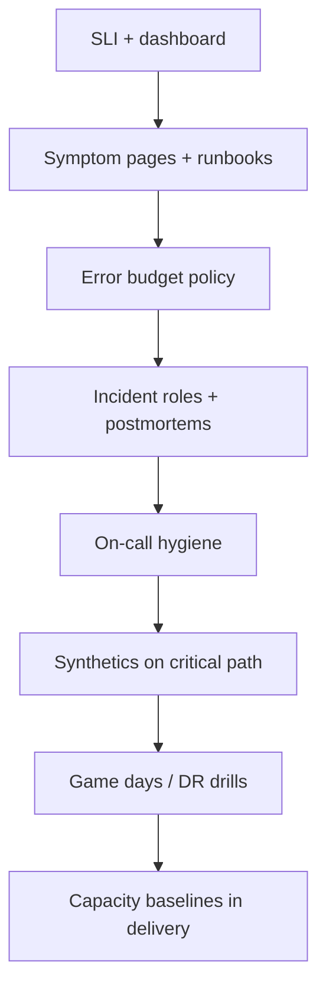

# Decision Guide

What to adopt first, what to postpone, and how SRE(Site Reliability Engineering) choices interact with deploy and delivery guides.

> **Related:** Overview → [§0](00-overview.md) · Error budgets → [§2](02-error-budgets.md) · HTS observability → [high-throughput-systems §11](../../high-throughput-systems/includes/11-observability.md) · Deploy rollback → [deployment-strategies §13](../../deployment-strategies/includes/13-slo-rollback-triggers.md) · CI(Continuous Integration)/CD(Continuous Delivery) decisions → [cicd-and-environments §9](../../cicd-and-environments/includes/09-decision-guide.md)

---

## Quick picker

| Situation | Start here |
|-----------|------------|
| No shared definition of “up” | [§1 SLI/SLO](01-sli-slo-sla.md) |
| Features ship while reliability burns | [§2 Error budgets](02-error-budgets.md) |
| Launch or peak unknown | [§3 Capacity](03-capacity-and-load-testing.md) |
| Lots of tools, little action | [§4 Observability practice](04-observability-practice.md) |
| Noisy or missing pages | [§5 Alerting](05-alerting-and-paging.md) |
| Chaotic war rooms | [§6 Incident command](06-incident-command.md) |
| Same outage twice | [§7 Postmortems](07-postmortems.md) |
| Burned-out rotation | [§8 On-call](08-on-call-design.md) |
| Untested DR / runbooks | [§9 Game days](09-game-days-and-drills.md) |
| Quiet-hours blind spots | [§10 Synthetics](10-synthetic-monitoring.md) |
| Just ramped a feature to PROD | [§10A Hypercare](10A-hypercare-checklist.md) |

---

## Adoption order (typical product team)

Do not start with chaos engineering if pages are noise and SLOs do not exist.

---

## Pairing with sibling guides

| Reliability need | This guide | Sibling |
|------------------|------------|---------|
| What to measure under load | §1, §3 | [HTS §1](../../high-throughput-systems/includes/01-measurement-and-slo.md), [§11](../../high-throughput-systems/includes/11-observability.md) |
| Auto rollback on burn | §2, §5 | [deployment §13](../../deployment-strategies/includes/13-slo-rollback-triggers.md) |
| Flag kill switch | §6 mitigate | [deployment §7](../../deployment-strategies/includes/07-feature-flags.md), [cicd §4](../../cicd-and-environments/includes/04-feature-flags-as-control.md) |
| Promote safely | §10 smoke | [cicd §2](../../cicd-and-environments/includes/02-cd-and-promotion.md) |
| DB failover truth | §9 | [database-connection §12](../../database-connection-and-security/includes/12-credential-rotation-and-dr.md) |
| Written response steps | all | [RUNBOOK-TEMPLATE.md](../../RUNBOOK-TEMPLATE.md) |

---

## Choose severity of process

| Team stage | Process weight |
|------------|----------------|
| **Early startup** | One SLI(Service Level Indicator), one runbook, informal IC(Incident Commander) |
| **Growth** | Budget policy, SEV model, weekly alert review |
| **Regulated / enterprise** | Formal postmortems, drill evidence, SLA(Service Level Agreement) alignment |

Heavier process without trustworthy SLIs creates theater. Invest in measurement first.

---

## Pros and cons of “full SRE program”

| Pros | Cons |
|------|------|
| Predictable reliability trade-offs | Calendar and tooling cost |
| Healthier on-call | Requires product partnership |
| Faster incident learning | Can stall features if gamed poorly |

---

## Common mistakes

| Mistake | Fix |
|---------|-----|
| Buying an APM and declaring SRE done | Follow adoption order |
| Copying Google’s 99.99% blindly | Match user journeys and cost |
| Reliability team owns every SLI | Service teams own; platform enables |
| Drills without runbook updates | Same-day doc fixes |
| Ignoring delivery and flags | Pair with [cicd](../../cicd-and-environments/README.md) + [deployment](../../deployment-strategies/README.md) |