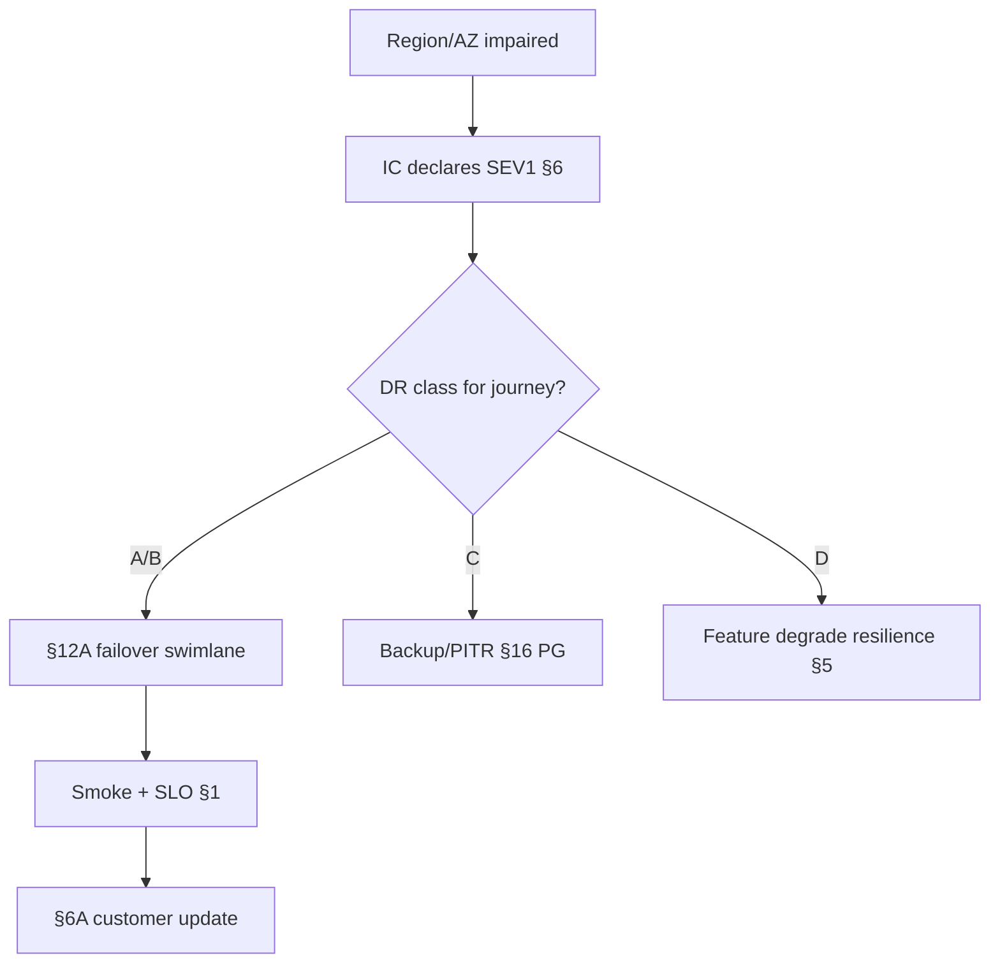

# Disaster Recovery

Disaster recovery (DR) is **how the org restores service** when a region, availability zone, or primary data plane is lost — within agreed **RPO(Recovery Point Objective)** and **RTO(Recovery Time Objective)**. This section is the **hub**; step-by-step orchestration lives in the deep playbook.

> **Scope:** DR(Disaster Recovery) vocabulary, classes, prerequisites, and when to escalate to full failover. Swimlanes, RACI(Responsible, Accountable, Consulted, Informed), and checklists → [§12A](12A-disaster-recovery-playbook.md). Incident command during DR → [§6](06-incident-command.md). Customer comms → [§6A](06A-incident-communications.md).
>
> **Related:** Drills → [§9](09-game-days-and-drills.md) · DB backup/PITR(Point-in-Time Recovery) → [postgresql-performance §16](../../postgresql-performance/includes/16-backup-restore-and-pitr.md) · Multi-region writes → [HTS §13A](../../high-throughput-systems/includes/13A-multi-region-write-and-failover.md) · Cells/residency → [architecture §10A](../../architecture-decisions/includes/10A-regional-cells-and-residency.md) · VISUAL-INDEX → [DR / failover](../../VISUAL-INDEX.md#dr--failover)

---

## At a glance

| Term | Meaning |
|------|---------|
| **RPO** | Max acceptable **data loss** (time or transactions) |
| **RTO** | Max acceptable **downtime** to restore service |
| **Failover** | Promote standby / shift traffic to DR target |
| **Failback** | Return to primary after heal |
| **Degrade** | Reduce features instead of full failover |

**Rule of thumb:** DR is an **org process**, not a backup checkbox. Untested promote is not a plan — drill it → [§9](09-game-days-and-drills.md).

---

## DR classes (summary)

Full role matrix and gates → [§12A](12A-disaster-recovery-playbook.md).

| Class | RPO | RTO | When |
|-------|-----|-----|------|
| **A — near-zero** | Seconds | Minutes | Hot standby / sync quorum |
| **B — minutes** | Async lag window | Tens of minutes | Promote replica; DNS(Domain Name System) cut |
| **C — hours** | Backup / PITR target | Hours | Restore when promote impossible |
| **D — degrade** | Accept local loss | Immediate UX degrade | Partial outage; failover risk > benefit |

Pick class **per journey** (payments vs analytics), not one number for everything — [§1A](01A-critical-journeys-and-sev-catalog.md).

---

## Prerequisites (before you need DR)

| Prerequisite | Owner |
|--------------|-------|
| Documented RPO/RTO per critical journey | Product + platform |
| Standby region/cell with **drilled promote** | DBA + platform |
| Runbooks linked from [RUNBOOK-TEMPLATE](../../RUNBOOK-TEMPLATE.md) | Service owners |
| DNS / traffic shift tested | Platform |
| Credential rotation path during failover | [database-connection §12](../../database-connection-and-security/includes/12-credential-rotation-and-dr.md) |
| Kafka/stream offset plan if in path | [apache-kafka §10](../../apache-kafka/includes/10-operations-dr-security-and-observability.md) |
| Status page DR boilerplate | Comms — [§6A](06A-incident-communications.md) |

---

## When to open the playbook

| Signal | Likely path |
|--------|-------------|
| Primary region unreachable for critical path | [§12A](12A-disaster-recovery-playbook.md) class A/B |
| Data corruption / bad deploy | Stop writes; may be restore not failover — [§6](06-incident-command.md) |
| Single AZ loss with multi-AZ primary | Often auto-heal; IC(Incident Commander) still declares |
| “Maybe flaky” | Measure SLO(Service Level Objective) burn; do not failover on noise — [§2](02-error-budgets.md) |

IC owns **go/no-go** on failover; DBA owns data promotion; platform owns traffic shift — detail in [§12A](12A-disaster-recovery-playbook.md).

---

## Hub vs deep playbook

| This hub (§12) | Deep playbook (§12A) |
|----------------|----------------------|
| Vocabulary and classes | Sequence diagram swimlane |
| Prerequisites and escalation | Per-role checklists |
| Links to data/stream guides | Freeze → DNS → promote → validate |
| When *not* to failover | Kafka catch-up, app reconnect steps |

After stabilize, run hypercare — [§10A](10A-hypercare-checklist.md). Postmortem required for any SEV1 DR — [§7](07-postmortems.md).

---

## Operational checklist

- [ ] RPO/RTO written per journey and signed by product
- [ ] Last game day date < 12 months — [§9](09-game-days-and-drills.md)
- [ ] §12A linked from service runbooks
- [ ] Failback procedure documented (often harder than failover)
- [ ] FinOps(Cloud Financial Operations) cost of standby region understood — [finops §7](../../finops-and-cost/includes/07-architecture-cost-tradeoffs.md)

---

## Common mistakes

| Mistake | Fix |
|---------|-----|
| Backup without restore drill | Quarterly PITR test — [PG §16](../../postgresql-performance/includes/16-backup-restore-and-pitr.md) |
| One RPO for all systems | Journey-scoped classes |
| Failover without deploy freeze | §12A freeze gate |
| No failback plan | Document return-to-primary |
| DR only in infra team wiki | Link §12 + §12A from IC runbooks |

---

## Pros and cons

| Strategy | Pros | Cons |
|----------|------|------|
| **Active-passive region** | Clear RPO/RTO story | Standby cost |
| **Active-active cells** | Lower RTO | Conflict resolution complexity — [HTS §13A](../../high-throughput-systems/includes/13A-multi-region-write-and-failover.md) |
| **Backup-only (class C)** | Cheaper | Hours of loss/downtime |
