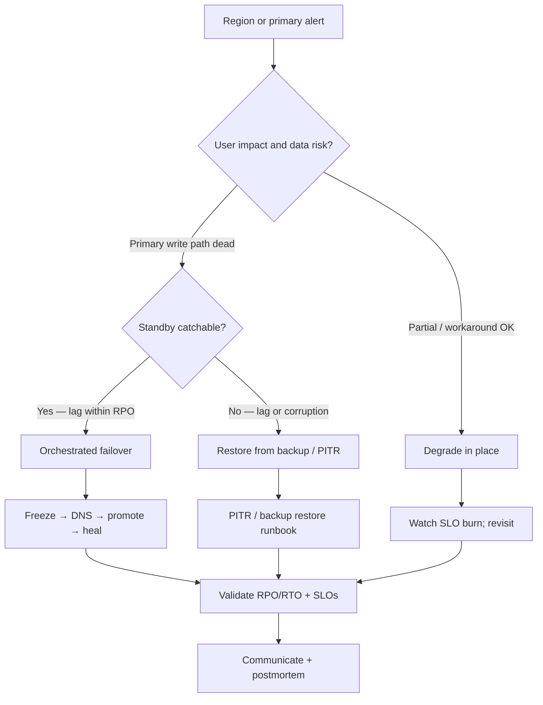

# Disaster Recovery Playbook

End-to-end orchestrated regional or primary failover — who freezes, who promotes, who validates — when the primary region or data plane is down.

> **Scope:** Swimlane, RACI, and the freeze → shift traffic → promote data → heal apps → validate sequence. Credential rotation details → [database-connection §12](../../database-connection-and-security/includes/12-credential-rotation-and-dr.md). PITR(Point-in-Time Recovery) mechanics → [postgresql-performance §16](../../postgresql-performance/includes/16-backup-restore-and-pitr.md). Kafka MM2(MirrorMaker 2) internals → [apache-kafka §10](../../apache-kafka/includes/10-operations-dr-security-and-observability.md). Write-path topology choices → [HTS §13A](../../high-throughput-systems/includes/13A-multi-region-write-and-failover.md).
>
> **Related:** Incident command → [§6](06-incident-command.md) · Hypercare after stabilize → [§10A](10A-hypercare-checklist.md) · DB credentials / DR vocab → [database-connection §12](../../database-connection-and-security/includes/12-credential-rotation-and-dr.md) · PG backup/PITR → [postgresql-performance §16](../../postgresql-performance/includes/16-backup-restore-and-pitr.md) · Multi-region reads → [HTS §13](../../high-throughput-systems/includes/13-multi-region-read-routing.md) · Multi-region writes → [HTS §13A](../../high-throughput-systems/includes/13A-multi-region-write-and-failover.md) · Kafka ops/DR → [apache-kafka §10](../../apache-kafka/includes/10-operations-dr-security-and-observability.md) · Cells / residency → [architecture §10A](../../architecture-decisions/includes/10A-regional-cells-and-residency.md) · DR spine diagram → [VISUAL-INDEX — DR / failover](../../VISUAL-INDEX.md#dr--failover) · Per-service skeleton → [RUNBOOK-TEMPLATE.md](../../RUNBOOK-TEMPLATE.md)

---

## At a glance

| Class | RPO(Recovery Point Objective) | RTO(Recovery Time Objective) | Typical trigger | Owns the call |
|-------|-------------------------------|------------------------------|-----------------|---------------|
| **A — near-zero** | Seconds (sync / quorum) | Minutes | Primary AZ/region loss with hot standby | IC(Incident Commander) + platform |
| **B — minutes** | Async lag window | Tens of minutes | Promote replica; DNS(Domain Name System) cut | IC + DBA |
| **C — hours** | Last good backup / PITR target | Hours | Restore from backup when promote impossible | IC + DBA |
| **D — degrade** | N/A (accept data loss risk locally) | Immediate UX degrade | Partial outage; failover risk > benefit | IC |

| Role | Owns in DR |
|------|------------|
| **IC** | Go / no-go, sequence order, cadence, severity |
| **DNS / platform** | Traffic shift, deploy freeze, edge health |
| **DBA** | Promote / restore data plane; lag and consistency gates |
| **Kafka / stream ops** | Catch-up, consumer offsets, MM2 cutover |
| **App owners** | Pooler reconnect, config flip, smoke, SLO(Service Level Objective) validate |
| **Comms** | Status page, exec, customer updates |

**Rule of thumb:** Decide RPO/RTO and the degrade-vs-failover tree **before** the fire. Untested promotion is not a plan — drill it → [§9](09-game-days-and-drills.md).

---

## Failover swimlane

```mermaid
sequenceDiagram
    participant IC as IC
    participant DNS as DNS / platform
    participant DBA as DBA
    participant Kafka as Kafka / ops
    participant App as App owners

    IC->>IC: Declare SEV; name roles
    IC->>DNS: Freeze deploys and risky jobs
    DNS-->>IC: Freeze confirmed
    IC->>DNS: Shift DNS / edge to DR region
    DNS-->>IC: Traffic landing on standby path
    IC->>DBA: Promote DB / cell primary
    DBA-->>IC: Promote complete; lag gate OK
    IC->>App: Reconnect poolers; flip write config
    App-->>IC: Apps writing to new primary
    IC->>Kafka: Catch up bus / CDC / MM2
    Kafka-->>IC: Lag within SLO
    IC->>App: Validate user-facing SLOs
    App-->>IC: Smoke + SLO hold
    IC->>IC: Communicate; enter hypercare / exit
```

Spine overview → [VISUAL-INDEX — DR / failover](../../VISUAL-INDEX.md#dr--failover). Write-path promote details → [HTS §13A](../../high-throughput-systems/includes/13A-multi-region-write-and-failover.md).

---

## Decide: degrade vs failover vs restore



| Choice | Prefer when | Avoid when |
|--------|-------------|------------|
| **Degrade in place** | Partial dependency loss; failover would widen blast radius | Writes already corrupt or region is gone |
| **Failover (promote)** | Standby healthy; lag ≤ RPO; runbook drilled | Dual-write risk; residency forbids promote target |
| **Restore from backup** | Promote unsafe; need PITR to known good | RTO budget shorter than restore time |

PITR steps → [postgresql-performance §16](../../postgresql-performance/includes/16-backup-restore-and-pitr.md). Credential / secret steps during promote → [database-connection §12](../../database-connection-and-security/includes/12-credential-rotation-and-dr.md).

---

## Checklist phases

### 1. Detect

- [ ] Alert or report acknowledged; bridge/channel open — [§6](06-incident-command.md)
- [ ] User impact and affected journeys named (not just host down)
- [ ] Replication lag / backup freshness / region health on the board
- [ ] Provisional SEV set; IC named

### 2. Decide

- [ ] RPO/RTO class for this system recalled (or looked up)
- [ ] Degrade vs failover vs restore chosen and written in channel
- [ ] Residency / cell constraints checked — [architecture §10A](../../architecture-decisions/includes/10A-regional-cells-and-residency.md)
- [ ] Abort criteria named (e.g. lag > RPO → stop promote)

### 3. Freeze

- [ ] Deploy freeze and risky migrations paused
- [ ] Batch / backfill / schema jobs that write to primary halted
- [ ] Feature flags that amplify write load disabled if needed

### 4. Shift traffic

- [ ] DNS / global LB / edge routed to DR path
- [ ] Health checks pass on target region
- [ ] Read-only or maintenance page used only if intentional

### 5. Promote data

- [ ] DBA promotes replica or restores to PITR target
- [ ] New primary accepts writes; old primary fenced (no split-brain)
- [ ] Secrets / IAM(Identity and Access Management) paths valid for new primary — [database-connection §12](../../database-connection-and-security/includes/12-credential-rotation-and-dr.md)

### 6. Heal apps

- [ ] Poolers reconnected; connection strings / config flipped
- [ ] App owners confirm write path to new primary
- [ ] Kafka / CDC(Change Data Capture) catch-up started — [apache-kafka §10](../../apache-kafka/includes/10-operations-dr-security-and-observability.md)

### 7. Validate

- [ ] Synthetic and critical-path smoke green
- [ ] User-facing SLO hold (errors, latency, success rate)
- [ ] Bus lag within agreed SLO; no unbounded DLQ(Dead Letter Queue) growth
- [ ] Enter short hypercare window — [§10A](10A-hypercare-checklist.md)

### 8. Communicate

- [ ] Status page / customer update with next cadence
- [ ] Exec / support briefed with impact and ETA
- [ ] Internal timeline notes kept for postmortem

### 9. Exit / postmortem

- [ ] Incident closed or severity downgraded explicitly
- [ ] Failback plan dated (or permanent home region documented)
- [ ] Postmortem scheduled — [§7](07-postmortems.md)
- [ ] Drill debt filed if runbook drifted — [§9](09-game-days-and-drills.md)
- [ ] Service runbook updated from [RUNBOOK-TEMPLATE.md](../../RUNBOOK-TEMPLATE.md)

---

## RACI (example)

| Activity | IC | DNS / platform | DBA | Kafka / ops | App owners | Comms |
|----------|----|----------------|-----|-------------|------------|-------|
| Declare SEV / go-no-go | A/R | C | C | C | C | I |
| Deploy / job freeze | A | R | C | C | C | I |
| DNS / traffic shift | A | R | I | I | C | I |
| Promote / restore DB | A | I | R | C | C | I |
| Reconnect poolers / app config | A | C | C | I | R | I |
| Catch up bus / CDC | A | I | C | R | C | I |
| Validate SLOs / smoke | A | C | C | C | R | I |
| Customer / exec updates | A | I | I | I | C | R |
| Postmortem + drill actions | A | C | C | C | C | I |

R = Responsible, A = Accountable, C = Consulted, I = Informed. Keep **one** accountable for go/no-go (the IC).

---

## Drill cadence

| Drill | Goal | Cadence |
|-------|------|---------|
| **Tabletop** | Roles, decide tree, comms | Quarterly |
| **Failover game day** | Freeze → promote → validate under clock | Quarterly |
| **Restore drill** | Backup/PITR meets RTO | Monthly automated + quarterly human |
| **Runbook dry-run** | Steps match reality | After each real DR or major topology change |

Schedule and safety rails → [§9 Game days and drills](09-game-days-and-drills.md). DB-specific restore practice → [database-connection §12](../../database-connection-and-security/includes/12-credential-rotation-and-dr.md) · [postgresql-performance §16](../../postgresql-performance/includes/16-backup-restore-and-pitr.md).

---

## Common mistakes

| Mistake | Fix |
|---------|-----|
| Promoting without fencing the old primary | Fence first; then promote — avoid split-brain |
| DNS flip before DB is writable | Order: freeze → promote (or ready standby) → traffic → heal apps |
| Skipping bus catch-up | Validate Kafka/CDC lag before declaring success |
| No RPO/RTO on the board | Class A–D decided in peacetime; IC recalls it under stress |
| Treating credential rotation as the whole DR plan | Rotation is a step; orchestration lives here |
| Never drilling failback | Failover without failback plan leaves you stranded |
| Dual-writing during cutover “just in case” | One write primary; see [HTS §13A](../../high-throughput-systems/includes/13A-multi-region-write-and-failover.md) |

---

## See also

| Guide / section | Use when |
|-----------------|----------|
| [§6 Incident command](06-incident-command.md) | Roles and first 15 minutes |
| [§10A Hypercare](10A-hypercare-checklist.md) | Watch window after stabilize |
| [HTS §13A Multi-region write](../../high-throughput-systems/includes/13A-multi-region-write-and-failover.md) | Sticky primary and promote sequence for writes |
| [architecture §10A Cells](../../architecture-decisions/includes/10A-regional-cells-and-residency.md) | Home cell / residency constraints on failover |
| [VISUAL-INDEX DR spine](../../VISUAL-INDEX.md#dr--failover) | One-page swimlane across guides |
| [RUNBOOK-TEMPLATE.md](../../RUNBOOK-TEMPLATE.md) | Per-service DR steps |