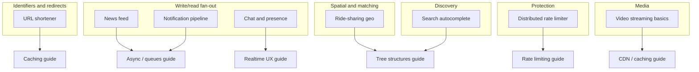

# Overview — System Design Walkthroughs

End-to-end designs for the systems that show up in interviews **and** in production incident reviews — URL shorteners, feeds, chat, geo-matching, rate limiters, notifications, search, and video. Each walkthrough follows the same shape: requirements, estimates, architecture, data model, bottlenecks, and links to the deep-dive guides that already own the hard parts.

> **Related:** How to run the framework → [01-how-to-approach.md](01-how-to-approach.md) · Throughput order → [high-throughput-systems overview](../../high-throughput-systems/includes/00-overview.md) · Pick the right walkthrough → [10-decision-guide.md](10-decision-guide.md)

---

## Why this guide exists

Most "system design" material stops at a whiteboard diagram. This guide treats each problem as a **small architecture decision record**: state the constraints, do the math, draw the boxes, name the bottleneck, and cite the guide in this corpus that goes deep on the fix. It is deliberately thin on any topic already covered elsewhere — caching, async, backpressure, rate limiting, event sourcing, and PostgreSQL scale-out all have dedicated guides. This guide is the **assembly layer**.

**Rule of thumb:** A walkthrough that doesn't name its bottleneck and link to the guide that fixes it isn't finished — it's a diagram.

---

## Who this is for

| Use case | How to read |
|----------|-------------|
| **Interview prep** | Read [§1 how to approach](01-how-to-approach.md) first, then pick 3–4 walkthroughs that cover different bottleneck classes (write fan-out, geo, streaming, rate limiting) |
| **New feature design doc** | Jump straight to the closest walkthrough, then follow its deep-dive links into the corpus for the parts that matter to your NFRs |
| **Reviewing someone else's design** | Use [§10 decision guide](10-decision-guide.md) scenario table to check they picked a defensible pattern for the stated scale |

---

## Problem map

Every box on the right is a guide that already exists in this corpus — walkthroughs assemble them, they don't replace them.

---

## Document map

| # | Topic | File |
|---|-------|------|
| 1 | How to approach a design problem | [01-how-to-approach.md](01-how-to-approach.md) |
| 2 | URL shortener | [02-url-shortener.md](02-url-shortener.md) |
| 3 | News feed | [03-news-feed.md](03-news-feed.md) |
| 4 | Chat and presence | [04-chat-and-presence.md](04-chat-and-presence.md) |
| 5 | Ride-sharing geo | [05-ride-sharing-geo.md](05-ride-sharing-geo.md) |
| 6 | Distributed rate limiter | [06-distributed-rate-limiter.md](06-distributed-rate-limiter.md) |
| 7 | Notification pipeline | [07-notification-pipeline.md](07-notification-pipeline.md) |
| 8 | Search autocomplete | [08-search-autocomplete.md](08-search-autocomplete.md) |
| 9 | Video streaming basics | [09-video-streaming-basics.md](09-video-streaming-basics.md) |
| 10 | Decision guide | [10-decision-guide.md](10-decision-guide.md) |

---

## How this relates to the rest of the corpus

| This guide owns | The corpus already owns |
|------------------|--------------------------|
| Problem framing, requirements, back-of-envelope math per scenario | Capacity math mechanics — [HTS §1](../../high-throughput-systems/includes/01-measurement-and-slo.md) |
| Assembling boxes into one coherent architecture per scenario | Each box in depth — caching, async, DB, streaming (HTS §2–§8) |
| Naming the bottleneck for a *specific* scenario | General bottleneck order for *any* system — [HTS build order](../../high-throughput-systems/includes/00-overview.md#build-order-non-negotiable-sequence) |
| Scenario-shaped tradeoffs (fan-out on write vs read, etc.) | General tradeoff frameworks — [architecture-decisions §6](../../architecture-decisions/includes/06-tradeoff-frameworks.md) |

---

## Common mistakes

| Mistake | Fix |
|---------|-----|
| Designing without stating scale assumptions | Always write QPS, data volume, and read:write ratio before drawing boxes — [§1](01-how-to-approach.md) |
| Memorizing one architecture and forcing every problem into it | Derive the bottleneck from the stated constraints; two "feed" problems can have different fixes |
| Re-explaining caching/async/rate-limiting from scratch | Link to the deep-dive guide; spend walkthrough time on what's specific to this problem |
| Stopping at the happy-path diagram | Every walkthrough here ends with bottlenecks and common mistakes — do the same in an interview or design doc |