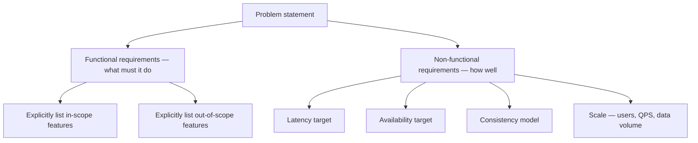
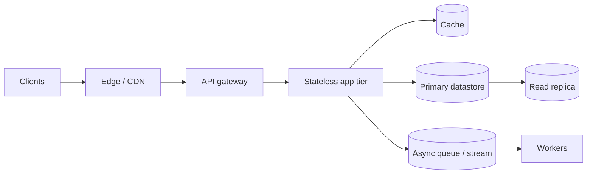

# How to Approach a Design Problem

A repeatable four-phase framework: clarify, estimate, design, then argue tradeoffs. Every walkthrough in this guide follows this shape — use it verbatim on problems not covered here.

> **Related:** Problem map → [00-overview.md](00-overview.md) · Capacity math → [HTS §1 measurement and SLOs](../../high-throughput-systems/includes/01-measurement-and-slo.md) · Tradeoff frameworks → [architecture-decisions §6](../../architecture-decisions/includes/06-tradeoff-frameworks.md) · ADRs → [architecture-decisions §5](../../architecture-decisions/includes/05-adrs-and-design-docs.md)

---

## At a glance

| Phase | Question | Time budget (interview) |
|-------|----------|--------------------------|
| **1. Clarify** | What must this do, for whom, at what scale? | 5 min |
| **2. Estimate** | How many requests, how much data, what ratio of reads to writes? | 5 min |
| **3. Design** | What are the boxes and how do they connect? | 15–20 min |
| **4. Tradeoffs** | Where does this break first, and what's the fix? | 10–15 min |

**Rule of thumb:** Never draw a box before you've written down at least one number. Scale determines architecture — a 100 QPS(Queries Per Second) service and a 1M QPS service solving "the same" problem look nothing alike.

---

## Phase 1 — Clarify scope and requirements

| Ask | Why |
|-----|-----|
| Who are the users and what's the core action? | Separates "must have" from "nice to have" |
| Read-heavy or write-heavy? | Determines whether you optimize the write path or the read path first |
| What consistency does the user expect? | Read-your-writes vs eventual changes the whole design — see [PG §14](../../postgresql-performance/includes/14-consistency-promises-and-costs.md) |
| What's explicitly out of scope? | Interviewers (and stakeholders) reward saying "I'm not designing X" over silently ignoring it |

**NFR(Non-Functional Requirement) checklist:** latency (p50/p99), availability (SLA/SLO(Service Level Objective)), durability, consistency, and expected growth over 1–3 years. Write these down before phase 2 — they are your estimate inputs.

---

## Phase 2 — Back-of-envelope estimates

| Quantity | Formula | Example |
|----------|---------|---------|
| **Requests/sec** | DAU × actions/day / 86,400 | 10M DAU × 5 posts/day / 86,400 ≈ 580 writes/sec |
| **Peak QPS** | Average × peak factor (2–10×) | 580 × 5 ≈ 2,900 writes/sec at peak |
| **Storage/year** | Records/day × record size × 365 | 50M rows/day × 500 B × 365 ≈ 9 TB/year |
| **Bandwidth** | QPS × payload size | 3,000 QPS × 2 KB ≈ 6 MB/s |
| **Read:write ratio** | Reads/sec ÷ writes/sec | 100:1 for a feed, ~1:1 for chat |

Full throughput vocabulary (Little's Law, concurrency vs latency vs throughput) → [HTS §1](../../high-throughput-systems/includes/01-measurement-and-slo.md).

**Rule of thumb:** Round aggressively (powers of 10) — the point is to find which resource saturates first, not to produce a precise number.

---

## Phase 3 — Layered architecture

Draw layers in the same order every time, then fill in only what's non-default for this problem:

| Layer | Default choice | Deep dive |
|-------|-----------------|-----------|
| Edge / CDN(Content Delivery Network) | Cache static + cacheable GET | [HTS §2 entry and edge](../../high-throughput-systems/includes/02-entry-and-edge.md) |
| Gateway | AuthN, coarse rate limits, routing | [api-design-and-protection §3](../../api-design-and-protection/includes/03-api-gateway.md) |
| App tier | Stateless, horizontally scaled | [api-design-and-protection §11](../../api-design-and-protection/includes/11-stateless-architecture.md) |
| Cache | Cache-aside, TTL by data class | [HTS §4 caching layers](../../high-throughput-systems/includes/04-caching-layers.md) |
| Primary store | PostgreSQL unless a reason to deviate | [postgresql-performance](../../postgresql-performance/README.md) |
| Async | Queue for anything not needed synchronously | [HTS §6 async, queues, workers](../../high-throughput-systems/includes/06-async-queues-workers.md) |

Only deviate from a default when the requirements (phase 1) or the numbers (phase 2) force it — and say why out loud.

---

## Phase 4 — Name the bottleneck, argue the tradeoff

Every design has a next bottleneck. State it, state the fix, and state what the fix costs.

| Say this | Not this |
|----------|----------|
| "At 5,000 writes/sec this table's index maintenance becomes the ceiling, so I'd partition by `created_at` and revisit sharding only if writes cross one node's capacity" | "We'd shard it" (no number, no reason) |
| "Fan-out on write costs O(followers) per post; a celebrity with 50M followers makes that untenable, so I'd hybridize" | Picking fan-out on write or read with no mention of the skew case |
| "Redis as the single source of truth loses data on eviction; I'd keep PostgreSQL as system of record and treat Redis as derived" | Treating a cache as a database |

Tradeoff articulation framework (cost/benefit, reversibility, blast radius) → [architecture-decisions §6](../../architecture-decisions/includes/06-tradeoff-frameworks.md). For a real design doc, capture the decision as an ADR → [architecture-decisions §5](../../architecture-decisions/includes/05-adrs-and-design-docs.md).

---

## Common mistakes

| Mistake | Fix |
|---------|-----|
| Jumping to boxes before writing any numbers | Phase 2 before phase 3, always |
| Treating every problem as "just add a cache" | Name *why* a cache helps for these specific read patterns |
| No mention of failure modes | Ask "what happens when the cache/queue/DB is down" for at least one component |
| Silence on data model | Sketch the primary tables/keys even in a 45-minute interview — it forces you to confront access patterns |
| Ending on the happy path | Always close with bottlenecks + one clear next step, as every walkthrough in [00-overview.md](00-overview.md) does |