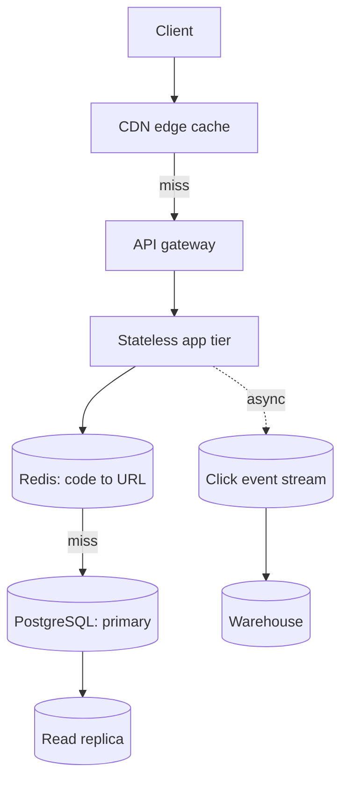

# URL Shortener

The classic first interview problem: deceptively simple write path, and a read path (redirects) that must survive viral spikes with single-digit-millisecond latency.

> **Related:** Framework → [01-how-to-approach.md](01-how-to-approach.md) · Caching a hot read path → [HTS §4](../../high-throughput-systems/includes/04-caching-layers.md) · ID generation and write scale → [postgresql-performance §9](../../postgresql-performance/includes/09-views-functions-and-scale-out-terminology.md) · Analytics pipeline (optional) → [HTS §14](../../high-throughput-systems/includes/14-message-brokers-and-queues.md)

---

## Requirements

| Type | Requirement |
|------|-------------|
| **Functional** | Create a short code for a long URL; redirect short code → long URL; optional custom aliases; optional expiry |
| **Functional (optional)** | Click analytics (count, referrer, geography) |
| **Non-functional** | Redirect latency in single-digit ms at p99; short codes are effectively unique; redirects available even if the write path is degraded |
| **Scale assumption** | 100M new URLs/month; 100:1 read:write ratio (redirects vastly outnumber creates) |

**Out of scope (say this explicitly):** malware/phishing scanning, full analytics dashboards, user accounts — mention they exist, don't design them.

---

## Back-of-envelope

| Quantity | Math | Result |
|----------|------|--------|
| Writes/sec | 100M / month ÷ 2.6M sec/month | ~40 writes/sec average |
| Reads/sec (100:1) | 40 × 100 | ~4,000 reads/sec average |
| Peak reads/sec (5×) | 4,000 × 5 | ~20,000 reads/sec peak |
| Storage/year | 1.2B URLs/year × ~500 B/row | ~600 GB/year (rows only — cheap) |
| 5-year code space (base62, 7 chars) | 62^7 ≈ 3.5 trillion | Vastly exceeds 6B URLs over 5 years |

**Rule of thumb:** This is a **read-scaling problem with a trivial write path** — most of the design effort goes into the redirect hot path, not URL creation.

---

## High-level architecture



Redirect path: `Edge cache → Redis → replica → primary`, in that order, each layer absorbing most of the traffic that misses the one before it.

---

## Data model and IDs

```sql
CREATE TABLE urls (
  code        text PRIMARY KEY,       -- base62, 7 chars
  long_url    text NOT NULL,
  created_at  timestamptz NOT NULL DEFAULT now(),
  expires_at  timestamptz,
  owner_id    bigint
);
```

| Approach | How | Tradeoff |
|----------|-----|----------|
| **Random + collision check** | Generate random base62 string, `INSERT ... ON CONFLICT` retry | Simple; rare retries at high write volume |
| **Counter + base62 encode** | Auto-increment ID (or Snowflake-style distributed ID) encoded to base62 | No collisions; needs a distributed ID generator once one DB can't hand out IDs fast enough |
| **Pre-generated key pool** | Offline batch generates unused codes into a pool table; app pops one per request | Removes hot-path collision handling entirely; classic "key generation service" design |

At 40 writes/sec, a single PostgreSQL primary with a sequence or pre-generated pool comfortably clears this — don't over-engineer a distributed ID generator until writes are orders of magnitude higher. If write volume grows, see sharding vs partitioning terminology → [PG §9](../../postgresql-performance/includes/09-views-functions-and-scale-out-terminology.md).

---

## APIs

| Endpoint | Behavior |
|----------|----------|
| `POST /urls` `{ long_url, custom_alias?, ttl? }` → `{ code, short_url }` | Validate URL, generate/reserve code, write row |
| `GET /{code}` | Look up `code` → `301`/`302` redirect to `long_url`; emit async click event |
| `DELETE /urls/{code}` | Owner-only; soft delete |

**301 vs 302:** `301` (permanent) lets browsers/CDNs cache the redirect, cutting origin load further — but breaks click analytics on cached hits. `302` (temporary) guarantees every click reaches the app for analytics, at the cost of edge caching. Choose based on whether analytics matters more than raw redirect throughput; state this tradeoff out loud.

---

## Scaling bottlenecks

| Bottleneck | Symptom | Fix |
|------------|---------|-----|
| **Redirect read hot path** | Redis/DB saturated on a viral link | Cache-aside with long TTL (codes are immutable) + CDN(Content Delivery Network) edge caching for `301` — [HTS §4](../../high-throughput-systems/includes/04-caching-layers.md) |
| **Hot single key** | One viral code hammers one Redis shard | Key-sharding / local shadow cache — [HTS §4 hot key problem](../../high-throughput-systems/includes/04-caching-layers.md#hot-key-problem) |
| **Write contention on ID generation** | Sequence or pool contends under high create rate | Pre-allocate ID ranges per app instance, or move to distributed ID scheme |
| **Analytics writes on the hot path** | Redirect latency degrades from synchronous click logging | Emit async event to a queue/stream; never block the redirect — [HTS §14](../../high-throughput-systems/includes/14-message-brokers-and-queues.md) |
| **Table growth** | Single `urls` table bloats indexes over years | Partition by `created_at` if retention/archival is needed — [PG §9](../../postgresql-performance/includes/09-views-functions-and-scale-out-terminology.md) |

---

## Common mistakes

| Mistake | Fix |
|---------|-----|
| Designing a distributed ID generator on day one | A single sequence or pre-generated pool handles far more scale than most designs need |
| Synchronous analytics writes on every redirect | Async event emission — the redirect must never wait on analytics |
| Forgetting the cache-miss stampede case | Singleflight/jittered TTL on cache population — [HTS §4](../../high-throughput-systems/includes/04-caching-layers.md#cache-stampede-and-thundering-herd) |
| No expiry/cleanup story | Decide TTL policy for unused codes and note it, even if "never expire" is the answer |
| Ignoring malicious redirect targets | Mention a URL-safety check exists (out of scope for deep design), don't silently skip it |

## Pros and cons

### Random code + collision retry
**Pros:** No shared counter to bottleneck; simple to shard writes across many DB instances.
**Cons:** Collision probability rises as the keyspace fills; needs monitoring on retry rate.

### Pre-generated key pool
**Pros:** Zero collision handling on the hot path; predictable latency.
**Cons:** Extra offline generation pipeline; pool exhaustion risk if generation lags consumption.