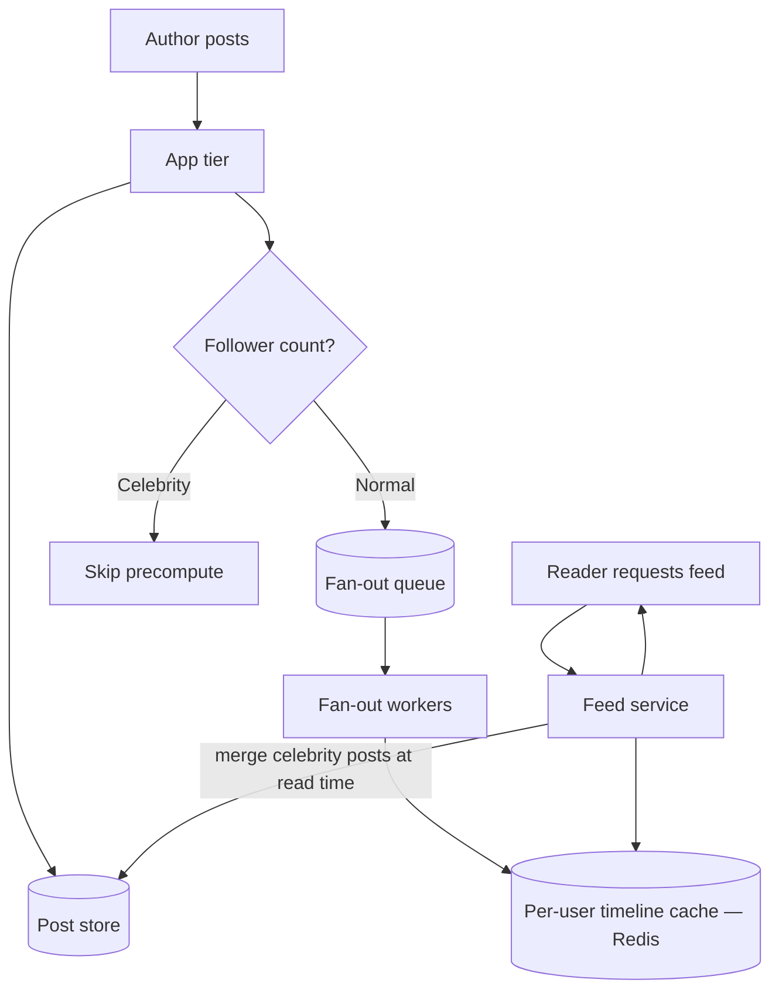
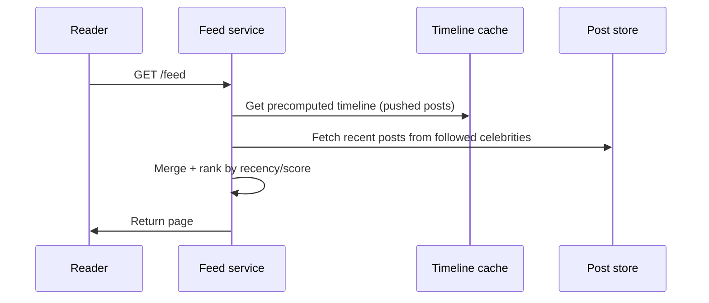

# News Feed

The canonical fan-out problem: precompute per-user timelines for fast reads (fan-out on write), or merge at read time (fan-out on read) — and neither works alone once a user has 50 million followers.

> **Related:** Framework → [01-how-to-approach.md](01-how-to-approach.md) · Async fan-out workers → [HTS §6](../../high-throughput-systems/includes/06-async-queues-workers.md) · Message brokers for fan-out → [HTS §14](../../high-throughput-systems/includes/14-message-brokers-and-queues.md) · Timeline cache → [HTS §4](../../high-throughput-systems/includes/04-caching-layers.md) · Ranking/relevance storage → [data-platforms §2](../../data-platforms/includes/02-search-systems.md)

---

## Requirements

| Type | Requirement |
|------|-------------|
| **Functional** | Users follow other users; posting fans out to followers' feeds; `GET /feed` returns a ranked/chronological page |
| **Non-functional** | Feed reads under ~200ms p99; new posts visible to followers within seconds; feed available even while the posting path is degraded |
| **Scale assumption** | 500M users, 200 average followers, celebrities with 50M+ followers, 100M posts/day |

---

## Back-of-envelope

| Quantity | Math | Result |
|----------|------|--------|
| Posts/sec | 100M / 86,400 | ~1,150 writes/sec average |
| Feed reads/sec | 500M DAU × 20 feed loads/day / 86,400 | ~115,000 reads/sec average |
| Fan-out writes (naive, per post) | 1,150 posts/sec × 200 avg followers | ~230,000 feed-entry writes/sec |
| Celebrity post fan-out | One post × 50M followers | 50M feed-entry writes from a single post |

The celebrity row is the whole problem: average-case fan-out is manageable, worst-case fan-out is not.

**Rule of thumb:** This is a **write-amplification problem** disguised as a read problem — the fix is almost always a hybrid, not a single strategy.

---

## High-level architecture



---

## Fan-out on write vs fan-out on read

| Strategy | Write cost | Read cost | Best for |
|----------|------------|-----------|----------|
| **Fan-out on write (push)** | O(followers) per post — precompute every follower's timeline entry | O(1) — read precomputed list | Normal users; read-heavy overall traffic |
| **Fan-out on read (pull)** | O(1) — just store the post | O(following) — merge posts from everyone you follow at read time | Celebrities; accounts with extreme follower counts |
| **Hybrid (used in production)** | Push for normal accounts, pull-and-merge for celebrity accounts | Feed service merges precomputed timeline + celebrity posts fetched live | Default recommendation at this scale |



**The celebrity problem, precisely:** fan-out on write turns one write into millions; fan-out on read turns every follower's feed read into a fan-in across everyone they follow. Neither degenerate case is acceptable at the extremes — hence the hybrid, with a follower-count threshold deciding which path a given author's posts take.

---

## Data model and APIs

```sql
CREATE TABLE posts (
  post_id     bigint PRIMARY KEY,
  author_id   bigint NOT NULL,
  body        text NOT NULL,
  created_at  timestamptz NOT NULL DEFAULT now()
);

CREATE TABLE follows (
  follower_id  bigint NOT NULL,
  followee_id  bigint NOT NULL,
  PRIMARY KEY (follower_id, followee_id)
);
```

Timeline cache (Redis, per user): a bounded sorted list of `(post_id, score)`, e.g. `ZADD timeline:{user_id} {timestamp} {post_id}`, trimmed to the last N entries.

| Endpoint | Behavior |
|----------|----------|
| `POST /posts` | Write post; enqueue fan-out job (or skip if author is a celebrity) |
| `GET /feed?cursor=` | Merge cached timeline + live celebrity posts; paginate by cursor |
| `POST /follow/{user_id}` | Insert edge; optionally backfill recent posts into the new follower's timeline |

---

## Scaling bottlenecks

| Bottleneck | Symptom | Fix |
|------------|---------|-----|
| **Fan-out write amplification** | Queue backlog spikes after high-follower-count posts | Celebrity threshold routes to pull-based merge instead of push — see hybrid above |
| **Fan-out worker throughput** | Followers see delayed posts | Scale workers on queue depth; partition fan-out jobs by author shard — [HTS §6](../../high-throughput-systems/includes/06-async-queues-workers.md) |
| **Timeline cache size** | Redis memory grows with users × timeline length | Bound timeline length (e.g. last 800 posts); evict cold users' timelines and rebuild on demand |
| **Backfill on new follow** | Following a celebrity triggers a large read, not a write, thankfully — but following many accounts at once can spike reads | Lazy-load timeline on first feed request instead of eager backfill |
| **Ranking beyond chronological** | Pure recency sort feels bad at scale | Precompute or cache a ranking score; treat as a read-model — [event-sourcing-and-cqrs §2](../../event-sourcing-and-cqrs/includes/02-cqrs-and-read-models.md) |

---

## Common mistakes

| Mistake | Fix |
|---------|-----|
| Picking pure fan-out on write and ignoring celebrities | Always ask about follower-count skew; propose the hybrid |
| Treating the timeline cache as the source of truth | Posts table is the system of record; timeline cache is derived and rebuildable — [data-platforms rule of thumb](../../data-platforms/includes/00-overview.md) |
| Synchronous fan-out on the post-creation request | Async queue; the author shouldn't wait for millions of writes |
| No pagination strategy on feed reads | Cursor-based pagination, not offset, for infinite scroll at scale |
| Ignoring feed staleness expectations | State the freshness SLO(Service Level Objective) — "new post visible within N seconds" — explicitly |

## Pros and cons

### Fan-out on write
**Pros:** O(1) reads; simple feed service.
**Cons:** Write amplification; wasted work fanning out to inactive followers.

### Fan-out on read
**Pros:** O(1) writes; no wasted precompute for inactive followers.
**Cons:** Expensive reads; harder to rank/merge consistently across many sources.