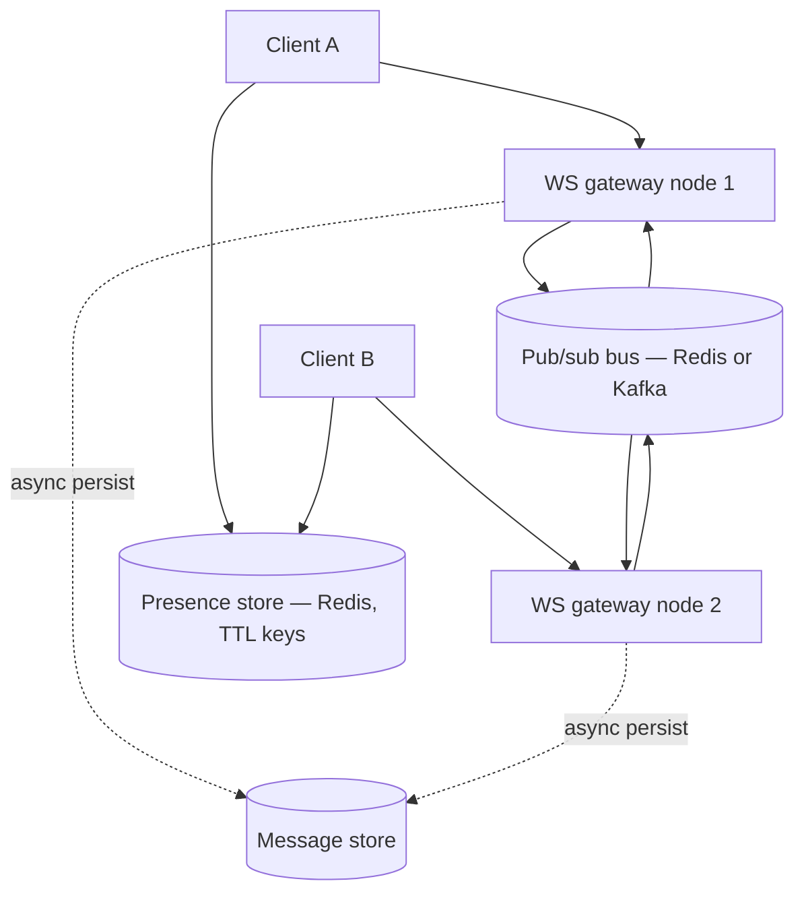
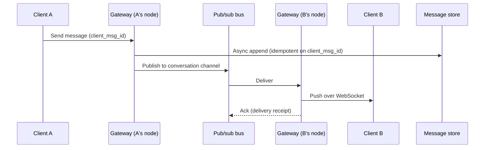

# Chat and Presence

A bidirectional, low-latency fan-out problem: messages must reach connected clients in near real time, and "who's online" is a separate, much higher-churn problem than message delivery.

> **Related:** Framework → [01-how-to-approach.md](01-how-to-approach.md) · Transport choice (WebSocket/SSE(Server-Sent Events)/polling) → [fullstack-bff-and-clients §5](../../fullstack-bff-and-clients/includes/05-realtime-ux.md) · Server-side async streaming → [api-design-and-protection §10C](../../api-design-and-protection/includes/10C-async-streaming.md) · Delivery semantics and dedup → [resilience-patterns §8](../../resilience-patterns/includes/08-delivery-semantics.md) · Message brokers for cross-node fan-out → [HTS §14](../../high-throughput-systems/includes/14-message-brokers-and-queues.md)

---

## Requirements

| Type | Requirement |
|------|-------------|
| **Functional** | 1:1 and group messaging; message history; online/offline/last-seen presence |
| **Non-functional** | Message delivery latency in low hundreds of ms; at-least-once delivery with client-side dedup; presence reflects reality within seconds, not minutes |
| **Scale assumption** | 50M concurrent connections, 500K messages/sec at peak, group chats up to a few hundred members |

**Out of scope (say this explicitly):** end-to-end encryption key management, media/attachment pipeline (see [09-video-streaming-basics.md](09-video-streaming-basics.md) for the upload/transcode shape if needed).

---

## Back-of-envelope

| Quantity | Math | Result |
|----------|------|--------|
| Concurrent WS connections | 50M | Needs many gateway nodes; a single node holds tens of thousands of sockets, not millions |
| Messages/sec | 500K peak | Each message may fan out to multiple recipients in a group |
| Connections per gateway node | ~50K–100K (OS/socket limited) | ~500–1,000 gateway nodes for 50M connections |
| Presence heartbeat writes | 50M connections × 1 heartbeat / 15–30s | ~1.7M–3.3M presence writes/sec — this is the real volume problem |

**Rule of thumb:** Presence churns far faster than messages. Design presence as a **high-write, short-TTL(Time To Live), eventually-consistent** system — never route it through the same durable store as message history.

---

## High-level architecture



**Why a bus between gateway nodes:** client A and client B are almost never connected to the same gateway process. A gateway node that receives a message must publish it to a bus that every other gateway node subscribes to, so whichever node holds the recipient's socket can push it down.

---

## Message delivery flow



Client-generated `client_msg_id` is the idempotency key — required because at-least-once delivery means a client or gateway retry can resend the same message. See systemwide idempotency → [resilience-patterns §6](../../resilience-patterns/includes/06-idempotency-systemwide.md).

---

## Data model

```sql
CREATE TABLE messages (
  conversation_id  bigint NOT NULL,
  message_id       bigint NOT NULL,
  sender_id        bigint NOT NULL,
  client_msg_id    uuid NOT NULL,
  body             text NOT NULL,
  created_at       timestamptz NOT NULL DEFAULT now(),
  PRIMARY KEY (conversation_id, message_id)
) PARTITION BY HASH (conversation_id);

CREATE UNIQUE INDEX ON messages (conversation_id, client_msg_id);
```

Partitioning by `conversation_id` keeps a conversation's messages co-located and spreads write load across nodes — see partitioning vs sharding terminology → [PG §9](../../postgresql-performance/includes/09-views-functions-and-scale-out-terminology.md).

Presence: `SET presence:{user_id} "online" EX 30` refreshed on each heartbeat; absence of the key means offline. No durable table — presence is derived state, not a system of record.

| Endpoint / channel | Behavior |
|---------------------|----------|
| `WS connect` | AuthN(Authentication), subscribe to user's conversation channels on the bus |
| `WS send {conversation_id, client_msg_id, body}` | Persist async, publish to bus, ack to sender |
| `GET /conversations/{id}/messages?cursor=` | Paginated history from the message store |
| `GET /presence/{user_id}` | Read presence key; TTL expiry implies offline |

---

## Scaling bottlenecks

| Bottleneck | Symptom | Fix |
|------------|---------|-----|
| **Cross-node fan-out** | Messages don't reach recipients on a different gateway node | Pub/sub bus (Redis Pub/Sub for smaller scale, Kafka for durable replay) between all gateway nodes |
| **Presence write volume** | Millions of heartbeat writes/sec | Redis with short TTL, not a durable DB; batch/debounce heartbeats client-side |
| **Group chat fan-out** | A 500-person group multiplies each message by 500 deliveries | Same push-fan-out tradeoffs as [03-news-feed.md](03-news-feed.md); cap group size or fan out asynchronously for very large groups |
| **Reconnect storms** | A gateway restart drops thousands of sockets at once, all clients reconnect simultaneously | Jittered exponential backoff on the client — [fullstack §5](../../fullstack-bff-and-clients/includes/05-realtime-ux.md) |
| **Message store write throughput** | Single-partition hot conversation | Hash-partition by `conversation_id`; see [PG §9](../../postgresql-performance/includes/09-views-functions-and-scale-out-terminology.md) |
| **Delivery guarantees vs ordering** | Out-of-order delivery in a group | Sequence number per conversation; client reorders on receipt |

---

## Common mistakes

| Mistake | Fix |
|---------|-----|
| Treating presence as strongly consistent | It's inherently stale by design — TTL heartbeats, not synchronous status updates |
| Storing presence in the same durable store as messages | Redis with TTL; presence is a cache of recent activity, not business state |
| No idempotency key on send | Duplicate messages on retry — always dedupe on `client_msg_id` |
| One socket per browser tab | Shared connection via a leader tab / shared worker — [fullstack §5](../../fullstack-bff-and-clients/includes/05-realtime-ux.md) |
| Assuming sender and recipient share a gateway node | Requires a bus; this is the core insight of the whole design |

## Pros and cons

### Redis Pub/Sub as the inter-gateway bus
**Pros:** Low latency; simple ops; good enough when message loss on a gateway crash is acceptable (client can resend from `client_msg_id`).
**Cons:** No replay/durability — a subscriber that's briefly down misses messages published during the gap.

### Kafka as the inter-gateway bus
**Pros:** Durable, replayable, natural fit if message history also flows through the same pipeline for other consumers (search indexing, analytics).
**Cons:** Higher latency and operational surface than Redis Pub/Sub for a pure low-latency delivery path.