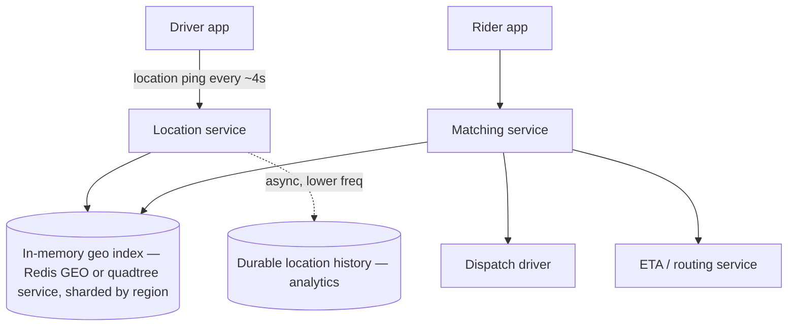
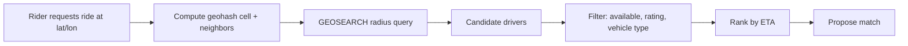

# Ride-Sharing and Geolocation

A high-frequency-write, spatial-query problem: driver locations change every few seconds, and matching a rider to a nearby driver must complete in well under a second.

> **Related:** Framework → [01-how-to-approach.md](01-how-to-approach.md) · Spatial index structures → [tree-and-index-structures §3 specialized trees](../../tree-and-index-structures/includes/03-specialized-trees.md) · Sharding by region → [postgresql-performance §9](../../postgresql-performance/includes/09-views-functions-and-scale-out-terminology.md) · Timeouts on the matching call → [resilience-patterns §1](../../resilience-patterns/includes/01-timeouts.md) · Caching hot routes/ETAs → [HTS §4](../../high-throughput-systems/includes/04-caching-layers.md)

---

## Requirements

| Type | Requirement |
|------|-------------|
| **Functional** | Drivers report location continuously; riders request a ride; system matches rider to a nearby available driver; ETA(Estimated Time of Arrival) shown to both sides |
| **Non-functional** | Match latency under ~1s; location freshness within a few seconds; tolerate driver-app disconnects gracefully |
| **Scale assumption** | 5M active drivers, location update every 4s, 100K ride requests/min at peak in dense metros |

---

## Back-of-envelope

| Quantity | Math | Result |
|----------|------|--------|
| Location updates/sec | 5M drivers / 4s interval | ~1.25M writes/sec globally |
| Per-region updates/sec | Split across ~50 major metros unevenly | Tens of thousands/sec in the busiest metro |
| Match requests/sec | 100K/min | ~1,700/sec at peak |
| Nearby-driver query | Radius search over active drivers in one metro | Must be sub-100ms to leave budget for matching logic |

**Rule of thumb:** Location writes vastly outnumber match requests — optimize the write path for **cheap, lossy, frequent updates** and keep the read path (nearby search) in memory.

---

## High-level architecture



The geo index is the hot path; the durable store is for analytics/audit and is updated asynchronously, not on every ping.

---

## Geospatial indexing

| Approach | How | Tradeoff |
|----------|-----|----------|
| **Geohash** | Encode lat/lon into a string prefix; nearby points share prefixes | Simple, works with any key-value store; edge cases at cell boundaries need neighbor-cell lookups |
| **Quadtree** | Recursively subdivide space into quadrants based on density | Adapts to uneven driver density; more complex to shard/replicate |
| **Redis `GEOADD`/`GEOSEARCH`** | Redis's built-in geospatial commands (geohash internally) | Production-friendly: in-memory, low-latency, minimal custom code |
| **R-tree / KD-tree** | Bounding-box or k-dimensional spatial trees | Better for arbitrary shapes and static datasets; less common for constantly-moving points |

Deeper structural tradeoffs (when a KD-tree or R-tree fits vs a hash-based approach) → [tree-and-index-structures §3](../../tree-and-index-structures/includes/03-specialized-trees.md#r-tree-and-variants).



**Rule of thumb:** Default to Redis `GEOADD`/`GEOSEARCH` sharded by metro/region. Reach for a custom quadtree service only when density is extremely uneven or Redis's radius-query model doesn't fit the ranking logic.

---

## Data model and APIs

```sql
-- Durable / analytics store — not the hot matching path
CREATE TABLE location_history (
  driver_id   bigint NOT NULL,
  lat         double precision NOT NULL,
  lon         double precision NOT NULL,
  recorded_at timestamptz NOT NULL,
  region      text NOT NULL
) PARTITION BY LIST (region);
```

Hot path lives in Redis, not PostgreSQL: `GEOADD drivers:{region} {lon} {lat} {driver_id}`, updated on every ping and re-read on every match query.

| Endpoint | Behavior |
|----------|----------|
| `POST /drivers/{id}/location` | Update Redis geo index for the driver's region; fire-and-forget durable log |
| `POST /rides` `{ pickup_lat, pickup_lon }` | Query nearby drivers, filter, rank, propose match, hold a short reservation |
| `POST /rides/{id}/accept` | Driver accepts; remove from candidate pool; start trip |
| `GET /rides/{id}/eta` | Query routing/ETA service, cache short-TTL(Time To Live) result per route segment |

---

## Scaling bottlenecks

| Bottleneck | Symptom | Fix |
|------------|---------|-----|
| **Location write volume** | Redis CPU saturated on `GEOADD` at peak | Shard geo index by region/metro; drop/batch updates for stationary drivers |
| **Hot metro (e.g. downtown at rush hour)** | One region's shard becomes a hotspot | Sub-shard a dense metro into finer geohash cells, each mapped to its own Redis shard |
| **Stale driver entries** | Disconnected drivers still "available" in the index | TTL on geo entries; heartbeat-driven expiry, same pattern as presence in [04-chat-and-presence.md](04-chat-and-presence.md) |
| **Match race conditions** | Two riders matched to the same driver | Short-lived reservation with a fencing token before final accept — [resilience-patterns §7 distributed locks](../../resilience-patterns/includes/07-distributed-locks.md) |
| **ETA computation cost** | Routing calls to an external/internal maps service are slow | Cache common route segments; precompute for popular corridors — [HTS §4](../../high-throughput-systems/includes/04-caching-layers.md) |
| **Cross-region matching** | Rider near a region boundary gets no candidates | Query neighbor geohash cells, not just the exact cell |

---

## Common mistakes

| Mistake | Fix |
|---------|-----|
| Storing live driver location only in PostgreSQL | Use an in-memory geo index for the hot path; PostgreSQL/warehouse for durable history only |
| No TTL on driver location entries | Ghost drivers matched after they've gone offline |
| Matching without a reservation step | Double-booking the same driver under concurrent requests |
| Treating ETA as free | It's an external dependency — apply timeouts and a fallback estimate — [resilience-patterns §1](../../resilience-patterns/includes/01-timeouts.md) |
| Ignoring region boundary effects | Always search neighbor cells around the query point, not just one cell |

## Pros and cons

### Redis GEO commands
**Pros:** Simple, fast, well-understood; good default for most ride-matching scale.
**Cons:** Single-region Redis instance still bounded by one shard's throughput; needs app-level sharding for very dense metros.

### Custom quadtree service
**Pros:** Adapts to uneven density; can encode richer ranking directly into tree traversal.
**Cons:** More code to build and operate; harder to reason about consistency during concurrent updates.