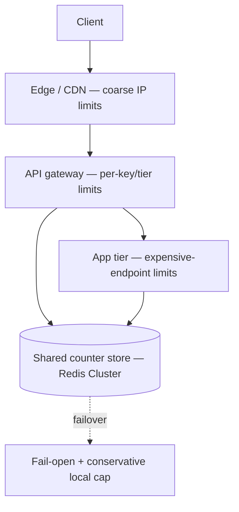
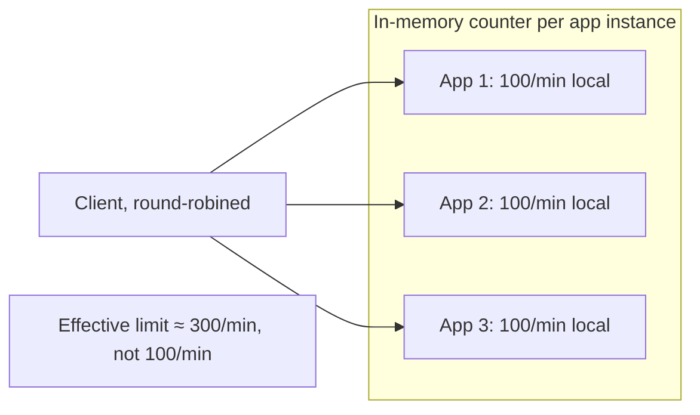

# Distributed Rate Limiter

The interview trap: candidates dive straight into token bucket vs sliding window and never design the *system* — where it runs, what stores the counters, and what happens when that store degrades. This walkthrough is deliberately light on algorithms; [api-rate-limiting](../../api-rate-limiting/README.md) already owns that in depth.

> **Scope:** **System-level design** for an interview or design doc — topology, storage, deployment layers, and failure modes. Algorithm selection (token bucket, sliding window, etc.) → [api-rate-limiting §1–§5](../../api-rate-limiting/includes/01-fixed-window.md). Production Redis topology and key design in depth → [api-rate-limiting §12](../../api-rate-limiting/includes/12-distributed-rate-limiting.md).
>
> **Related:** Framework → [01-how-to-approach.md](01-how-to-approach.md) · Where to enforce limits in the stack → [api-rate-limiting §7](../../api-rate-limiting/includes/07-deployment-layers.md) · Backpressure beyond rate limiting → [HTS §9](../../high-throughput-systems/includes/09-backpressure-and-limits.md)

---

## Requirements

| Type | Requirement |
|------|-------------|
| **Functional** | Limit requests per identity (API key, user, IP) to N per window; reject over-limit requests with a clear signal |
| **Non-functional** | Limiter adds minimal latency (low single-digit ms); works correctly across many stateless app/gateway instances; degrades predictably if the counter store is unavailable |
| **Scale assumption** | 200K requests/sec across the fleet; limiter must not become the new bottleneck |

**The one sentence that reframes the interview:** *"A rate limiter is a shared counter with a consistency and availability tradeoff — the algorithm is the easy 20%; the storage and failure-mode design is the other 80%."*

---

## Back-of-envelope

| Quantity | Math | Result |
|----------|------|--------|
| Requests/sec needing a limiter check | 200K/sec | Every request pays at least one counter round trip unless coalesced |
| Distinct identities (keys) | ~1M active API(Application Programming Interface) keys/users | One counter per identity per window — moderate key cardinality for Redis |
| Limiter overhead budget | p99 latency budget ~2ms for the check | Rules out a naive DB read; Redis or in-process approximation required |

---

## High-level architecture



This is the same layered enforcement model as [api-rate-limiting §7 deployment layers](../../api-rate-limiting/includes/07-deployment-layers.md) — a walkthrough should mention **all three layers** (edge, gateway, app), not just one.

---

## Why this is a systems problem, not an algorithms problem



With N stateless replicas behind a load balancer, an in-process counter multiplies the real limit by N. The fix is a **shared store** — full topology, key design, hot-key mitigation, clock skew handling, and regional vs global quotas are covered in depth at [api-rate-limiting §12](../../api-rate-limiting/includes/12-distributed-rate-limiting.md). Restate the key points here rather than duplicating:

| Concern | Default answer | Deep dive |
|---------|------------------|-----------|
| **Store** | Redis Cluster, sharded by identity | [api-rate-limiting §12](../../api-rate-limiting/includes/12-distributed-rate-limiting.md#redis-topologies) |
| **Key shape** | `ratelimit:{scope}:{identity}:{window}` | [api-rate-limiting §12 key design](../../api-rate-limiting/includes/12-distributed-rate-limiting.md#key-design) |
| **Clock skew** | TTL-anchored windows, not wall-clock comparison across nodes | [api-rate-limiting §12](../../api-rate-limiting/includes/12-distributed-rate-limiting.md#clock-skew-and-window-boundaries) |
| **Hot identity** | Sub-shard keys or local approximate + periodic sync | [api-rate-limiting §12](../../api-rate-limiting/includes/12-distributed-rate-limiting.md#key-design) |
| **Store down** | Fail-open with a conservative local cap (document the policy) | [api-rate-limiting §11](../../api-rate-limiting/includes/11-common-mistakes-and-architecture.md) |

---

## Data model / API surface

The limiter is usually an internal check, not a public API:

```text
CHECK(scope, identity, cost) -> { allowed: bool, remaining: int, reset_at: timestamp }
```

Response headers on a limited public API: `X-RateLimit-Limit`, `X-RateLimit-Remaining`, `Retry-After` on `429` — response strategy detail → [api-rate-limiting §9](../../api-rate-limiting/includes/09-response-strategies.md).

Algorithm choice for the `CHECK` implementation (token bucket vs sliding window counter vs leaky bucket) is a five-minute decision once requirements are clear — use the decision guide → [api-rate-limiting §10](../../api-rate-limiting/includes/10-decision-guide.md), then spend the remaining interview time on topology and failure modes above.

---

## Scaling bottlenecks

| Bottleneck | Symptom | Fix |
|------------|---------|-----|
| **Redis round trip on every request** | Added latency at 200K req/sec | Batch checks where possible; enforce coarse limits at the edge/gateway so only a subset reach app-tier Redis checks |
| **Hot identity (one very active API key)** | Single Redis key/slot saturates | Sub-shard the key or use local-approximate + periodic sync — [api-rate-limiting §12](../../api-rate-limiting/includes/12-distributed-rate-limiting.md#key-design) |
| **Multi-region deployment** | Cross-region Redis round trips add latency; global quota needs coordination | Regional counters + optional lower global cap — [api-rate-limiting §12 global vs regional](../../api-rate-limiting/includes/12-distributed-rate-limiting.md#global-vs-regional-counters) |
| **Counter store outage** | Every request blocked on a dead dependency | Fail-open + emergency local cap, never fail-closed on a non-critical dependency — [HTS §9 backpressure](../../high-throughput-systems/includes/09-backpressure-and-limits.md) |

---

## Common mistakes

| Mistake | Fix |
|---------|-----|
| Spending the whole interview on token bucket vs sliding window math | Cover the algorithm in two sentences; spend the bulk of the time on storage, topology, and failure modes |
| Assuming a single global Redis instance for all regions | Regional counters — cross-ocean round trips on every request otherwise |
| Fail-closed when the counter store is down | Fail-open with a conservative fallback; a dead rate limiter shouldn't take down the whole API |
| Not mentioning where enforcement happens (edge vs gateway vs app) | State all three layers — [api-rate-limiting §7](../../api-rate-limiting/includes/07-deployment-layers.md) |
| Designing this in isolation from product tiers | Rate limits are a product decision as much as an engineering one — [api-design-and-protection §5](../../api-design-and-protection/includes/05-rate-limit-tiers.md) |