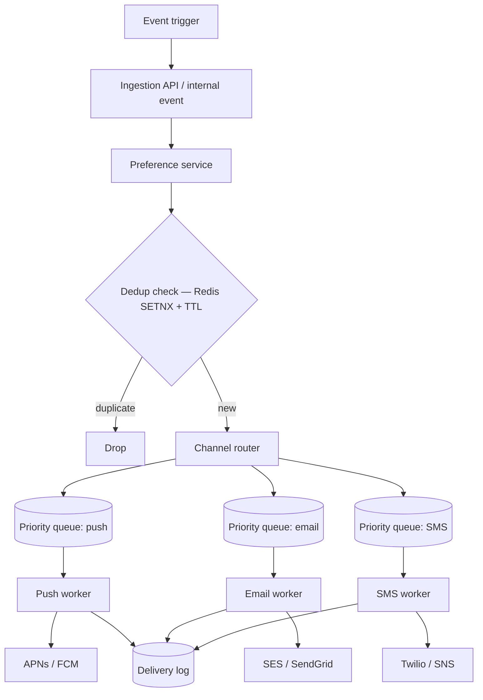
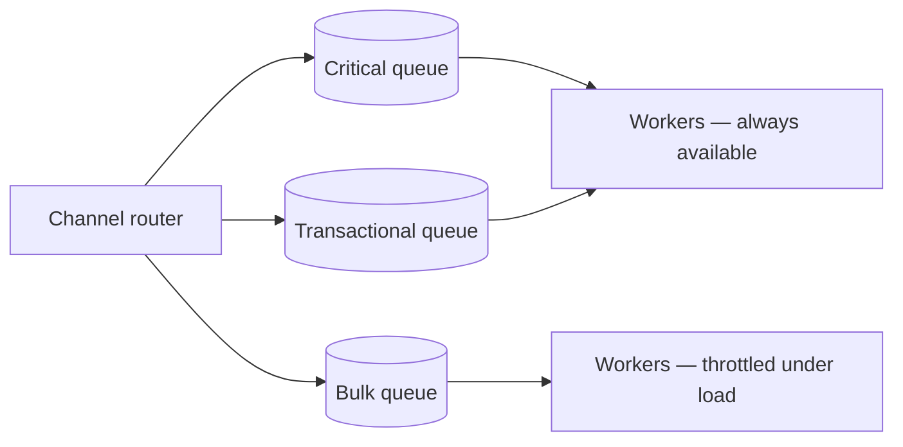

# Notification Pipeline

A fan-out and prioritization problem across heterogeneous, unreliable third-party channels — push, email, and SMS(Short Message Service) each have different latency, cost, and failure characteristics, and users must not be double-notified.

> **Related:** Framework → [01-how-to-approach.md](01-how-to-approach.md) · Reliable publish after a DB write → [event-sourcing-and-cqrs §5 async integration](../../event-sourcing-and-cqrs/includes/05-async-integration.md) · Message brokers and DLQ(Dead Letter Queue) → [HTS §14](../../high-throughput-systems/includes/14-message-brokers-and-queues.md) · Dedup and idempotency → [resilience-patterns §6](../../resilience-patterns/includes/06-idempotency-systemwide.md) · Bus product choice → [apache-kafka](../../apache-kafka/README.md)

---

## Requirements

| Type | Requirement |
|------|-------------|
| **Functional** | Send notifications via push, email, and SMS based on event triggers and user preferences; respect per-channel opt-out; avoid duplicate sends |
| **Non-functional** | Critical/security notifications delivered ahead of bulk/marketing; retries with backoff per channel; auditable delivery status |
| **Scale assumption** | 50M events/day, fan-out to multiple channels per event, occasional bulk campaigns (10M+ notifications in a burst) |

---

## Back-of-envelope

| Quantity | Math | Result |
|----------|------|--------|
| Events/sec average | 50M / 86,400 | ~580/sec |
| Notifications/sec (avg 1.5 channels/event) | 580 × 1.5 | ~870/sec average |
| Bulk campaign burst | 10M notifications over 1 hour | ~2,800/sec sustained — must not starve real-time critical notifications |
| Dedup window | Same event re-triggered within minutes (retries upstream) | Idempotency key store sized for the dedup TTL, not forever |

**Rule of thumb:** This is a **priority queueing problem** wearing a "notifications" costume — the design lives or dies on keeping low-priority bulk traffic from delaying high-priority alerts.

---

## High-level architecture



Each channel gets its own queue and worker pool because each has different throughput limits, provider rate limits, and failure modes — a slow SMS provider must never block push delivery.

---

## Priority and preferences

| Priority | Example | Queue treatment |
|----------|---------|------------------|
| **Critical** (security, OTP) | Login code, fraud alert | Dedicated high-priority queue per channel, minimal batching |
| **Transactional** | Order confirmation, password reset | Standard queue, fast SLA(Service Level Agreement) |
| **Bulk / marketing** | Weekly digest, promo | Low-priority queue; rate-limited against provider caps; throttled during high-priority bursts |

Implementation options for priority: separate queues per priority tier (simplest, recommended default) or a single queue with a priority field and a consumer that polls high-priority first. Separate queues per tier map cleanly onto per-tier scaling and backpressure policy — prefer them.



---

## Data model and dedup

```sql
CREATE TABLE notification_preferences (
  user_id     bigint NOT NULL,
  channel     text NOT NULL,   -- push, email, sms
  category    text NOT NULL,   -- transactional, marketing, security
  enabled     boolean NOT NULL DEFAULT true,
  PRIMARY KEY (user_id, channel, category)
);

CREATE TABLE delivery_log (
  notification_id  uuid PRIMARY KEY,
  user_id          bigint NOT NULL,
  channel          text NOT NULL,
  status           text NOT NULL,  -- queued, sent, delivered, failed
  provider_ref     text,
  created_at       timestamptz NOT NULL DEFAULT now()
);
```

Dedup key: `notify:dedup:{event_id}:{channel}` with `SETNX` + a TTL covering the plausible retry window of the upstream event source — same pattern as systemwide idempotency → [resilience-patterns §6](../../resilience-patterns/includes/06-idempotency-systemwide.md).

| Endpoint | Behavior |
|----------|----------|
| `POST /notify` `{ event_id, user_id, template, priority }` | Dedup check, look up preferences, route to per-channel priority queues |
| `GET /users/{id}/preferences` / `PUT` | Manage opt-in/opt-out per channel and category |
| `GET /notifications/{id}/status` | Read delivery log for support/debugging |

---

## Scaling bottlenecks

| Bottleneck | Symptom | Fix |
|------------|---------|-----|
| **Bulk campaign starving critical alerts** | Security codes delayed behind a promo blast | Separate priority queues per tier; throttle bulk workers under contention |
| **Provider rate limits** | Push/email/SMS provider throttles or bans for bursty sends | Per-provider token bucket in the worker; backoff and retry with jitter — [resilience-patterns §2](../../resilience-patterns/includes/02-retries-backoff-jitter.md) |
| **Duplicate sends on retry** | Upstream event retried, user gets notified twice | Dedup key with TTL before enqueueing, not just at the worker |
| **Slow/failing channel blocking the pipeline** | One channel's outage backs up shared infrastructure | Per-channel queues and worker pools so failures are isolated — [resilience-patterns §4 bulkheads](../../resilience-patterns/includes/04-bulkheads.md) |
| **Permanent failures piling up** | Invalid phone numbers/emails retried forever | Dead-letter queue after max attempts — [HTS §14](../../high-throughput-systems/includes/14-message-brokers-and-queues.md) |
| **Write reliability from the triggering service** | Event lost between DB write and notification trigger | Transactional outbox in the triggering service — [event-sourcing-and-cqrs §5](../../event-sourcing-and-cqrs/includes/05-async-integration.md) |

---

## Common mistakes

| Mistake | Fix |
|---------|-----|
| One shared queue for all priorities | Split by priority tier; bulk traffic must not delay critical alerts |
| No dedup layer | Idempotency key per `(event_id, channel)` before enqueueing |
| Synchronous send in the request path of the triggering service | Fire-and-forget via outbox + async pipeline; the triggering request should not wait on a push provider |
| Ignoring per-user channel preferences at send time | Check preferences before enqueueing, not just at signup |
| No dead-letter handling | Alert on DLQ depth; permanent failures need a bounded retry count, not infinite retry |