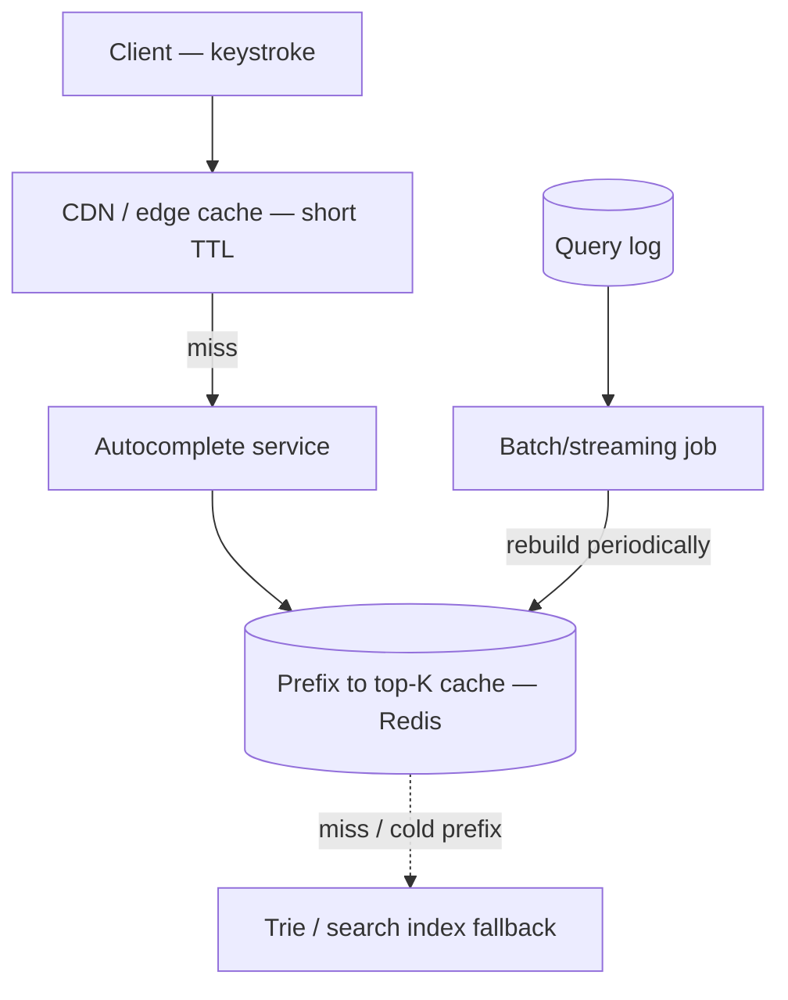

# Search Autocomplete

A latency-obsessed read problem: suggestions must return in well under 100ms, which usually rules out computing anything live and forces precomputation of top results per prefix.

> **Related:** Framework → [01-how-to-approach.md](01-how-to-approach.md) · Trie / prefix structures → [tree-and-index-structures §3](../../tree-and-index-structures/includes/03-specialized-trees.md) · Edge caching → [HTS §4](../../high-throughput-systems/includes/04-caching-layers.md) · Full-text/faceted search at scale → [data-platforms §2](../../data-platforms/includes/02-search-systems.md) · Freshness via CDC(Change Data Capture) → [HTS §15](../../high-throughput-systems/includes/15-cdc-and-search-indexing.md)

---

## Requirements

| Type | Requirement |
|------|-------------|
| **Functional** | As a user types, return top-K ranked suggestions matching the prefix |
| **Non-functional** | p99 latency under ~50–100ms; suggestions reflect trending queries within minutes to hours, not seconds |
| **Scale assumption** | 500M searches/day, keystroke-triggered queries (5–10× the search volume itself), top-K = 5–10 |

---

## Back-of-envelope

| Quantity | Math | Result |
|----------|------|--------|
| Search requests/day | 500M | ~5,800/sec average |
| Autocomplete requests (keystrokes, ~7×) | 5,800 × 7 | ~40,000/sec average |
| Peak autocomplete QPS(Queries Per Second) (5×) | 40,000 × 5 | ~200,000/sec peak |
| Distinct prefixes worth precomputing | Millions of unique prefixes, heavily long-tailed | Precompute only prefixes above a frequency threshold; fall back for the rest |

**Rule of thumb:** At this QPS, a live trie traversal per request across a distributed dataset is the wrong default. **Precompute top-K per prefix offline, serve from an in-memory cache.**

---

## High-level architecture



The precomputed cache is the hot path for the overwhelming majority of prefixes (they follow a power-law distribution); the trie/index fallback only serves the long tail of rare prefixes.

---

## Precomputation pipeline

| Approach | How | Tradeoff |
|----------|-----|----------|
| **Trie in memory, per node** | Build a full trie of terms with frequency at each node; traverse per query | Correct and general, but expensive to keep synchronized/replicated across many serving nodes at high QPS |
| **Precomputed top-K per prefix (recommended default)** | Offline/streaming job aggregates query frequency, computes top-K suggestions per prefix, writes `prefix -> [term1, term2, ...]` into Redis | O(1) lookup at serve time; rebuild job owns the complexity instead of the hot path |
| **Search-engine-backed** | OpenSearch/Elasticsearch prefix or edge-n-gram query | Good when autocomplete needs to share infrastructure/relevance signals with full search — [data-platforms §2](../../data-platforms/includes/02-search-systems.md) |


**Rule of thumb:** Structural trie/radix tradeoffs (memory vs lookup cost vs compression) → [tree-and-index-structures §3](../../tree-and-index-structures/includes/03-specialized-trees.md#trie-prefix-tree) — but in production, most teams don't serve a live trie; they serve a precomputed cache built *using* trie/aggregation logic offline.

---

## Data model and APIs

```text
Redis key:   autocomplete:{prefix}
Redis value: ["term1", "term2", "term3", ...]  (top-K, precomputed)
```

| Endpoint | Behavior |
|----------|----------|
| `GET /suggest?q={prefix}` | Lookup `autocomplete:{prefix}`; on cache miss, fall back to trie/search index and backfill the cache |
| Internal batch job | Recompute top-K per prefix from query logs on a schedule (minutes to hours) |
| Internal streaming job (optional) | Incrementally bump frequency counts for trending queries, refresh hot prefixes faster than the full batch cycle |

---

## Ranking and freshness

| Concern | Approach |
|---------|----------|
| **Ranking signal** | Query frequency is the baseline; blend in recency (trending terms) and personalization (user's own history) as separate scoring factors, not a full re-rank per request |
| **Freshness** | Full batch rebuild on a schedule (e.g. hourly) for the long tail; a lighter streaming increment for trending terms so a breaking-news term surfaces within minutes |
| **Personalization** | Merge a small personalized list (user's recent searches) with the global top-K client-side or in the service layer — avoid a full per-user precomputed cache unless the user base is small |
| **Typo tolerance** | Out of scope for a basic design — mention it requires fuzzy matching (edit distance) typically delegated to the search-engine-backed approach |

---

## Scaling bottlenecks

| Bottleneck | Symptom | Fix |
|------------|---------|-----|
| **Live trie traversal at high QPS** | Serving nodes need a huge, frequently-updated in-memory structure replicated everywhere | Precomputed prefix → top-K cache; push complexity to an offline job |
| **Cold / rare prefixes** | Cache miss for long-tail prefixes | Fallback to trie/search index for rare prefixes only; most traffic never reaches this path |
| **Cache staleness on trending topics** | Breaking-news term doesn't show up in suggestions for hours | Streaming increment job on top of the batch rebuild |
| **Edge latency** | Per-keystroke round trip to origin adds up | Edge/CDN(Content Delivery Network) cache with short TTL(Time To Live) for popular prefixes; debounce client-side keystroke requests |
| **Prefix cardinality explosion** | Precomputing every possible prefix wastes storage | Only precompute prefixes above a frequency threshold; shorter prefixes naturally cover more traffic |

---

## Common mistakes

| Mistake | Fix |
|---------|-----|
| Designing a live, globally-replicated trie as the serving structure | Precompute top-K per prefix instead; reserve the trie for offline aggregation or the long-tail fallback |
| No debounce on the client | Every keystroke fires a request; debounce by 100–200ms client-side |
| Treating ranking as static forever | Blend in recency/trending; a purely frequency-based static list feels stale |
| Ignoring the long tail | Explicitly design a fallback path for prefixes with no precomputed entry |
| Personalizing by rebuilding a full cache per user | Merge a small personal list with the global result instead of computing a divergent global structure per user |