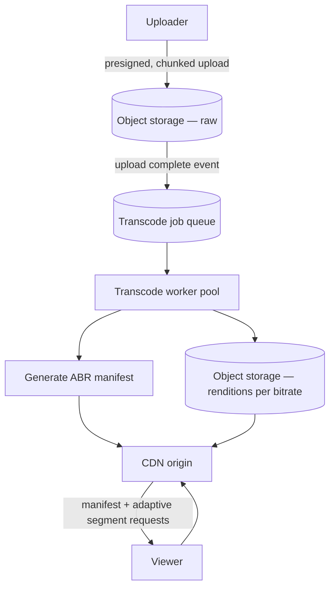
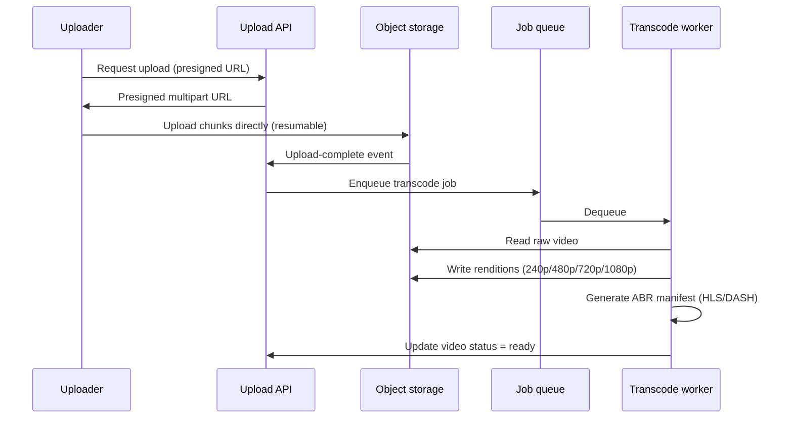
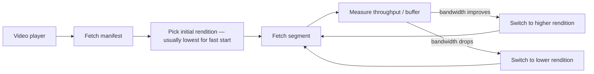

# Video Streaming Basics

An asynchronous pipeline problem end to end: uploads must be resumable, transcoding is CPU-heavy and must run off the request path, and playback must adapt to the viewer's network rather than serving one fixed quality.

> **Related:** Framework → [01-how-to-approach.md](01-how-to-approach.md) · CDN(Content Delivery Network) and media delivery → [§9A](09A-cdn-and-media-delivery.md) · Resumable/chunked uploads → [api-design-and-protection §18](../../api-design-and-protection/includes/18-object-storage-and-uploads.md) · Async worker scaling → [HTS §6](../../high-throughput-systems/includes/06-async-queues-workers.md) · CDN(Content Delivery Network) caching → [HTS §4](../../high-throughput-systems/includes/04-caching-layers.md) · Storage/retention cost → [finops-and-cost §4](../../finops-and-cost/includes/04-storage-and-retention-cost.md)

---

## Requirements

| Type | Requirement |
|------|-------------|
| **Functional** | Users upload video; system transcodes to multiple resolutions/bitrates; playback adapts to viewer bandwidth; videos served globally with low startup latency |
| **Non-functional** | Uploads resumable/reliable for large files; transcoding does not block the upload response; playback start time low even on poor networks |
| **Scale assumption** | 500K uploads/day, average 500MB raw, playback traffic orders of magnitude larger than upload traffic |

**Out of scope (say this explicitly):** live streaming/low-latency broadcast (different problem — real-time encode + distribute), content moderation, recommendation ranking.

---

## Back-of-envelope

| Quantity | Math | Result |
|----------|------|--------|
| Uploads/sec average | 500K / 86,400 | ~6/sec average — upload volume is small |
| Raw storage/day | 500K × 500MB | ~250 TB/day before transcoding output |
| Transcoded storage multiplier | ~3–5 renditions × ~0.3–1× original size each | Roughly 1.5–3× additional storage per video |
| Playback bandwidth | Views vastly exceed uploads (100–1000×) | This is fundamentally a **CDN egress problem**, not an upload problem |

**Rule of thumb:** Upload and transcode are backend-async problems solved with queues and workers; the actual scaling challenge is **serving playback traffic through a CDN**, which dwarfs everything else in this system.

---

## High-level architecture



---

## Upload and transcode flow



Uploads go **directly to object storage** via presigned URLs — the app tier never proxies large file bytes. Resumable/chunked upload mechanics are covered in depth at [api-design-and-protection §18](../../api-design-and-protection/includes/18-object-storage-and-uploads.md); this walkthrough assumes that pattern and focuses on what happens after upload completes.

---

## Adaptive bitrate playback

| Concept | What it means |
|---------|----------------|
| **Rendition** | One encoded version of the video at a specific resolution/bitrate |
| **Segment** | A short chunk (2–10s) of a rendition, individually fetchable |
| **Manifest** | A playlist describing available renditions and segment URLs — HLS(HTTP Live Streaming) uses `.m3u8`, DASH(Dynamic Adaptive Streaming over HTTP(Hypertext Transfer Protocol)) uses `.mpd` |
| **ABR(Adaptive Bitrate)** | Player monitors download speed/buffer health and switches renditions between segments — no reconnect needed |



**Rule of thumb:** Always start playback at a low rendition for fast startup, then let the player step up — don't guess the "right" starting quality from the manifest alone.

---

## Data model and APIs

```sql
CREATE TABLE videos (
  video_id     bigint PRIMARY KEY,
  owner_id     bigint NOT NULL,
  status       text NOT NULL,   -- uploading, processing, ready, failed
  created_at   timestamptz NOT NULL DEFAULT now()
);

CREATE TABLE renditions (
  video_id     bigint NOT NULL REFERENCES videos(video_id),
  quality      text NOT NULL,   -- 240p, 480p, 720p, 1080p
  storage_key  text NOT NULL,
  PRIMARY KEY (video_id, quality)
);
```

| Endpoint | Behavior |
|----------|----------|
| `POST /uploads` | Issue presigned multipart upload URL(s); create `videos` row with `status = uploading` |
| `POST /uploads/{id}/complete` | Confirm upload; enqueue transcode job |
| `GET /videos/{id}/manifest` | Return HLS/DASH manifest once `status = ready` |
| `GET /videos/{id}/status` | Poll transcode progress — see async job/poll pattern → [api-design-and-protection §10A](../../api-design-and-protection/includes/10A-async-jobs-polling.md) |

---

## Scaling bottlenecks

| Bottleneck | Symptom | Fix |
|------------|---------|-----|
| **Transcoding CPU cost** | Worker pool can't keep up with upload rate | Autoscale workers on queue depth; consider hardware-accelerated encoding for high volume — [HTS §6](../../high-throughput-systems/includes/06-async-queues-workers.md) |
| **Playback egress bandwidth** | This is the real cost and scale driver, not upload | CDN with high cache-hit ratio; origin shielding so transcode storage isn't hit directly per view — [HTS §4](../../high-throughput-systems/includes/04-caching-layers.md) |
| **Large upload reliability** | Connection drops mid-upload on big files | Chunked/resumable multipart upload — [api-design-and-protection §18](../../api-design-and-protection/includes/18-object-storage-and-uploads.md) |
| **Storage growth** | Multiple renditions per video multiply storage cost | Tiered storage — move cold renditions/originals to cheaper storage classes; retention policy — [finops-and-cost §4](../../finops-and-cost/includes/04-storage-and-retention-cost.md) |
| **Slow time-to-first-frame** | Player waits too long before playback starts | Start at low rendition; segment size small enough for fast initial fetch |

---

## Common mistakes

| Mistake | Fix |
|---------|-----|
| Transcoding synchronously in the upload request | Async job queue; upload response returns before transcoding even starts |
| Serving a single fixed bitrate | ABR with multiple renditions — mobile/poor-network viewers need lower bitrates available |
| Proxying upload bytes through the app tier | Presigned direct-to-storage upload — [api-design-and-protection §18](../../api-design-and-protection/includes/18-object-storage-and-uploads.md) |
| No CDN, serving playback from origin | CDN is not optional at any meaningful viewer scale — this is where nearly all bandwidth cost and latency lives |
| Ignoring storage cost of every rendition forever | Explicit retention/tiering policy for old or rarely-viewed content |