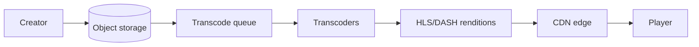
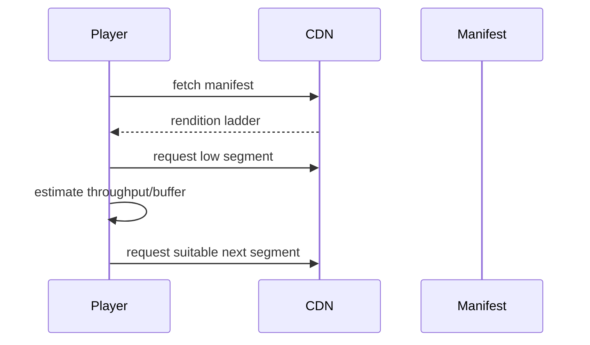

# CDN and Media Delivery

> **Scope:** This section owns CDN(Content Delivery Network) delivery, transcoding, and ABR(Adaptive Bitrate) operations for media. For upload security and object storage contracts, see [API §18](../../api-design-and-protection/includes/18-object-storage-and-uploads.md).

> **Related:** [§9 Video streaming basics](09-video-streaming-basics.md) · [API uploads](../../api-design-and-protection/includes/18-object-storage-and-uploads.md) · [fullstack web performance](../../fullstack-bff-and-clients/README.md)

---

## At a glance

| Stage | Main decision | Guardrail |
|-------|---------------|-----------|
| Upload | Direct, resumable object-store upload | Verify content and ownership asynchronously |
| Process | Immutable source → rendition set | Idempotent job keyed by asset version |
| Package | Short media segments + manifest | Align segments and retain captions |
| Deliver | CDN cache with signed access where needed | Cache key must include authorization variant |
| Play | ABR selects sustainable bitrate | Start low; avoid rebuffering |

**Rule of thumb:** Store once, transcode asynchronously, and let the player adapt; do not proxy large media bytes through application servers.

---

## Delivery path

The upload API(Application Programming Interface) creates an asset record and an object-store destination. A worker validates type/size, virus-scans where required, creates multiple renditions, packages HLS(HTTP Live Streaming) or DASH(Dynamic Adaptive Streaming over HTTP(Hypertext Transfer Protocol)), publishes only complete manifests, then invalidates or versions cache paths.

| Asset state | Client behavior |
|-------------|-----------------|
| Uploaded | Processing; do not expose as playable |
| Validating | Show progress; support retryable upload status |
| Transcoding | Poll/webhook status; no partial manifest |
| Ready | Serve versioned playback URL |
| Failed | Explain safe reason; retain diagnostics for operator |

---

## Caching and access

Use immutable versioned paths for segments and renditions; then cache them for a long TTL(Time To Live). Keep manifests short-lived if they change. Signed URLs/cookies authorize edge delivery without sending every segment to the origin.

| Cache key input | Include? |
|-----------------|----------|
| Asset version/rendition | Yes |
| Compression/format variant | Yes |
| Raw query-string analytics | No |
| Viewer identity | Only when authorization requires it |
| Entitlement tier | If it changes watermark/quality |

Origin shielding and request coalescing protect storage on cache misses. Measure cache hit ratio, origin bytes, first-frame time, rebuffer ratio, error rate, and regional bitrate distribution. A 200 response from the CDN does not prove playback succeeded.

---

## ABR and transcoding

ABR chooses a rendition using recent throughput, buffer health, device capability, and viewport—not advertised bandwidth alone. Build a bitrate ladder that includes a low startup rendition and sensible resolution steps; validate visual quality rather than copying a generic ladder.

| Failure | Mitigation |
|---------|------------|
| Slow transcoder backlog | Separate queues by duration/priority; autoscale with downstream limits |
| Origin stampede | CDN shielding, immutable assets, request coalescing |
| Rebuffering | Smaller segments, lower startup bitrate, ladder review |
| Partial publish | Publish manifest last after all segments verify |
| Cost spike | Track egress by rendition/region; expire unused sources per policy |

---

## Security and operations

Validate media after upload, not from claimed MIME(Media Type) alone. Limit upload size/duration, scan untrusted files, strip unsafe metadata, authorize every asset mutation, and keep originals separate from public renditions. Watermarking or DRM(Digital Rights Management) is a product/security decision with playback and licensing costs.

Run restore and replay drills: rebuild renditions from an original, reprocess a failed encoder version, and verify manifests and captions. Roll out player, encoder, and CDN configuration independently with synthetic playback checks across regions.

## Common mistakes

| Mistake | Fix |
|---------|-----|
| Stream media through API servers | Use direct storage and CDN delivery |
| Cache one mutable path forever | Version asset paths and publish manifests atomically |
| Start at highest bitrate | Start conservatively and adapt |
| Expose file immediately after upload | Validate and complete rendition set first |
| Use CDN hit rate as player success | Measure first frame and rebuffering |
| Put signed URL identity in every cache key | Use scoped signatures/cookies and bounded variants |