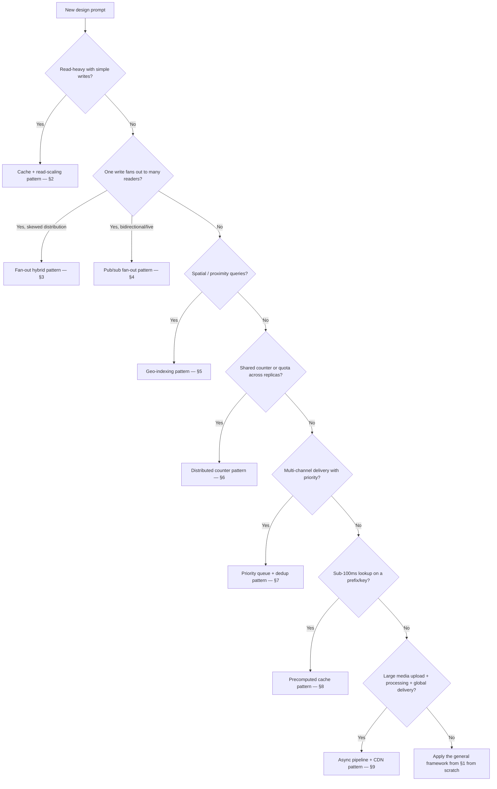

# Decision Guide

A master flow for a design problem not explicitly covered above — classify it, map it to the closest walkthrough, and know which technique it's actually testing.

> **Related:** Framework → [01-how-to-approach.md](01-how-to-approach.md) · Problem map → [00-overview.md](00-overview.md)

---

## At a glance

| If the core challenge is… | It's really testing | Closest walkthrough |
|----------------------------|----------------------|----------------------|
| A hot read path behind a simple write | Caching + read scaling | [02-url-shortener.md](02-url-shortener.md) |
| Write amplification with a skewed distribution | Fan-out on write vs read, hybrid design | [03-news-feed.md](03-news-feed.md) |
| Bidirectional, low-latency, many-to-many | Pub/sub fan-out across stateful connections | [04-chat-and-presence.md](04-chat-and-presence.md) |
| High-frequency spatial writes + proximity queries | Geospatial indexing + in-memory hot path | [05-ride-sharing-geo.md](05-ride-sharing-geo.md) |
| Shared counters across stateless replicas | Distributed state, not just an algorithm | [06-distributed-rate-limiter.md](06-distributed-rate-limiter.md) |
| Multi-destination delivery with priority and dedup | Priority queues + idempotency across unreliable channels | [07-notification-pipeline.md](07-notification-pipeline.md) |
| Extreme read-latency requirement on a prefix query | Precomputation over live computation | [08-search-autocomplete.md](08-search-autocomplete.md) |
| Large binary uploads + CPU-heavy async processing + global delivery | Async pipeline + CDN(Content Delivery Network) egress | [09-video-streaming-basics.md](09-video-streaming-basics.md) |

**Rule of thumb:** Almost every "design X" prompt reduces to one of: **cache a hot read**, **fan out a write**, **coordinate shared state across replicas**, or **move heavy work off the request path**. Name which one(s) apply before designing anything.

---

## Classification flow

---

## Common interview scenarios

| Prompt | Maps to | Core technique tested |
|--------|---------|-------------------------|
| "Design Bit.ly / TinyURL" | [02-url-shortener.md](02-url-shortener.md) | Cache-aside, ID generation, hot-key handling |
| "Design Twitter / Instagram feed" | [03-news-feed.md](03-news-feed.md) | Fan-out on write vs read, celebrity problem |
| "Design WhatsApp / Messenger" | [04-chat-and-presence.md](04-chat-and-presence.md) | WebSocket fan-out, pub/sub bus, presence TTLs |
| "Design Uber / Lyft" | [05-ride-sharing-geo.md](05-ride-sharing-geo.md) | Geospatial index, matching, ETA |
| "Design a rate limiter" | [06-distributed-rate-limiter.md](06-distributed-rate-limiter.md) | Shared counter store, topology, failure modes |
| "Design a notification system" | [07-notification-pipeline.md](07-notification-pipeline.md) | Priority queues, multi-channel dedup |
| "Design Google/Typeahead search" | [08-search-autocomplete.md](08-search-autocomplete.md) | Precomputed prefix cache, ranking, freshness |
| "Design YouTube / Netflix (basics)" | [09-video-streaming-basics.md](09-video-streaming-basics.md) | Async transcode pipeline, ABR(Adaptive Bitrate), CDN |
| "Design a distributed cache" | Not a dedicated walkthrough | Apply [01-how-to-approach.md](01-how-to-approach.md) + [HTS §4 caching layers](../../high-throughput-systems/includes/04-caching-layers.md) directly |
| "Design a payments/ledger system" | Not a dedicated walkthrough | [event-sourcing-and-cqrs](../../event-sourcing-and-cqrs/README.md) + [resilience-patterns §6 idempotency](../../resilience-patterns/includes/06-idempotency-systemwide.md) |
| "Design an API(Application Programming Interface) gateway" | Not a dedicated walkthrough | [api-design-and-protection §3](../../api-design-and-protection/includes/03-api-gateway.md) directly |

---

## Rollout checklist for any new design

| # | Check |
|---|-------|
| 1 | Functional and non-functional requirements stated, with explicit out-of-scope items |
| 2 | At least one back-of-envelope number computed before drawing boxes |
| 3 | Architecture diagram drawn with the standard layers ([01-how-to-approach.md §3](01-how-to-approach.md#phase-3--layered-architecture)) |
| 4 | Data model / key access patterns sketched |
| 5 | At least one named bottleneck with a specific fix, not a generic "add caching/scaling" |
| 6 | Tradeoff articulated for the hardest decision (fan-out direction, consistency model, storage choice) |
| 7 | Links out to the corpus guide that owns each subsystem in depth, instead of re-deriving it |

---

## Common mistakes (summary across all walkthroughs)

| Mistake | Section |
|---------|---------|
| No numbers before architecture | [§1 phase 2](01-how-to-approach.md#phase-2--back-of-envelope-estimates) |
| Memorized architecture applied without adapting to stated scale | This page — classify first |
| Re-deriving caching/async/rate-limiting from scratch instead of linking out | Every walkthrough's **Related** block |
| Stopping at the happy path with no bottleneck named | Every walkthrough's **Scaling bottlenecks** section |
| Treating a cache or derived store as the source of truth | [data-platforms rule of thumb](../../data-platforms/includes/00-overview.md), echoed in [03](03-news-feed.md), [05](05-ride-sharing-geo.md) |

## Pros and cons

### Using this corpus of walkthroughs to prep
**Pros:** Forces the estimate → architecture → bottleneck → tradeoff habit; heavy cross-links mean depth is one click away.
**Cons:** Real interviews/design docs have unique constraints — treat these as scaffolding, not scripts to recite.