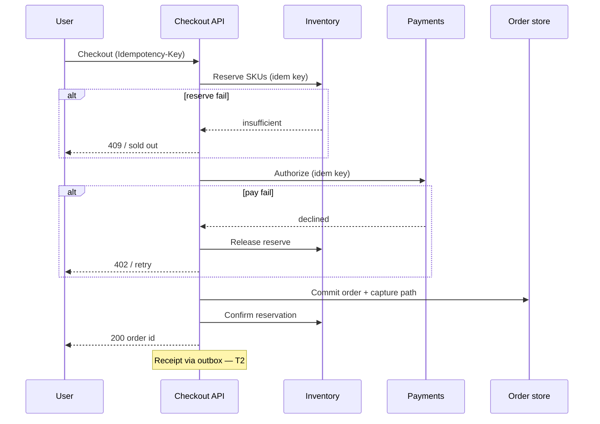

# Checkout and Inventory

End-to-end checkout is a **T0-critical path**: reserve inventory, authorize payment, confirm order — with optional T1/T2 work async. Inventory and money must stay **consistent under retries and partial failure**.

> **Scope:** System-design walkthrough for cart → pay → confirm — reservation model, idempotency, and saga boundaries. Resilience policies → [resilience §12](../../resilience-patterns/includes/12-worked-example-checkout.md). Payments depth → [payments-and-fintech](../../payments-and-fintech/README.md). Orchestration → [ES §7](../../event-sourcing-and-cqrs/includes/07-sagas-and-distributed-workflows.md) · [ES §7B](../../event-sourcing-and-cqrs/includes/07B-sagas-compensation-idempotency.md).
>
> **Related:** Idempotency → [api §13](../../api-design-and-protection/includes/13-idempotency.md) · Outbox receipt → [ES §5A](../../event-sourcing-and-cqrs/includes/05A-outbox-and-inbox.md) · Rate limits at flash sale → [HTS §9](../../high-throughput-systems/includes/09-backpressure-and-limits.md)

---

## At a glance

| Step | Tier | Consistency | On failure |
|------|------|-------------|------------|
| **Validate cart / price** | T0 | Read own writes | Fail checkout |
| **Reserve inventory** | T0 | Strong per SKU | Fail; no payment |
| **Authorize payment** | T0 | Idempotent with processor | Release reserve |
| **Confirm order** | T0 | Single commit boundary | Compensate |
| **Receipt / email** | T2 | At-least-once | Retry async |

**Rule of thumb:** Checkout succeeds when **reserve + pay** succeed. Never authorize payment without a **held reservation** you can release on decline.

---

## Request flow

---

## Inventory reservation model

| Model | Pros | Cons |
|-------|------|------|
| **Soft hold + TTL(Time To Live)** | Simple; auto-expire abandoned carts | Oversell if TTL too long |
| **Hard decrement on reserve** | Strong cap | Must release on cancel |
| **Oversell with backorder** | Revenue on hot SKU | CX(Customer Experience) complexity |

| Field | Purpose |
|-------|---------|
| `reservation_id` | Idempotency for reserve/release |
| `expires_at` | TTL for abandoned checkout |
| `order_id` | Links reserve to commit |

Use **compare-and-swap** or row lock on `available_qty` — not read-modify-write without isolation. Hot SKU → shard counter or queue serialize — [HTS §5](../../high-throughput-systems/includes/05-database-throughput.md).

---

## Saga and compensation

| Order | Action | Compensation |
|-------|--------|--------------|
| 1 | Reserve inventory | Release reservation |
| 2 | Authorize payment | Void authorization |
| 3 | Create order row | Mark cancelled + release + void |
| 4 | Capture (if separate) | Refund — [payments §3A](../../payments-and-fintech/includes/03A-refunds-payouts-settlement.md) |

Orchestrated saga or workflow engine when steps span teams — [ES §7A](../../event-sourcing-and-cqrs/includes/07A-sagas-choreography-orchestration.md). **Ledger posts** for money → [payments §3](../../payments-and-fintech/includes/03-ledger-and-double-entry.md).

---

## API design notes

| Concern | Pattern |
|---------|---------|
| **Idempotency-Key** | Same key → same order id — [api §13](../../api-design-and-protection/includes/13-idempotency.md) |
| **Timeout budget** | 2–4 s user-facing; tight per dependency — [resilience §12](../../resilience-patterns/includes/12-worked-example-checkout.md) |
| **Status poll** | If async capture, `202` + job id — [api §10](../../api-design-and-protection/includes/10-async-patterns.md) |
| **Flash sale** | Queue or token at edge — [HTS §9](../../high-throughput-systems/includes/09-backpressure-and-limits.md) |

---

## Common mistakes

| Mistake | Why it hurts | Fix |
|---------|--------------|-----|
| Pay before reserve | Charge without stock | Reserve first |
| Blind retry on pay | Double auth | Idempotency keys |
| No reservation TTL | Ghost holds | TTL + sweeper job |
| T1 blocks T0 | Recs timeout kills checkout | Bulkhead — [resilience §12](../../resilience-patterns/includes/12-worked-example-checkout.md) |
| At-most-once receipt | User anxiety | Outbox + dedup — [ES §5A](../../event-sourcing-and-cqrs/includes/05A-outbox-and-inbox.md) |

---

## Pros and cons

| Reservation style | Pros | Cons |
|-------------------|------|------|
| **TTL soft hold** | Good UX for carts | Tune TTL carefully |
| **Hard decrement** | No oversell | Release path required |
| **Event-sourced inventory** | Audit trail | Projection lag to manage |
