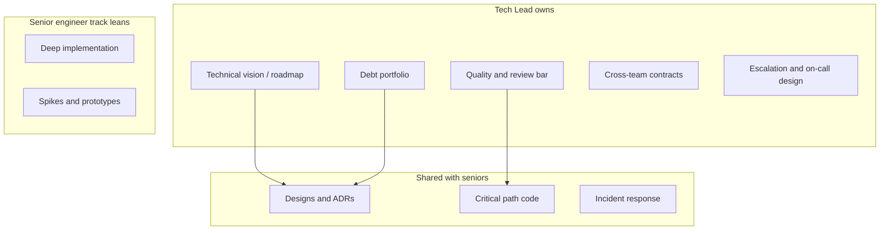

# Overview — Tech Lead vs Senior Individual Contributor

What a Tech Lead owns that a strong senior individual contributor does not — and how the two roles reinforce each other.

> **Related:** Architecture decisions → [architecture-decisions](../../architecture-decisions/README.md) · Product discovery → [§1A](01A-product-discovery.md) · Debt × business × CX → [§5A](05A-debt-business-cx-balance.md) · Reliability practice → [sre-and-incidents](../../sre-and-incidents/README.md) · Decision picker → [§11](11-decision-guide.md)

---

## At a glance

| Dimension | Senior individual contributor | Tech Lead |
|-----------|-------------------------------|-----------|
| **Scope** | Deep problems in a domain | Product area / team technical outcomes |
| **Success** | High-quality deliveries they touch | Team velocity × quality × operability |
| **Decisions** | Local design excellence | Cross-cutting trade-offs, ADRs |
| **People** | Mentors when asked | Systematic leveling and review bar |
| **Stakeholders** | Clarifies tickets | Frames risk for PM/exec/support |
| **Ops** | Good on-call citizen | Owns escalation paths and debt vs features |

**Rule of thumb:** Seniors make hard things work. Tech Leads make the **system of work** produce hard things reliably.

---

## Ownership map

| Owns | Does not own alone |
|------|--------------------|
| Definition of done for the team | Every line of code |
| Facilitating design reviews | Being the only designer |
| Negotiating debt vs roadmap | Ignoring product priorities |
| API(Application Programming Interface) ownership across teams | Writing every integration |
| Hiring bar input | Full HR process |

---

## Weekly rhythm (example)

| Cadence | Activity |
|---------|----------|
| Daily | Unblock, review critical PRs, triage risk |
| Weekly | Roadmap sync with PM; debt/risk glance |
| Biweekly | Design review slot; leveling 1:1 themes |
| Monthly | Stakeholder tech health; error-budget look with SRE(Site Reliability Engineering) |

Reliability partnership → [sre-and-incidents](../../sre-and-incidents/README.md). Architecture artifacts → [architecture-decisions](../../architecture-decisions/README.md).

---

## Reading path

1. [§1 Vision and roadmap](01-technical-vision-and-roadmap.md)
2. [§2–§3 Reviews](02-design-reviews.md)
3. [§5–§6 Debt and estimation](05-tech-debt-portfolio.md)
4. [§7–§8 Stakeholders and APIs](07-stakeholder-communication.md)
5. [§10–§11 Ownership and decisions](10-ownership-and-escalation.md)

---

## Common mistakes

| Mistake | Fix |
|---------|-----|
| TL as “best coder on every ticket” | Delegate depth; keep architectural control |
| Senior individual contributor ignored in design | Pair on ADRs; share facilitation |
| No written vision | One-pager roadmap — [§1](01-technical-vision-and-roadmap.md) |
| Soft review bar to “go faster” | Explicit standards — [§3](03-code-review-standards.md) |
| Invisible ops ownership | Escalation map — [§10](10-ownership-and-escalation.md) |