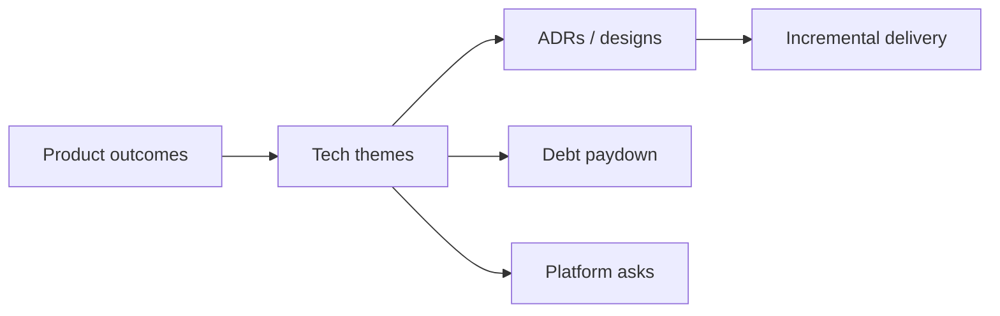

# Technical Vision and Roadmap

Translate product goals into a coherent technical direction people can execute against for quarters, not days.

> **Related:** Product discovery → [§1A](01A-product-discovery.md) · ADRs and design docs → [architecture-decisions §5](../../architecture-decisions/includes/05-adrs-and-design-docs.md) · Debt portfolio → [§5](05-tech-debt-portfolio.md) · Stakeholders → [§7](07-stakeholder-communication.md)

---

## At a glance

| Artifact | Length | Audience |
|----------|--------|----------|
| **Vision one-pager** | 1 page | Team + PM |
| **Tech roadmap** | 1–2 quarters themes | Eng + product |
| **ADR set** | Per decision | Implementers |
| **NFR(Non-Functional Requirement) sheet** | Latency, RPO(Recovery Point Objective)/RTO(Recovery Time Objective), compliance | Cross-functional |

**Rule of thumb:** If removing the TL’s name from the doc would make it unusable, it is too personality-driven — write for the **team**.

---

## Vision one-pager template

| Section | Content |
|---------|---------|
| **Context** | Product bet and constraints |
| **Current state** | Architecture sketch + top risks |
| **Target state** | 2–4 quarters out (boxes, not brands) |
| **Principles** | 3–5 decision rules (e.g. “async by default for fan-out”) |
| **Non-goals** | Explicitly out of scope |
| **Near-term bets** | 3 themes max |

---

## Roadmap hygiene

| Do | Do not |
|----|--------|
| Theme by outcome (“safe partner onboarding”) | Endless Jira dump |
| Sequence by dependency and risk | Parallelize everything |
| Reserve capacity for debt/SRE(Site Reliability Engineering) | 100% feature allocation |
| Revisit monthly | Carve in stone annually |

Link major forks to [ADRs](../../architecture-decisions/includes/05-adrs-and-design-docs.md). Reliability themes pair with [error budgets](../../sre-and-incidents/includes/02-error-budgets.md).

---

## Aligning with product

| Conversation | TL brings |
|--------------|-----------|
| Roadmap planning | Capacity reality, risk callouts |
| MVP scope | NFR(Non-Functional Requirement) minimums |
| Date pressure | Cut scope or add risk — never silent hope |

---

## Common mistakes

| Mistake | Fix |
|---------|-----|
| Vision = vendor shopping list | Principles and boundaries first |
| No non-goals | Add them; protects focus |
| Roadmap only features | Include operability and debt |
| Updating only in crises | Monthly light refresh |
| Hiding constraints from PM | Surface early — [§7](07-stakeholder-communication.md) |