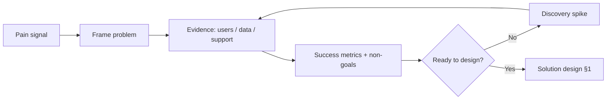

# Product Discovery for Tech Leads

Find evidence for the **right problem** before solution design — so EPICs are not guesses dressed as plans.

> **Scope:** TL partnership with product on discovery methods, success metrics, and kill criteria. Solution design / EPIC breakdown → [cursor-workflows §1](../../cursor-workflows/includes/01-solution-design.md) · [§1A templates](../../cursor-workflows/includes/01A-epic-feature-user-story-templates.md). Vision once bets are clear → [§1](01-technical-vision-and-roadmap.md). Debt × CX(Customer Experience) tradeoffs → [§5A](05A-debt-business-cx-balance.md).
>
> **Related:** Stakeholders → [§7](07-stakeholder-communication.md) · Estimation → [§6](06-estimation-and-risk.md) · Org/stage fit → [architecture §14](../../architecture-decisions/includes/14-org-stage-and-pricing-fit.md)

---

## At a glance

| Mode | Goal | Exit |
|------|------|------|
| **Problem discovery** | Who hurts, how often, what “done” means | Problem statement + success metrics |
| **Solution discovery** | Which approach might work | Spike / prototype with kill criteria |
| **Delivery** | Build the chosen slice | EPIC → FEATURE → ship |

**Rule of thumb:** If you cannot name the **user**, the **job**, and a **measurable outcome**, you are not ready for architecture — only for more discovery.

---

## When TLs must slow the build

| Signal | Do this |
|--------|---------|
| Conflicting asks from sales / PM / support | Facilitation: one problem statement |
| “Build X like Competitor” with no user evidence | Demand interviews, data, or a time-boxed spike |
| Success = “shipped on date” only | Add outcome metric (activation, conversion, ticket deflection) |
| Tech solution chosen before problem framed | Park ADR; reopen discovery |

---

## Lightweight methods (pick 1–2)

| Method | Use when | TL role |
|--------|----------|---------|
| **Support / SEV mining** | Ops pain or CX debt | Quantify frequency and cost |
| **Funnel / KPI(Key Performance Indicator) drop** | Growth or conversion bet | Pair with analytics owner |
| **5–8 user interviews** | New workflow unclear | Join 2+; push for jobs not feature lists |
| **JTBD(Jobs To Be Done) sketch** | Competing solutions exist | Keep “job” separate from UI |
| **Shadow / ride-along** | B2B(Business-to-Business) workflow opaque | Note system handoffs and workarounds |
| **Prototype / fake door** | Demand unknown | Instrument; pre-agree kill criteria |
| **Technical spike** | Feasibility unknown | Time-box; produce options not production |

Skip ceremony: one clear problem beat a 40-page research deck.

---

## Discovery brief (hand to solution design)

Fill before [cursor-workflows §1](../../cursor-workflows/includes/01-solution-design.md):

| Field | Example |
|-------|---------|
| User / persona | SMB(Small and Medium Business) admin onboarding teammates |
| Job / pain | Invite fails; support tickets spike |
| Evidence | 120 tickets/mo; 18% activate drop |
| Success metric | Activate rate +2 pts; tickets −40% |
| Non-goals | Full IdP(Identity Provider) rebuild this quarter |
| Constraints | Date, compliance, stack |
| Open questions | SSO(Single Sign-On) required for tier? |
| Kill / pivot | If activate flat after 4 weeks, roll back flag |

---

## Engineering in discovery (not “no eng”)

| Eng activity | OK in discovery | Too early |
|--------------|-----------------|-----------|
| Spikes, prototypes, feature flags | Yes | Multi-service extraction |
| Instrumentation / funnel events | Yes | Irreversible schema as SoR |
| Cost / capacity sketch | Yes | Full multi-region build |
| ADR for irreversible spike outcome | If spike decides | ADR before problem is clear |

Org/pricing constraints that bound options → [architecture §14](../../architecture-decisions/includes/14-org-stage-and-pricing-fit.md).

---

## Handoff checklist

- [ ] Problem statement one paragraph; stakeholders agree
- [ ] Success metrics named (business or CX, not only “deployed”)
- [ ] Non-goals listed
- [ ] Evidence cited (even if thin — say confidence)
- [ ] Kill / pivot criteria written
- [ ] Ready for options + recommendation — [cursor-workflows §1](../../cursor-workflows/includes/01-solution-design.md)

---

## Common mistakes

| Mistake | Why it hurts | Fix |
|---------|--------------|-----|
| Discovery = endless research | Misses window | Time-box; decide with stated confidence |
| Eng skipped until “requirements frozen” | Wrong architecture | TL joins discovery early |
| Success = output (stories shipped) | Builds unused features | Outcome metrics |
| Solution-first (“we need Kafka”) | Expensive wrong bet | Problem brief first |
| Ignoring support/SEV data | Misses CX debt | Mine tickets — [§5A](05A-debt-business-cx-balance.md) |
| No kill criteria | Zombie features | Pre-agree stop rules |

---

## Pros and cons

| Approach | Pros | Cons |
|----------|------|------|
| **Discovery-first** | Higher hit rate; clearer ADRs | Feels slow under date pressure |
| **Build-first** | Fast motion | Rework, CX debt, political sunk cost |
| **Spike-bounded discovery** | Learns cheaply | Needs discipline to throw code away |

---

## Other guides in this repo

| Guide | Use when |
|-------|----------|
| [§1 Technical vision](01-technical-vision-and-roadmap.md) | Multi-quarter bets after discovery |
| [cursor-workflows §1](../../cursor-workflows/includes/01-solution-design.md) | Options, EPICs, stories |
| [§5A Debt × business × CX](05A-debt-business-cx-balance.md) | Shipping under pressure after weak discovery |
| [system-design §1](../../system-design-walkthroughs/includes/01-how-to-approach.md) | Clarify requirements in design practice |