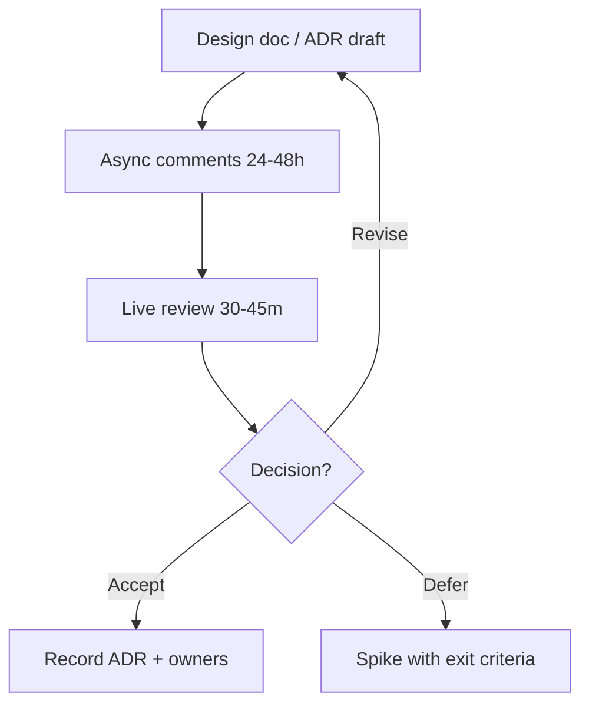

# Design Reviews

Facilitate reviews that catch architectural risk early without becoming theater or rubber stamps.

> **Related:** ADR process → [architecture-decisions §5](../../architecture-decisions/includes/05-adrs-and-design-docs.md) · Trade-offs → [architecture-decisions §6](../../architecture-decisions/includes/06-tradeoff-frameworks.md) · Code review → [§3](03-code-review-standards.md)

---

## At a glance

| Trigger | Review depth |
|---------|--------------|
| New service / bounded context | Full design review + ADR |
| Cross-team API(Application Programming Interface) or event | Contract + ownership review |
| Significant data model change | Design + migration plan |
| Local refactor, same boundaries | Lightweight or skip |

**Rule of thumb:** Review **decisions and failure modes**, not slide aesthetics. Time-box; decide or explicitly defer.

---

## Review flow

| Role | Responsibility |
|------|----------------|
| **Author** | Problem, options, recommendation, risks |
| **Facilitator (often TL)** | Agenda, time-box, decision capture |
| **Reviewers** | Challenge assumptions; propose alternatives |
| **Scribe** | Action items and ADR updates |

---

## Agenda (45 minutes)

| Minutes | Topic |
|---------|-------|
| 5 | Problem and non-goals |
| 10 | Options and trade-offs |
| 15 | Failure modes, operability, security |
| 10 | Open questions / decisions |
| 5 | Owners and follow-ups |

Check failure domains with [architecture-decisions §11](../../architecture-decisions/includes/11-failure-domains.md) when blast radius is unclear.

---

## Quality bar for a design packet

- [ ] Context and constraints stated
- [ ] ≥2 real options (including “do nothing / postpone”)
- [ ] Data ownership and sync/async choice
- [ ] Rollback / expand-contract if schema
- [ ] Observability and on-call impact
- [ ] Explicit decision and date

---

## Common mistakes

| Mistake | Fix |
|---------|-----|
| Review after code is merged | Gate risky work on design accept |
| Only seniors allowed to author | Coach mids to present; TL facilitates |
| Endless debate, no ADR | Capture decision same day |
| Skipping security/ops | Fixed agenda slots |
| Treating review as approval theater | Invite dissent; document dissent |