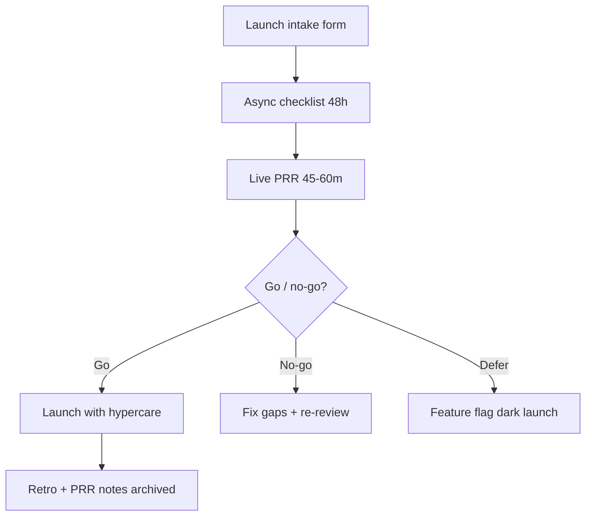

# Production Readiness Facilitation

A Production Readiness Review (PRR) — or launch review — is the **decision forum** before new services, major migrations, or high-risk features reach production. Tech leads facilitate; they don’t own every answer. Design reviews catch architecture early — [§2](02-design-reviews.md); PRR(Production Readiness Review) confirms operability, rollback, and ownership before traffic — aligned with [deployment §14](../../deployment-strategies/includes/14-feature-to-prod-playbook.md).

> **Scope:** Facilitating PRR/launch reviews: agenda, attendees, evidence, go/no-go. Design review process → [§2](02-design-reviews.md). Feature-to-prod playbook → [deployment §14](../../deployment-strategies/includes/14-feature-to-prod-playbook.md).
>
> **Related:** [§2 Design reviews](02-design-reviews.md) · [deployment §14 Feature to prod](../../deployment-strategies/includes/14-feature-to-prod-playbook.md) · SLO(Service Level Objective) gates → [§1](../../sre-and-incidents/includes/01-sli-slo-sla.md) · Hypercare → [SRE §10A](../../sre-and-incidents/includes/10A-hypercare-checklist.md)

---

## At a glance

| Trigger | PRR depth |
|---------|-----------|
| New service or region | Full PRR |
| Major dependency swap | Full |
| Large traffic or data migration | Full + game day |
| Additive API(Application Programming Interface) behind flag | Lightweight |
| Config-only change | Skip if paved road |

**Rule of thumb:** PRR validates **how it fails safely**, not slide polish. No go without named owners for on-call, rollback, and comms.

---

## Review flow

| Role | Responsibility |
|------|----------------|
| **Author / EM(Engineering Manager)** | Scope, dates, risk summary |
| **Facilitator (TL)** | Time-box; drive decisions |
| **SRE(Site Reliability Engineering) rep** | SLOs, capacity, observability |
| **Security / compliance** | Data class, threat notes when applicable |
| **Scribe** | Actions, owners, dates |

---

## Checklist themes

Cross-link evidence instead of duplicating depth:

| Theme | Evidence |
|-------|----------|
| **Architecture** | ADR(Architecture Decision Record) / design review — [§2](02-design-reviews.md) |
| **Observability** | Dashboards, alerts, SLO — [SRE §1](../../sre-and-incidents/includes/01-sli-slo-sla.md) |
| **Deploy / rollback** | Strategy + triggers — [deployment §14](../../deployment-strategies/includes/14-feature-to-prod-playbook.md) |
| **Capacity** | Load test results — [SRE §3](../../sre-and-incidents/includes/03-capacity-and-load-testing.md) |
| **Runbooks** | Linked from [RUNBOOK-TEMPLATE.md](../../RUNBOOK-TEMPLATE.md) |
| **Comms** | Support, status page, customer notice if external |

---

## Facilitation tactics

| Tactic | Why |
|--------|-----|
| Pre-read async checklist | Live time for gaps, not reading |
| Red / yellow / green scoring | Surfaces blockers without debate theater |
| Explicit rollback demo | “Press undo” beats theoretical plan |
| Name on-call + hypercare window | [SRE §10A](../../sre-and-incidents/includes/10A-hypercare-checklist.md) |
| Record go with conditions | “Go if load test completes by DATE” |

Defer is valid — **dark launch behind flags** beats a heroic weekend cutover.

---

## After launch

| Activity | Owner |
|----------|-------|
| **Hypercare window** | On-call + author for 48–72h — [SRE §10A](../../sre-and-incidents/includes/10A-hypercare-checklist.md) |
| **Metric watch** | Error budget, latency, saturation vs SLO |
| **Support briefing** | Known issues, feature flags, rollback steps |
| **Retro** | Capture PRR misses; update checklist template |

Archive the signed checklist on the launch ticket — the next team learns from gaps, not memory.

---

## Common mistakes

| Mistake | Fix |
|---------|-----|
| PRR day before launch | Two-week runway for blockers |
| Rubber-stamp attendance | Required roles or written async sign-off |
| No rollback tested | Demo rollback in staging |
| SLOs undefined | Minimum SLI(Service Level Indicator) set — [SRE §1](../../sre-and-incidents/includes/01-sli-slo-sla.md) |
| Design review skipped | [§2](02-design-reviews.md) before PRR for new services |
| Notes lost | Archive checklist with launch ticket |
