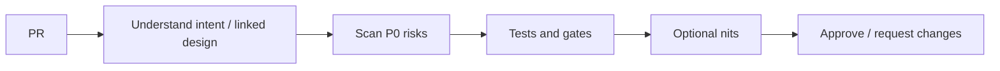

# Code Review Standards

Code review is a teaching and risk-control system — not a LGTM(Looks Good To Me) speedrun.

> **Related:** Design reviews → [§2](02-design-reviews.md) · Mentoring → [§4](04-mentoring-and-leveling.md) · Quality gates → [testing-strategy §7](../../testing-strategy/includes/07-quality-gates.md)

---

## At a glance

| Priority | Review for |
|----------|------------|
| **P0** | Correctness, security, data loss, authZ |
| **P1** | Operability, tests at right layer, contracts |
| **P2** | Clarity, naming, local design |
| **Nit** | Style already covered by linters — prefer tools |

**Rule of thumb:** Blocking comments need a **principle** (“breaks idempotency”) not a taste (“I would have…”).

---

## Reviewer checklist

| Check | Examples |
|-------|----------|
| Intent | Linked ticket/ADR; scope matches description |
| Correctness | Edge cases, concurrency, null/empty |
| Security | AuthN/Z, injection, secrets, PII(Personally Identifiable Information) logs |
| Contracts | API(Application Programming Interface)/event compatibility |
| Tests | Right pyramid layer — [testing-strategy](../../testing-strategy/README.md) |
| Ops | Metrics, timeouts, feature flag, rollback |

---

## Author expectations

| Expectation | Why |
|-------------|-----|
| Small, reviewable diffs | Better review quality |
| Description of risk and test plan | Speeds P0 scan |
| Self-review first | Catch drive-by mistakes |
| Respond to principles, not egos | Healthy culture |

---

## SLAs and ownership

| Item | Guidance |
|------|----------|
| First response | Within team SLA (e.g. one business day) |
| Critical path PRs | TL or designated reviewer on-call for review |
| Stale reviews | Escalation in standup — not silent blockers |
| Disagreement | Escalate to design review / ADR, don’t flame |

---

## Pros and cons

| Style | Pros | Cons |
|-------|------|------|
| Strict P0 bar | Fewer prod incidents | Needs coaching so it doesn’t feel punitive |
| Rubber stamp | Fast merges | Debt and defects accumulate |
| Style wars | — | Waste — automate formatting |

---

## Common mistakes

| Mistake | Fix |
|---------|-----|
| Reviewing only style | Automate format; focus P0/P1 |
| Approve without running mental threat model | Security slot on checklist |
| Huge PRs “because deadline” | Split or pair-review live |
| TL reviews every PR | Distribute; TL samples + critical paths |
| No link to definition of done | Align with [testing gates](../../testing-strategy/includes/07-quality-gates.md) |