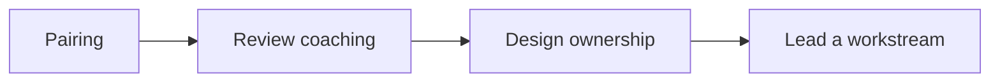

# Mentoring and Leveling

Grow engineers deliberately — expectations, feedback loops, and stretch work — without turning the TL into a full-time manager substitute.

> **Related:** Code review as coaching → [§3](03-code-review-standards.md) · Ownership → [§10](10-ownership-and-escalation.md) · Overview roles → [§0](00-overview.md)

---

## At a glance

| Level signal | Expect roughly |
|--------------|----------------|
| **Junior** | Delivers tasked work with guidance; asks early |
| **Mid** | Owns features end-to-end; improves local design |
| **Senior** | Owns ambiguous problems; raises team standard |
| **Staff+ / TL track** | Cross-team impact; multi-quarter bets |

**Rule of thumb:** Leveling evidence is **outcomes and scope**, not years or lines of code.

---

## Mentoring modes

| Mode | When | TL role |
|------|------|---------|
| Pair | New domain, high risk | Model thinking aloud |
| Review coaching | PR comments as lessons | Explain the principle |
| Shadow design review | Growing seniors | Let them facilitate sections |
| Stretch ownership | Ready for next level | Clear success criteria + backup |

---

## 1:1 themes (engineering)

| Theme | Questions |
|-------|-----------|
| Growth | What skill unlocks the next level? |
| Blockers | What is slow that process could fix? |
| Feedback | What should I start/stop as TL? |
| Career | Individual-contributor depth vs leadership interest |

People-manager HR topics stay with the EM when the org splits EM/TL — coordinate explicitly.

---

## Feedback that lands

| Prefer | Avoid |
|--------|-------|
| Specific example + impact + ask | Vague “be more proactive” |
| Timely (days, not quarters) | Only at review season |
| Balanced: strength + stretch | Only defects |

---

## Common mistakes

| Mistake | Fix |
|---------|-----|
| Only mentoring the strongest | Rotate attention; juniors need structured paths |
| Hoarding critical work | Delegate with guardrails |
| Leveling by charisma | Written expectations + evidence |
| Feedback only in PR tone | Separate coaching conversations |
| Confusing mentoring with doing their work | Teach; don’t silently finish |