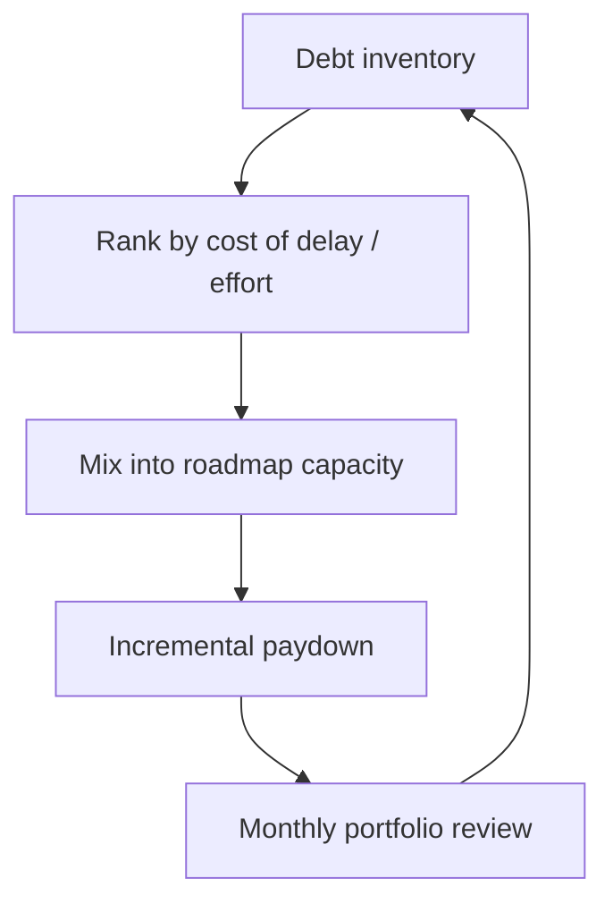

# Tech Debt Portfolio

Treat debt like a product backlog: inventory, cost of delay, and negotiated paydown — not endless complaining.

> **Related:** Debt × business × CX(Customer Experience) → [§5A](05A-debt-business-cx-balance.md) · Vision/roadmap → [§1](01-technical-vision-and-roadmap.md) · Estimation → [§6](06-estimation-and-risk.md) · Error budgets → [sre-and-incidents §2](../../sre-and-incidents/includes/02-error-budgets.md) · Strangler modernization → [architecture-decisions §4](../../architecture-decisions/includes/04-strangler-and-modernization.md)

---

## At a glance

| Debt type | Example | Paydown style |
|-----------|---------|---------------|
| **Code** | Untestable module | Refactor with feature |
| **Design** | Wrong boundary | ADR + strangler |
| **Ops** | No metrics / noisy pages | Reliability sprint |
| **Knowledge** | Bus factor 1 | Docs + pairing |
| **Dependency** | Unmaintained library | Upgrade / replace |

**Rule of thumb:** If debt has no **owner, symptom, and cost**, it is a rant — not a portfolio item.

---

## Inventory fields

| Field | Purpose |
|-------|---------|
| ID / title | Trackable |
| Symptom | User/eng pain today |
| Cost of delay | Incidents, slow features, risk |
| Effort band | S/M/L |
| Trigger | “Before partner launch”, “when error budget burns” |
| Owner | Named engineer |

---

## Negotiation with product

| Frame | Example |
|-------|---------|
| Risk | “Without X, peak season likely SEV-2” |
| Speed | “Y cuts feature cycle time ~30%” |
| Compliance | “Z required for audit evidence” |
| Bundle | “Ship feature A with refactor of module B” |

When reliability debt dominates, use [error budgets](../../sre-and-incidents/includes/02-error-budgets.md) as the stop-the-line mechanism. When roadmap, debt, and CX(Customer Experience) conflict → [§5A](05A-debt-business-cx-balance.md).

---

## Capacity heuristic

| Allocation | Guidance |
|------------|----------|
| Healthy team | ~10–20% ongoing debt/ops hardening |
| Burning platform | Temporarily raise until SLOs recover |
| Greenfield | Still bank small continuous cleanup |

---

## Common mistakes

| Mistake | Fix |
|---------|-----|
| Big-bang rewrite as only plan | Strangler — [architecture §4](../../architecture-decisions/includes/04-strangler-and-modernization.md) |
| Debt board never groomed | Monthly ranking |
| Paying only “fun” refactors | Rank by cost of delay |
| Zero feature work forever | Balance; communicate trade-offs |
| No link to incidents | Tag debt items that caused SEVs |