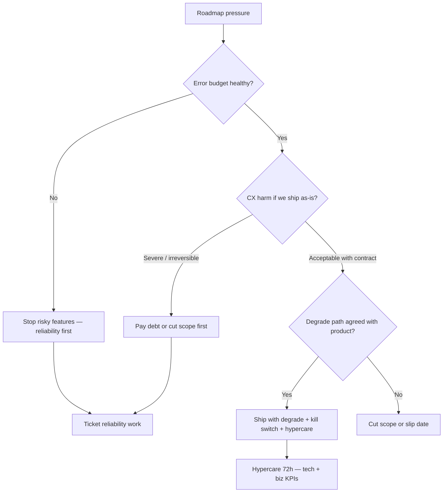

# Balancing Debt, Business, and CX

When roadmap pressure, tech debt, and CX(Customer Experience) disagree — choose **ship with degrade**, **stop features**, or **pay debt first** with an explicit contract.

> **Scope:** Triangular tradeoffs and decision rights for Tech Leads. Inventory and portfolio mechanics → [§5](05-tech-debt-portfolio.md). Error-budget policy → [sre §2](../../sre-and-incidents/includes/02-error-budgets.md). Degrade UX contracts → [resilience §5](../../resilience-patterns/includes/05-load-shedding-and-degradation.md). Org/stage defaults → [architecture §14](../../architecture-decisions/includes/14-org-stage-and-pricing-fit.md).
>
> **Related:** Stakeholders → [§7](07-stakeholder-communication.md) · Estimation → [§6](06-estimation-and-risk.md) · Web Vitals / field UX → [fullstack §4](../../fullstack-bff-and-clients/includes/04-web-performance.md) · Post-ship watch → [sre §10A](../../sre-and-incidents/includes/10A-hypercare-checklist.md)

---

## At a glance

| Axis | Question | Typical signals |
|------|----------|-----------------|
| **Business** | Must we ship by date / capture revenue / unblock a deal? | Contract date, launch window, competitive pressure |
| **Tech debt** | Will unpaid debt block speed, safety, or compliance next? | SEV tags, cycle-time drag, audit gaps |
| **CX** | Will users feel broken, slow, or confusing if we ship now? | Support volume, funnel drop, Web Vitals, NPS(Net Promoter Score)/CSAT(Customer Satisfaction) |

**Rule of thumb:** Never optimize one axis silently. Name the **trade**, the **owner**, and the **exit** (flag off, debt ticket, or budget freeze).

---

## Decision flow

| Outcome | When | Minimum contract |
|---------|------|------------------|
| **Stop features** | Error budget burned, SEV pattern, or compliance gate red | Freeze criteria + recovery plan — [sre §2](../../sre-and-incidents/includes/02-error-budgets.md) |
| **Pay debt first** | Debt causes SEVs, blocks the next FEATURE, or CX is already bad | Ranked portfolio item + capacity — [§5](05-tech-debt-portfolio.md) |
| **Ship with degrade** | Date matters, core journey protected, optional UX can simplify | Written degrade behavior, flag/kill switch, rollback metric |
| **Cut scope / slip** | Degrade would break trust or money path; debt not yet SEV-level | Explicit non-goals; new date or MVP slice |

---

## CX debt vs eng debt

| Kind | Example | Prefer |
|------|---------|--------|
| **Eng debt** | Untested module, missing metrics, shared DB anti-pattern | Portfolio + bundle with features — [§5](05-tech-debt-portfolio.md) |
| **CX debt** | Confusing errors, slow LCP(Largest Contentful Paint), silent failures | Fix before grow traffic; measure with RUM(Real User Monitoring)/support |
| **Reliability debt** | No timeouts, noisy pages, no runbook | Error budget stop-the-line |
| **Product debt** | Wrong workflow / missing journey | Product owns; eng advises cost |

**CX debt outranks eng debt** when users already abandon or support is drowning — even if the code “works.”

---

## Ship-with-degrade checklist

Use only when product agrees the **fallback is the product** for that window.

- [ ] T0 journey stays correct (money, auth, data integrity) — [architecture §11](../../architecture-decisions/includes/11-failure-domains.md)
- [ ] Degrade behavior named in UI/API(Application Programming Interface) copy (omit, stale, queue) — [resilience §5](../../resilience-patterns/includes/05-load-shedding-and-degradation.md)
- [ ] Kill switch or flag owner + abort metric — [deployment §7](../../deployment-strategies/includes/07-feature-flags.md) · [§13](../../deployment-strategies/includes/13-slo-rollback-triggers.md)
- [ ] Hypercare window on calendar (tech + business KPI(Key Performance Indicator)) — [sre §10A](../../sre-and-incidents/includes/10A-hypercare-checklist.md)
- [ ] Debt ticket filed with trigger (“remove degrade within N days” or “before next launch”)

---

## Negotiation frames (with product / exec)

| Frame | Say | Avoid |
|-------|-----|-------|
| **Risk** | “Shipping without X makes peak SEV-2 likely” | Vague “quality concerns” |
| **CX** | “Funnel drops ~Y% when Z is slow; here’s RUM” | Taste arguments without data |
| **Speed** | “Paying A now cuts cycle time ~30% for Q3” | Endless rewrite as the only plan |
| **Budget** | “Error budget burned — freeze matches our SRE policy” | Heroics without a written freeze |
| **Deal** | “We can hit the date if we cut B and degrade C” | Silent quality cuts |

Stakeholder update skeleton → [§7](07-stakeholder-communication.md).

---

## Capacity heuristic (triangle)

| Situation | Feature | Debt / reliability | CX hardening |
|-----------|---------|--------------------|--------------|
| Healthy | ~70–80% | ~10–20% | Bake into FEATURE DoD |
| Budget burning | Freeze risky | Majority until SLO(Service Level Objective) recovers | Protect T0 only |
| Launch crunch | Focused MVP | Bundle only blocking debt | Explicit degrade contract |
| Post-SEV | Pause growth features | Incident actions first | Fix user-visible pain |

---

## Common mistakes

| Mistake | Why it hurts | Fix |
|---------|--------------|-----|
| Ship date wins every argument | CX and reliability debt compound | Use the decision flow; record the trade |
| Degrade without product sign-off | Support chaos; trust loss | Written fallback contract |
| “We’ll fix UX next sprint” forever | CX debt becomes the product | Exit date or kill the feature |
| Paying only fun eng refactors | Users still hurt | Rank CX and SEV-linked debt higher |
| Freeze with no recovery plan | Roadmap stalls indefinitely | Budget burn → named recovery work |
| No hypercare after risky ship | Learn too late | [sre §10A](../../sre-and-incidents/includes/10A-hypercare-checklist.md) |

---

## Pros and cons

| Approach | Pros | Cons |
|----------|------|------|
| **Stop features** | Protects trust and SLO | Political cost; needs clear policy |
| **Pay debt first** | Restores speed and safety | Looks “slow” without framed ROI |
| **Ship with degrade** | Hits dates; limits blast radius | Requires discipline to remove degrade |
| **Cut scope / slip** | Honest quality | May miss market window |

---

## Other guides in this repo

| Guide | Use when |
|-------|----------|
| [§5 Tech debt portfolio](05-tech-debt-portfolio.md) | Inventory, ranking, capacity mix |
| [sre-and-incidents](../../sre-and-incidents/README.md) | Error budgets, incidents, hypercare |
| [resilience-patterns §5](../../resilience-patterns/includes/05-load-shedding-and-degradation.md) | How degrade behaves under load |
| [architecture §14](../../architecture-decisions/includes/14-org-stage-and-pricing-fit.md) | Org/stage defaults that change the triangle |
| [finops-and-cost](../../finops-and-cost/README.md) | When cost pressure is the business axis |
