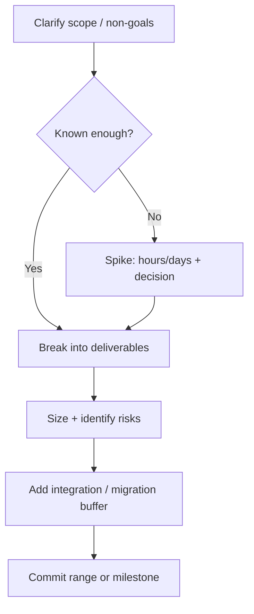

# Estimation and Risk

Estimate to expose uncertainty and sequence work — not to pretend precision.

> **Related:** Roadmap → [§1](01-technical-vision-and-roadmap.md) · Stakeholders → [§7](07-stakeholder-communication.md) · Design reviews → [§2](02-design-reviews.md)

---

## At a glance

| Need | Technique |
|------|-----------|
| Sprint planning | Relative sizing + capacity |
| Cross-team date | Range + confidence + risks |
| Unknown domain | Time-boxed spike with exit criteria |
| External dependency | Explicit assumption list |

**Rule of thumb:** Prefer **ranges and risks** over single-point dates. A date without assumptions is a wish.

---

## Estimation flow

| Anti-pattern | Prefer |
|--------------|--------|
| “Two weeks” with no scope | Written scope + out-of-scope |
| Padding silently | Visible contingency tied to risks |
| Ignoring integration | Explicit contract/test/migration tasks |
| Heroic overtime plan | Cut scope or move date |

---

## Risk register (lightweight)

| Risk | Likelihood | Impact | Mitigation | Trigger |
|------|------------|--------|------------|---------|
| Vendor API(Application Programming Interface) unstable | M | H | Contract tests + adapter | First integrate week |
| Data migration longer | H | H | Expand/contract; dual write | Staging dry-run fails |
| Key person PTO | L | M | Backup owner | Calendar |

Escalate early when triggers fire — [§10](10-ownership-and-escalation.md).

---

## Communicating uncertainty

| Phrase | Meaning |
|--------|---------|
| “Likely 3–5 weeks at 70% confidence” | Range + confidence |
| “Blocked on security review SLA(Service Level Agreement)” | External dependency |
| “Spike ends Friday: build vs buy” | Decision gate |

---

## Common mistakes

| Mistake | Fix |
|---------|-----|
| Estimating tasks before problem is clear | Spike first |
| Confusing estimate with commitment | Separate forecast vs promise |
| Hiding risks from PM | Surface in planning — [§7](07-stakeholder-communication.md) |
| No buffer for test/ops | Include gates and rollout |
| Re-estimating only after miss | Re-forecast at midpoints |