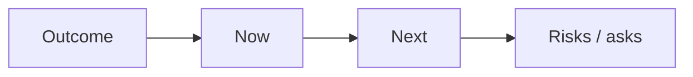

# Stakeholder Communication

Translate technical reality for PM, execs, support, and security without drowning them — or sandbagging them.

> **Related:** Vision → [§1](01-technical-vision-and-roadmap.md) · Estimation → [§6](06-estimation-and-risk.md) · Incidents → [sre-and-incidents](../../sre-and-incidents/README.md) · API(Application Programming Interface) ownership → [§8](08-cross-team-api-ownership.md)

---

## At a glance

| Audience | They need | You bring |
|----------|-----------|-----------|
| **PM** | Scope, date, trade-offs | Options with costs |
| **Exec** | Risk to outcomes | One slide: status, risk, ask |
| **Support** | Customer impact, workarounds | Runbook links, status text |
| **Security** | Control evidence, exceptions | Clear threat + mitigation |
| **Peer TLs** | Contracts, timelines | Written ownership |

**Rule of thumb:** Lead with **decision and impact**, then detail. Never surprise stakeholders on launch week with known risks.

---

## Status update skeleton

| Section | Content |
|---------|---------|
| **Outcome** | What business goal this serves |
| **Now** | Shipped / in progress (facts) |
| **Next** | Near milestones |
| **Risks** | Top 1–3 with mitigation |
| **Ask** | Decision, people, or date flex |

---

## Hard conversations

| Situation | Frame |
|-----------|-------|
| Date slip | Scope cut options A/B/C + risk of forcing date |
| Quality vs speed | Error budget / incident cost |
| Build vs buy | TCO(Total Cost of Ownership) and lock-in — [§9](09-build-vs-buy.md) |
| Saying no | Non-goals + alternative path |

During incidents, follow [incident command](../../sre-and-incidents/includes/06-incident-command.md) for severity and comms — TL supports, does not freelance conflicting messages.

---

## Writing that scales

| Prefer | Avoid |
|--------|-------|
| Short written updates | Only verbal hallway decisions |
| Links to ADRs/runbooks | Re-explaining from scratch |
| Explicit asks | “FYI” walls of text |
| Shared channel of record | DM-only critical decisions |

---

## Common mistakes

| Mistake | Fix |
|---------|-----|
| Over-jargoning execs | Outcome language first |
| Under-informing eng peers | Share ADRs and contracts |
| Optimistic silence | Early risk callouts |
| Conflicting messages in incident | Single comms lead |
| No paper trail for decisions | ADR or decision log |