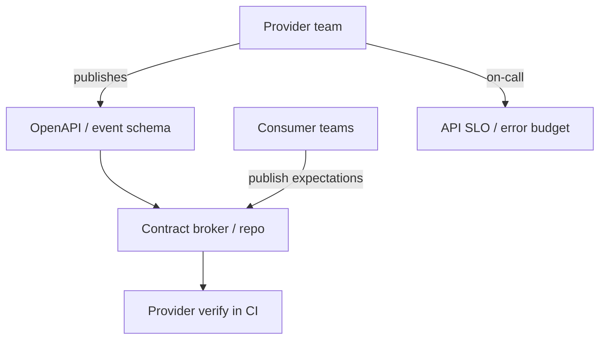

# Cross-Team API Ownership

Who owns the contract, how breaking changes ship, and how SLAs between teams stay honest.

> **Related:** Versioning & deprecation → [api-design §14](../../api-design-and-protection/includes/14-api-versioning-and-deprecation.md) · Contract CI(Continuous Integration) → [api-design §15](../../api-design-and-protection/includes/15-contract-and-schema-testing.md) · Contract strategy → [testing-strategy §3](../../testing-strategy/includes/03-contract-testing-boundaries.md) · Stakeholders → [§7](07-stakeholder-communication.md)

---

## At a glance

| Question | Owner |
|----------|-------|
| Spec and compatibility policy | **Provider** team |
| Consumer expectations / Pact | **Consumer** defines; provider verifies |
| Breaking change schedule | Joint; provider drives deprecation clock |
| Runtime SLO(Service Level Objective) for the API | Provider publishes; consumers design to it |
| Incident for 5xx on API | Provider primary; consumer assists with client evidence |

**Rule of thumb:** If two teams deploy independently, you need an **explicit contract owner** and a **versioning path** — [api-design §14](../../api-design-and-protection/includes/14-api-versioning-and-deprecation.md).

---

## Ownership model

| Artifact | Lives where |
|----------|-------------|
| OpenAPI / proto | Provider repo (source of truth) |
| Pacts | Broker or consumer repos |
| Changelog / deprecation | Provider docs + API portal |
| Integration runbook | Shared; linked from both |

---

## Breaking-change process

| Step | Action |
|------|--------|
| 1 | Classify break — [§14](../../api-design-and-protection/includes/14-api-versioning-and-deprecation.md) |
| 2 | Prefer additive change; else `/v2` or dual-run |
| 3 | Announce with date and migration guide |
| 4 | Contract CI blocks accidental breaks — [§15](../../api-design-and-protection/includes/15-contract-and-schema-testing.md) |
| 5 | Sunset old version after consumer evidence |

---

## SLA / expectations sheet (template)

| Field | Example |
|-------|---------|
| Availability SLO | 99.9% monthly |
| p99 latency | 200 ms region X |
| Support hours | Business / 24×7 |
| Change notice | 30 days for breaks |
| Auth model | mTLS(Mutual Transport Layer Security) / OAuth(Open Authorization) client credentials |

---

## Common mistakes

| Mistake | Fix |
|---------|-----|
| “Shared” API with no owner | Name provider team |
| Breaking field in place | Version + deprecation clock |
| Consumers paging provider for client bugs | Clear RACI(Responsible, Accountable, Consulted, Informed) in runbook |
| No contract tests across teams | Pact/schema verify — testing §3 + api §15 |
| Informal Slack-only API changes | Changelog + review |