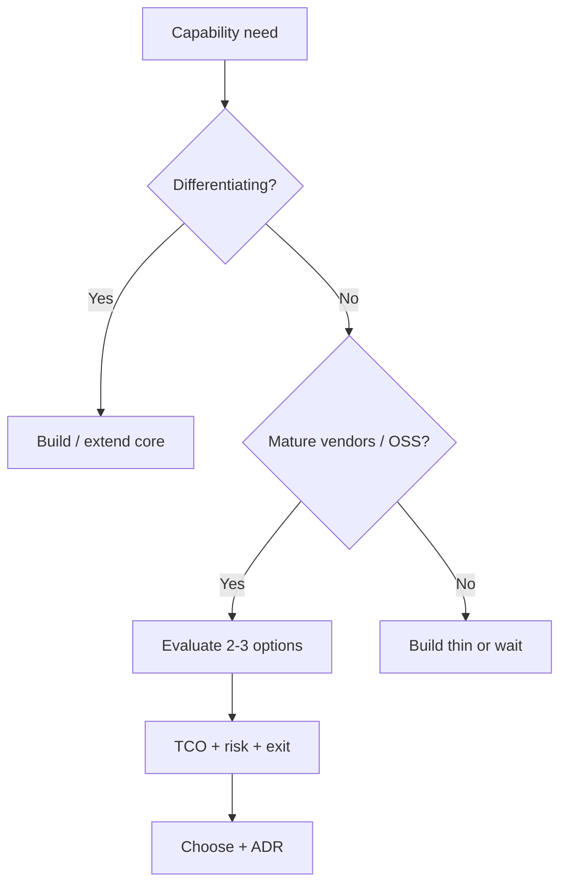

# Build vs Buy

Decide when to build in-house, adopt open source, or purchase SaaS(Software as a Service) — with TCO(Total Cost of Ownership) and exit plans, not hype.

> **Related:** Architecture trade-offs → [architecture-decisions §6](../../architecture-decisions/includes/06-tradeoff-frameworks.md) · Security/supply chain → [enterprise-security-compliance](../../enterprise-security-compliance/README.md) · Stakeholders → [§7](07-stakeholder-communication.md)

---

## At a glance

| Lean **build** when | Lean **buy** when |
|---------------------|-------------------|
| Differentiating product logic | Commodity capability (email, auth commodity IdP(Identity Provider)) |
| Tight latency/data residency needs | Vendor meets compliance and SLAs |
| Integration is the product | Time-to-value dominates |
| Existing team expertise deep | Hiring for commodity is wasteful |

**Rule of thumb:** Buy undifferentiated heavy lifting; build the **decision advantage**. Always price **exit**.

---

## Decision canvas

| Factor | Questions |
|--------|-----------|
| **TCO** | License, impl, ops, training, renewals (3 years) |
| **Risk** | Lock-in, outages, roadmap misalignment |
| **Compliance** | Data residency, SOC2, DPA, subprocessors |
| **Integration** | APIs, events, SSO(Single Sign-On), audit logs |
| **Exit** | Export formats, dual-run period, rewrite cost |

Record the choice as an [ADR](../../architecture-decisions/includes/05-adrs-and-design-docs.md).

---

## Evaluation scorecard (example weights)

| Criterion | Weight | Notes |
|-----------|--------|-------|
| Meets must-have NFRs | Must | Latency, residency |
| Security & compliance | High | See enterprise-security guide |
| Integration fit | High | Contract quality |
| TCO 3-year | High | Include eng opportunity cost |
| Vendor health / OSS governance | Med | Bus factor, funding |
| Exit difficulty | Med | Penalize lock-in |

---

## Pros and cons

| Option | Pros | Cons |
|--------|------|------|
| Build | Control, fit | Opportunity cost, ops burden |
| Buy SaaS | Speed, ops offload | Lock-in, data gravity, cost curve |
| OSS + operate | Flexibility, community | You still run it |

---

## Common mistakes

| Mistake | Fix |
|---------|-----|
| Buy because demo was pretty | Scorecard + spike |
| Build everything for “control” | Ask if differentiating |
| No exit plan | Export + dual-run in ADR |
| Ignoring eng time in TCO | Include build and integrate cost |
| Skipping security review on vendor | Supply-chain / AppSec gate |