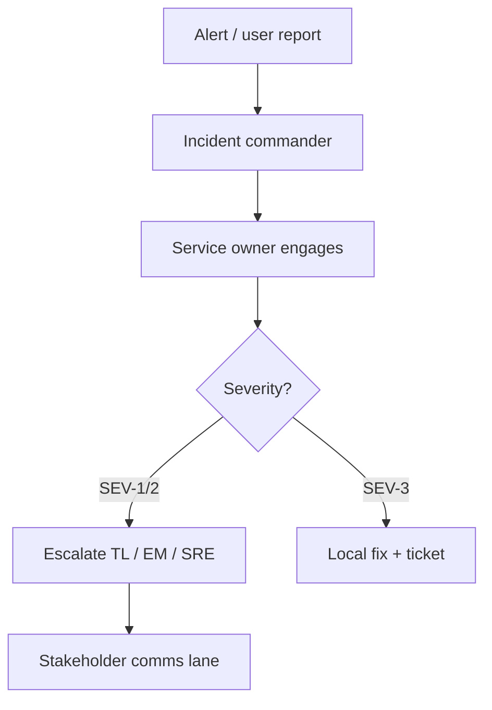

# Ownership and Escalation

Make “who is accountable” and “when to escalate” boringly clear — before the SEV.

> **Related:** Overview roles → [§0](00-overview.md) · On-call design → [sre-and-incidents §8](../../sre-and-incidents/includes/08-on-call-design.md) · Incident command → [sre-and-incidents §6](../../sre-and-incidents/includes/06-incident-command.md) · API(Application Programming Interface) ownership → [§8](08-cross-team-api-ownership.md)

---

## At a glance

| Domain | Primary owner | Escalates to |
|--------|---------------|--------------|
| Service runtime | Team on-call | TL → EM/SRE(Site Reliability Engineering) as severity rises |
| Cross-team API | Provider on-call | Provider TL + consumer TL |
| Platform (CI, cluster) | Platform on-call | Platform TL |
| Security incident | Security + service owner | CISO path per runbook |
| Product priority conflict | TL + PM | EM / director |

**Rule of thumb:** Every production system has a **named owning team** and a **pager path**. “Shared” without a name is unowned.

---

## RACI for a service (example)

| Activity | Eng | TL | EM | SRE | PM |
|----------|-----|----|----|-----|-----|
| Feature delivery | R | A | C | C | C |
| On-call | R | A | C | C/A | I |
| Error budget policy | C | A | C | R | I |
| Cross-team contract | R | A | I | I | C |

R=Responsible, A=Accountable, C=Consulted, I=Informed.

Follow [incident command](../../sre-and-incidents/includes/06-incident-command.md) for roles during active incidents.

---

## Escalation triggers

| Trigger | Action |
|---------|--------|
| SLO(Service Level Objective) burn rapid | Page SRE + TL; freeze risky deploys |
| Cross-team blocker > SLA(Service Level Agreement) | TL-to-TL escalate with written ask |
| Unclear ownership | Temporary owner assigned same day |
| People conflict | EM path — TL does not solo HR |

---

## Ownership checklist for new systems

- [ ] Owning team in service catalog
- [ ] On-call rotation and handoff — [SRE §8](../../sre-and-incidents/includes/08-on-call-design.md)
- [ ] Runbook link
- [ ] Slack/Teams + status channel mapped
- [ ] Dependency list with provider contacts
- [ ] Backup TL during leave

---

## Common mistakes

| Mistake | Fix |
|---------|-----|
| “Everyone owns it” | Name one team |
| Escalating too late | Publish triggers |
| TL as perpetual IC(Incident Commander) | Rotate; coach others |
| No backup during PTO | Explicit coverage |
| Skipping post-incident ownership of follow-ups | Track in postmortem — [SRE postmortems](../../sre-and-incidents/includes/07-postmortems.md) |