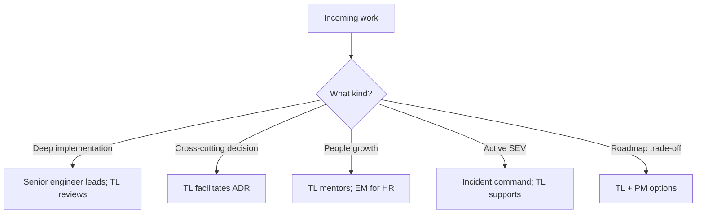

# Decision Guide

When to lean into Tech Lead practices — and common failure modes when the role is unclear.

> **Related:** Overview → [§0](00-overview.md) · Vision → [§1](01-technical-vision-and-roadmap.md) · Architecture ADRs → [architecture-decisions](../../architecture-decisions/README.md) · Reliability → [sre-and-incidents](../../sre-and-incidents/README.md)

---

## Quick picker

| Situation | Do this |
|-----------|---------|
| Ambiguous multi-quarter bet | Vision one-pager + ADR — [§1](01-technical-vision-and-roadmap.md), [architecture §5](../../architecture-decisions/includes/05-adrs-and-design-docs.md) |
| Risky design in flight | Facilitate design review — [§2](02-design-reviews.md) |
| Quality slipping / rubber stamps | Raise review bar — [§3](03-code-review-standards.md) |
| Uneven growth on team | Mentoring plan — [§4](04-mentoring-and-leveling.md) |
| Features blocked by drag | Debt portfolio negotiation — [§5](05-tech-debt-portfolio.md) |
| Date pressure with unknowns | Ranges + risk register — [§6](06-estimation-and-risk.md) |
| Exec / PM misaligned | Stakeholder update skeleton — [§7](07-stakeholder-communication.md) |
| Cross-team breakages | API(Application Programming Interface) ownership + versioning — [§8](08-cross-team-api-ownership.md) |
| Vendor pitch | Build-vs-buy scorecard — [§9](09-build-vs-buy.md) |
| SEV chaos / unclear pages | Ownership & escalation — [§10](10-ownership-and-escalation.md) |

---

## Role clarity flow

---

## Health checklist for a TL

- [ ] Written technical vision for the area
- [ ] Design review cadence with decisions recorded
- [ ] Review standards understood by the team
- [ ] Debt inventory ranked and partially funded
- [ ] Estimation uses ranges and risks
- [ ] Named owners for services and APIs
- [ ] Escalation paths tested (not only theoretical)
- [ ] Partnership with SRE(Site Reliability Engineering) on error budgets

---

## Common mistakes

| Mistake | Why it hurts | Fix |
|---------|--------------|-----|
| TL as hero coder on every path | Team stays dependent | Delegate; keep architectural control — [§0](00-overview.md) |
| No ADRs | Relitigate forever | architecture-decisions guide |
| Soft quality bar under date pressure | Escaped defects | Gates + reviews — [testing-strategy §7](../../testing-strategy/includes/07-quality-gates.md) |
| Debt only as complaints | No paydown | Portfolio — [§5](05-tech-debt-portfolio.md) |
| Optimistic dates without risks | Surprise slips | [§6](06-estimation-and-risk.md) |
| Unowned APIs | Integration thrash | [§8](08-cross-team-api-ownership.md) |
| Ignoring on-call pain | Burnout + outages | [sre-and-incidents](../../sre-and-incidents/README.md) + [§10](10-ownership-and-escalation.md) |

---

## Other guides in this repo

| Guide | Use when |
|-------|----------|
| [architecture-decisions](../../architecture-decisions/README.md) | Structural technical choices |
| [sre-and-incidents](../../sre-and-incidents/README.md) | Reliability culture and incidents |
| [testing-strategy](../../testing-strategy/README.md) | Quality system and DoD |
| [cicd-and-environments](../../cicd-and-environments/README.md) | Delivery ownership vs platform |
| [enterprise-security-compliance](../../enterprise-security-compliance/README.md) | Secure SDLC(Software Development Life Cycle) expectations |