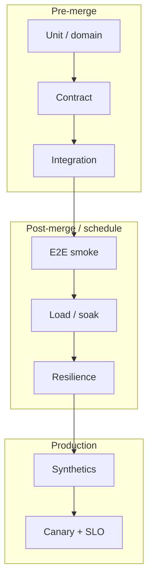

# Overview — Testing Strategy

How Tech Leads decide what to automate, how deep each layer goes, and how CI(Continuous Integration) and production checks close the loop.

> **Related:** Contract CI tooling → [api-design §15](../../api-design-and-protection/includes/15-contract-and-schema-testing.md) · Pipeline wiring → [cicd-and-environments](../../cicd-and-environments/README.md) · Domain event tests → [event-sourcing §9](../../event-sourcing-and-cqrs/includes/09-testing-and-verification.md) · Decision picker → [§9](09-decision-guide.md)

---

## At a glance

| Goal | Start here | Add when risk grows |
|------|------------|---------------------|
| Fast feedback on logic | Unit + pure domain tests | Property/table-driven cases |
| Safe service boundaries | Contract tests | Provider verification in CI |
| Real deps work together | Integration (Testcontainers) | Narrow E2E(End-to-End) smoke |
| Survive load and failure | Load + soak | Resilience / chaos drills |
| Catch regressions in prod | Synthetics + canary | Error-budget gates |

**Rule of thumb:** Automate **deterministic, high-signal** checks near the code. Keep E2E thin. Put flaky or exploratory work **outside** merge gates.

---

## Strategy stack

| Layer | Proves | Owns flake risk |
|-------|--------|-----------------|
| **Unit** | Pure logic, edge cases | Low — fix or delete |
| **Contract** | Consumer ↔ provider shape | Medium — schema drift |
| **Integration** | DB, broker, cache wiring | Medium — env isolation |
| **E2E** | Critical user journeys | High — keep few |
| **Non-func** | Capacity, soak, failure | Scheduled, not every PR |
| **Production** | Reality matches intent | Ops + release train |

---

## Ownership

| Role | Owns |
|------|------|
| **Author** | Unit/integration for changed code; no new flaky suite |
| **Tech Lead** | Pyramid shape, gate policy, flake budget |
| **Platform / CI** | Runner isolation, artifacts, retry policy |
| **SRE(Site Reliability Engineering)** | Load profiles, synthetics, canary SLOs |

Domain-specific depth (aggregates, projectors) → [ES §9](../../event-sourcing-and-cqrs/includes/09-testing-and-verification.md). API(Application Programming Interface) schema gates → [api-design §15](../../api-design-and-protection/includes/15-contract-and-schema-testing.md).

---

## Reading path

1. [§1 Pyramid vs diamond](01-test-pyramid-and-diamond.md) — shape the portfolio
2. [§2 What not to automate](02-what-not-to-automate.md) — cut waste
3. [§3–§4](03-contract-testing-boundaries.md) — boundaries and E2E budget
4. [§7 Quality gates](07-quality-gates.md) — definition of done in CI
5. [§8–§9](08-production-verification.md) — live verification + decisions

---

## Common mistakes

| Mistake | Fix |
|---------|-----|
| Only E2E covers business rules | Move rules to unit/domain tests |
| Contract tests = full OpenAPI authoring | Scope: strategy → [§3](03-contract-testing-boundaries.md); tooling → api-design §15 |
| Load test only `/health` | Exercise hot paths → [§5](05-load-soak-resilience-tests.md) |
| Ignore flake until it blocks release | Quarantine + owner SLA(Service Level Agreement) → [§6](06-flaky-test-management.md) |
| Green CI, silent prod breakage | Synthetics + canary → [§8](08-production-verification.md) |