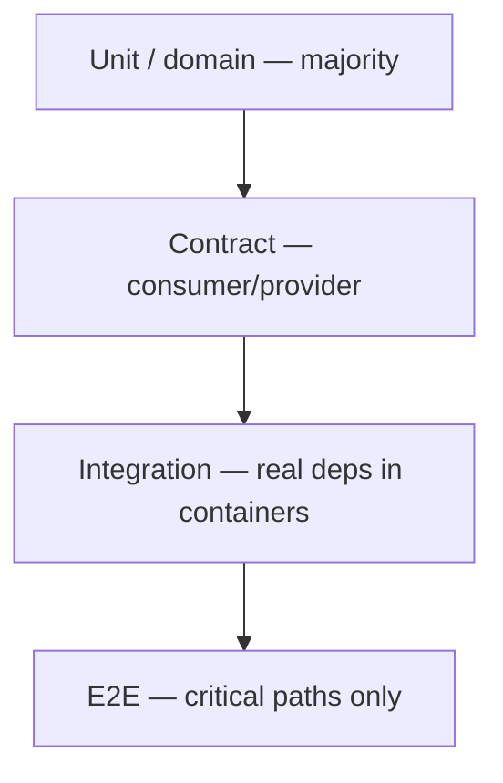

# Test Pyramid and Diamond

Choose a portfolio shape that matches coupling, not a dogma. Most backend services need a **pyramid**; UI-heavy or BFF(Backend for Frontend) surfaces often look more like a **diamond**.

> **Related:** Overview → [§0](00-overview.md) · Integration/E2E budget → [§4](04-integration-and-e2e.md) · ES layers → [event-sourcing §9](../../event-sourcing-and-cqrs/includes/09-testing-and-verification.md)

---

## At a glance

| Shape | Many of | Few of | Fits |
|-------|---------|--------|------|
| **Pyramid** | Unit, domain | E2E | Services with clear domain logic |
| **Diamond** | Integration / API(Application Programming Interface) | Pure unit *and* full UI E2E | Thin controllers + heavy adapters |
| **Ice cream** (anti-pattern) | Manual + E2E | Unit | Slow, flaky, late feedback |

**Rule of thumb:** Count **minutes to green** and **defect escape rate**, not test file counts.

---

## Pyramid (default for services)

| Layer | % of runtime (typical) | Examples |
|-------|------------------------|----------|
| Unit / domain | 60–80% | Pricing rules, state machines, validators |
| Contract | 5–15% | Pact, schema fixtures |
| Integration | 10–25% | Repository + Postgres, outbox + broker |
| E2E | 1–5% | Login → create order → pay smoke |

Event-sourced systems still pyramid: aggregate tests dominate; projector + outbox sit in integration — [ES §9](../../event-sourcing-and-cqrs/includes/09-testing-and-verification.md).

---

## Diamond (when adapters dominate)

When most risk lives in **mapping and I/O** (GraphQL resolvers, BFF composition, legacy DB), push weight into **integration**:

| Layer | Role in diamond |
|-------|-----------------|
| Thin unit | Pure mappers, policy helpers |
| **Wide integration** | HTTP(Hypertext Transfer Protocol) + DB + cache contracts |
| Narrow E2E | 3–5 journeys max |
| Avoid | Thousands of brittle UI clicks |

---

## What each layer should assert

| Layer | Assert | Do not assert |
|-------|--------|---------------|
| Unit | Business outcomes, edge cases | SQL(Structured Query Language) plan, network bytes |
| Contract | Status, required fields, types | Full business workflow |
| Integration | Persistence, transactions, retries | Pixel-perfect UI |
| E2E | Journey completes; critical SLIs | Every validation message |

---

## Pros and cons

| Shape | Pros | Cons |
|-------|------|------|
| Pyramid | Fast CI(Continuous Integration), precise failures | Needs discipline to keep E2E thin |
| Diamond | Catches wiring bugs early | Heavier containers; slower PR loops |
| Ice cream | Feels “realistic” | Slow, flaky, opaque failures |

---

## Common mistakes

| Mistake | Fix |
|---------|-----|
| “100% unit coverage” with no integration | Add one Testcontainers path per critical store |
| Duplicating the same assertion at three layers | One owner layer; others smoke only |
| Measuring success by test count | Track flake rate and escaped defects |
| Skipping contracts because “we have E2E” | Contracts catch breakages cheaper — [§3](03-contract-testing-boundaries.md) |