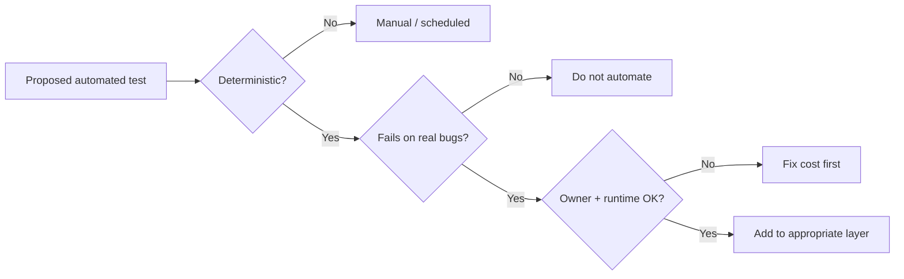

# What Not to Automate

Automation that does not catch defects or slow every PR is negative ROI. Explicitly **decline** some checks.

> **Related:** Pyramid shape → [§1](01-test-pyramid-and-diamond.md) · Flake handling → [§6](06-flaky-test-management.md) · Gates → [§7](07-quality-gates.md)

---

## At a glance

| Candidate | Automate? | Prefer |
|-----------|-----------|--------|
| Pure business rules | Yes | Unit / table-driven |
| Third-party SaaS(Software as a Service) UI | Rarely | Contract mocks + manual smoke |
| Exploratory UX | No | Session-based testing |
| One-off migration dry-run | Script once | Runbook, not CI(Continuous Integration) suite |
| Visual polish / branding | Selective | Snapshot on critical screens only |
| Chaos in every PR | No | Scheduled game day |

**Rule of thumb:** If a check is **non-deterministic**, **slow (> few minutes)**, or **unowned**, it does not belong in the merge gate.

---

## High-cost, low-signal automation

| Anti-pattern | Why it hurts | Alternative |
|--------------|--------------|-------------|
| Full browser suite for every API(Application Programming Interface) change | Minutes of flake for backend PRs | API contract + one smoke |
| Asserting clock/time.now() without control | Intermittent failures | Inject clock / freeze time |
| Testing vendor SDKs | You do not own their bugs | Mock at boundary |
| Screenshot diffs on every theme tweak | Noise, endless baselines | Critical flows only |
| “Retry until green” in CI | Hides product bugs | Quarantine + fix — [§6](06-flaky-test-management.md) |

---

## Keep human / scheduled

| Activity | Why not merge-gate |
|----------|--------------------|
| Exploratory testing | Discovers unknown unknowns |
| Accessibility deep audit | Needs judgment + tooling variety |
| Partner UAT | External calendar, real credentials |
| DR(Disaster Recovery) restore drill | Infra + people — [sre-and-incidents](../../sre-and-incidents/README.md) |
| Load / soak | Expensive; schedule nightly — [§5](05-load-soak-resilience-tests.md) |

---

## Checklist before adding a suite

- [ ] Failure message names the **component** and **invariant**
- [ ] Runs in **< target PR budget** (team-agreed minutes)
- [ ] Has a **named owner** for flakes
- [ ] Does not duplicate an existing layer’s assertions
- [ ] Data setup is **isolated** (no shared mutable fixtures)

---

## Common mistakes

| Mistake | Fix |
|---------|-----|
| Automating because “audit asked for coverage %” | Map controls to real risk; cite gate policy |
| Copying another team’s E2E count | Match your coupling and release risk |
| Leaving zombie tests “for later” | Delete or quarantine with owner |
| Automating demos / slide screenshots | Manual checklist for demos |