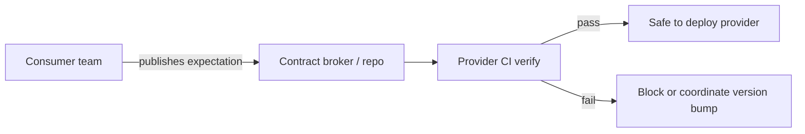

# Contract Testing Boundaries

When contracts sit between teams, and how this guide differs from OpenAPI/Pact **tooling**.

> **Scope:** **Team and portfolio boundaries** — what to contract-test, consumer vs provider ownership, when Pact vs schema-only is enough. **CI(Continuous Integration) tooling** (Spectral, openapi-diff, Pact broker, deploy coupling) → [api-design §15 Contract and schema testing](../../api-design-and-protection/includes/15-contract-and-schema-testing.md).
>
> **Related:** Integration/E2E → [§4](04-integration-and-e2e.md) · Versioning → [api-design §14](../../api-design-and-protection/includes/14-api-versioning-and-deprecation.md) · Event schemas → [event-sourcing §8](../../event-sourcing-and-cqrs/includes/08-event-schema-evolution.md) · Kafka contracts → [apache-kafka §12](../../apache-kafka/includes/12-testing-and-verification.md)

---

## At a glance

| Boundary | Contract approach | Owner |
|----------|-------------------|-------|
| Public HTTP(Hypertext Transfer Protocol) API(Application Programming Interface) | OpenAPI lint + breaking diff | Provider team |
| Critical consumer (billing, auth) | Consumer-driven Pact + provider verify | Consumer defines; provider gates |
| Internal same-repo modules | Prefer unit/integration | Skip Pact overhead |
| Async events | Schema registry / JSON Schema fixtures | Producer + consumers |
| Partner API | Versioned OpenAPI + sandbox contract suite | Both sides + broker |

**Rule of thumb:** Contract tests protect **compatibility across deploy boundaries**. They are not a substitute for business-rule unit tests.

---

## Strategy vs tooling

| This guide (§3) | api-design §15 |
|-----------------|----------------|
| Which integrations need contracts | Spectral, oasdiff, Pact broker steps |
| Consumer vs provider responsibilities | Pipeline mermaid and fail conditions |
| How contracts fit the pyramid | Breaking change examples |

Do not duplicate Spectral rules here — link and enforce in CI via [§15](../../api-design-and-protection/includes/15-contract-and-schema-testing.md).

---

## Ownership flow

| Role | Does | Does not |
|------|------|----------|
| **Consumer** | Encode needed fields/status | Dictate provider internals |
| **Provider** | Verify all published pacts / schemas | Ship breaks without version path |
| **Platform** | Broker, auth, retention | Own domain expectations |

---

## When schema-only is enough

| Situation | Prefer |
|-----------|--------|
| Single team owns both sides | OpenAPI/schema tests in one repo |
| Many unknown consumers | Provider-driven OpenAPI + breaking diff |
| Known high-stakes consumers | Add Pact (or equivalent) |
| Event streams | Registry compatibility mode — [Kafka §6](../../apache-kafka/includes/06-serialization-and-schema-evolution.md) |

---

## Common mistakes

| Mistake | Fix |
|---------|-----|
| Pact on every internal call | Limit to deploy-decoupled consumers |
| Contracts without provider verification in CI | Wire verify gate — api-design §15 |
| Treating contract pass as full E2E | Keep journey tests separate — [§4](04-integration-and-e2e.md) |
| Breaking field change without `/v2` | Version + diff baseline — [§14](../../api-design-and-protection/includes/14-api-versioning-and-deprecation.md) |
| Skipping event contracts | Golden fixtures + registry — [ES §9](../../event-sourcing-and-cqrs/includes/09-testing-and-verification.md) |