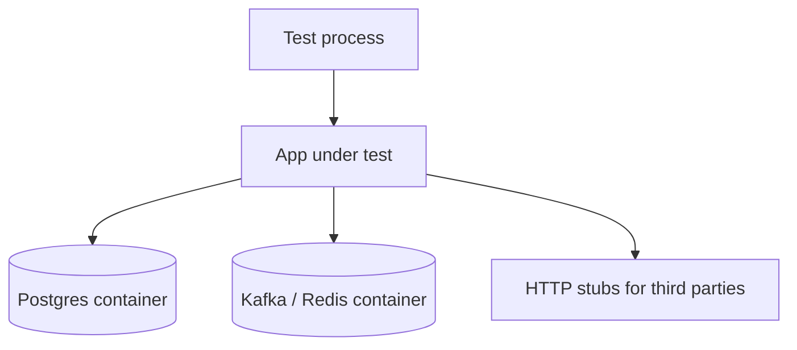

# Integration and E2E

Prove wiring with real dependencies, then keep E2E(End-to-End) journeys few and owned.

> **Related:** Pyramid → [§1](01-test-pyramid-and-diamond.md) · Contracts → [§3](03-contract-testing-boundaries.md) · Flakes → [§6](06-flaky-test-management.md) · CI(Continuous Integration) stages → [cicd-and-environments](../../cicd-and-environments/README.md) · ES outbox/saga integration → [event-sourcing §9](../../event-sourcing-and-cqrs/includes/09-testing-and-verification.md)

---

## At a glance

| Kind | Dependencies | When to run |
|------|--------------|-------------|
| **Integration** | Real DB/broker/cache in containers | Every PR (or affected packages) |
| **Component / API(Application Programming Interface)** | App + deps, no browser | Every PR for service changes |
| **E2E smoke** | Full stack, 3–5 journeys | Post-merge + pre-prod |
| **E2E deep** | Rare paths, partner sandbox | Nightly / release train |

**Rule of thumb:** Prefer **Testcontainers** (or equivalent) over shared staging for merge gates. Shared envs belong to smoke and UAT.

---

## Integration patterns

| Pattern | Use for | Avoid for |
|---------|---------|-----------|
| Testcontainers | Transactions, migrations, consumers | Pixel UI |
| In-memory fakes | Pure domain speed | Persistence bugs |
| Recorded HTTP (VCR) | Stable third-party shapes | Auth/token churn without scrubbing |
| Shared staging | Exploratory, partner demos | Parallel PR isolation |

Outbox + consumer pipelines → [ES §9](../../event-sourcing-and-cqrs/includes/09-testing-and-verification.md) · Kafka Testcontainers → [apache-kafka §12](../../apache-kafka/includes/12-testing-and-verification.md).

---

## E2E budget

| Cap | Guidance |
|-----|----------|
| **Journey count** | 3–5 must-pass paths (auth, money, core create/read) |
| **Runtime** | Fit post-merge budget; not every PR if > ~10 min |
| **Data** | Ephemeral tenants/users; never mutate shared prod-like accounts |
| **Assertions** | Outcome + critical SLI(Service Level Indicator); not every label |

| Journey example | Assert |
|-----------------|--------|
| Signup → first resource | 2xx, resource visible |
| Checkout / payment | Idempotent success; ledger consistent |
| Admin critical action | AuthZ deny + allow paths |

---

## Isolation checklist

- [ ] Unique DB schema/database per suite or parallel worker
- [ ] No reliance on wall-clock without control
- [ ] Third parties stubbed or sandboxed
- [ ] Cleanup on failure (or disposable containers)
- [ ] Seeds versioned with migrations

---

## Pros and cons

| Approach | Pros | Cons |
|----------|------|------|
| Heavy integration | Catches real SQL(Structured Query Language)/broker bugs | Slower CI; needs good fixtures |
| Thin E2E | Protects user-visible paths | Opaque failures; flake risk |
| Shared staging only | Cheap to start | Collisions, non-repro |

---

## Common mistakes

| Mistake | Fix |
|---------|-----|
| E2E as only regression net | Move rules down the pyramid |
| One giant “god” journey | Split by product risk |
| Sleeping for eventual consistency | Poll with timeout / await helpers |
| Running full E2E on docs-only PRs | Path filters in CI — [cicd](../../cicd-and-environments/README.md) |