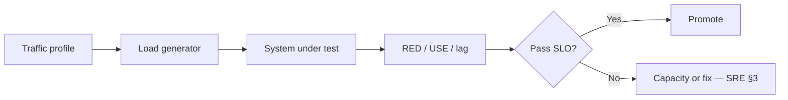

# Load, Soak, and Resilience Tests

Non-functional suites prove capacity and failure behavior — not every PR, but before scale events and on a schedule.

> **Scope:** **How to design and gate** load, soak, and resilience tests in the quality portfolio. **Capacity planning math and SLOs** → [sre-and-incidents §3 capacity](../../sre-and-incidents/includes/03-capacity-and-load-testing.md). **Timeouts, retries, breakers, chaos mechanics** → [resilience-patterns](../../resilience-patterns/README.md).
>
> **Related:** Quality gates → [§7](07-quality-gates.md) · Prod verification → [§8](08-production-verification.md) · Throughput measurement → [high-throughput-systems §1](../../high-throughput-systems/includes/01-measurement-and-slo.md) · Chaos drills → [resilience-patterns §10](../../resilience-patterns/includes/10-chaos-and-failure-injection.md)

---

## At a glance

| Suite | Question | Cadence |
|-------|----------|---------|
| **Load** | Meet target RPS / p99 under profile? | Pre-release + after capacity change |
| **Soak** | Stable over hours (leaks, bloat, lag)? | Nightly / weekly |
| **Spike / stress** | Graceful degrade past limit? | Before peak events |
| **Resilience** | Dependency failure → bounded blast? | Game day + CI(Continuous Integration) smoke of fault flags |

**Rule of thumb:** Load tests use **production-like paths and data shape**. Health checks alone prove nothing — same lesson as [HTS decision guide](../../high-throughput-systems/includes/12-decision-guide-and-common-mistakes.md).

---

## Load profile checklist

| Element | Define |
|---------|--------|
| **Actors** | Mix of list, search, write, webhook |
| **Arrival** | Steady, ramp, spike |
| **Data** | Hot keys, cold keys, tenant spread |
| **Success** | SLI(Service Level Indicator) thresholds (error %, p99, saturation) |
| **Abort** | Hard stop if error budget / safety trip |

Capacity interpretation and headroom → [SRE §3](../../sre-and-incidents/includes/03-capacity-and-load-testing.md).

---

## Soak and resilience

| Test | Watch for | Pair with |
|------|-----------|-----------|
| Soak 4–24h | Memory growth, connection leaks, queue lag, disk | Same profile at ~50–70% peak |
| Kill dependency | Timeouts fire; no cascade | [resilience-patterns](../../resilience-patterns/README.md) |
| Inject latency | Backpressure / 429 / degrade path | HTS backpressure |
| Partition / poison message | DLQ(Dead Letter Queue), no silent drop | Kafka/ES testing sections |

---

## Where results live

| Output | Use |
|--------|-----|
| Report artifact in CI | Trend p99 and error rate |
| Dashboard link | Share with SRE(Site Reliability Engineering) / TL |
| Gate on nightly | Block release train if regresses > threshold |
| Not on every PR | Unless micro-benchmark for hot path |

---

## Common mistakes

| Mistake | Fix |
|---------|-----|
| Load test empty DB | Seed realistic cardinality |
| No saturation signals | Watch pools, CPU, queue depth — USE(Utilization, Saturation, Errors) |
| Resilience = “kill pod once” | Script dependency faults + assert bounded recovery |
| Treating load pass as functional QA | Still need pyramid for correctness |
| Ignoring soak leaks until prod OOM | Weekly soak on critical services |