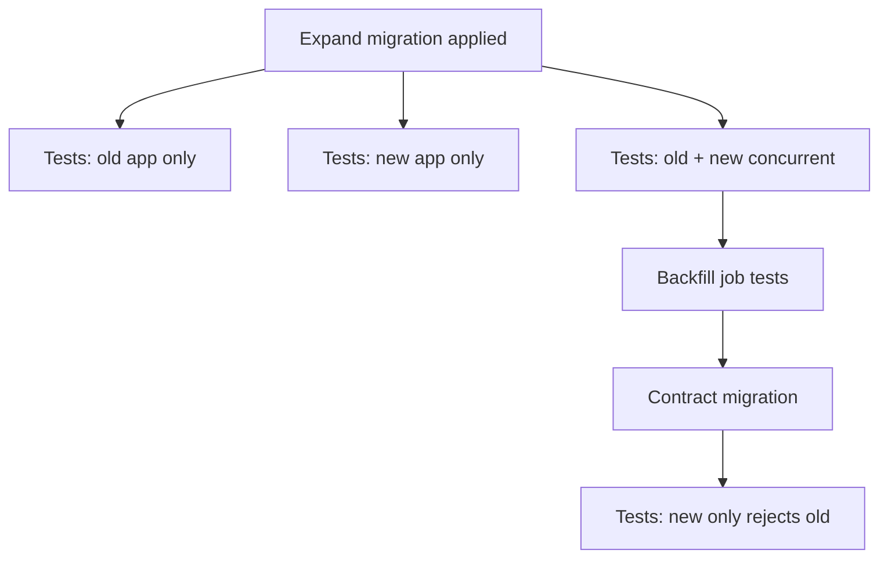

# Migration and Async Pipeline Tests

Schema migrations and async pipelines fail in **dual-run windows** — tests must prove **expand/contract safety**, **CDC(Change Data Capture) projection**, and **consumer idempotency** while old and new code coexist.

> **Scope:** Test strategy for migrations, outbox/CDC relays, and downstream sinks. DDL(Data Definition Language) steps → [PG §15](../../postgresql-performance/includes/15-schema-migration-checklist.md). Platform coordination → [data-platforms §6](../../data-platforms/includes/06-migration-coordination.md). Event/outbox tests → [ES §9](../../event-sourcing-and-cqrs/includes/09-testing-and-verification.md). Deploy coupling → [deployment §12](../../deployment-strategies/includes/12-schema-migrations-and-deploy.md).
>
> **Related:** Contract CI(Continuous Integration) → [api §15](../../api-design-and-protection/includes/15-contract-and-schema-testing.md) · Kafka testing → [apache-kafka §12](../../apache-kafka/includes/12-testing-and-verification.md) · HTS CDC → [HTS §15](../../high-throughput-systems/includes/15-cdc-and-search-indexing.md)

---

## At a glance

| Layer | Prove |
|-------|-------|
| **Expand DDL** | Old app still reads/writes |
| **Dual-write app** | Both shapes persisted correctly |
| **CDC / outbox** | Downstream sees ordered, complete events |
| **Contract** | New consumers tolerate old payloads |
| **Contract phase** | New-only after flag; old path removed |

**Rule of thumb:** If tests assume **one app version**, they will not catch production migration bugs — simulate **vN and vN+1** against the same database.

---

## Expand / contract test matrix

| Scenario | Assert |
|----------|--------|
| Old app after expand | CRUD on old columns succeeds |
| New app before backfill complete | Reads default/null safely |
| Both apps writing | No constraint violations; final row correct |
| After contract | Old columns gone; migrations irreversible path documented |

Steps checklist → [PG §15](../../postgresql-performance/includes/15-schema-migration-checklist.md).

---

## Async pipeline tests

| Component | Test type |
|-----------|-----------|
| **Outbox relay** | Integration: commit + message published — [ES §9](../../event-sourcing-and-cqrs/includes/09-testing-and-verification.md) |
| **CDC connector** | Fixture DB change → expected Kafka/event payload |
| **Search projector** | Event sequence → index document |
| **Warehouse sink** | Schema evolution + late arrival |

Use **Testcontainers** or sandbox broker — not mocks for serialization boundaries. Idempotent consumer: replay same message twice → one side effect — [ES §5A](../../event-sourcing-and-cqrs/includes/05A-outbox-and-inbox.md).

---

## CDC and search reindex

| Check | Method |
|-------|--------|
| **Lag SLO(Service Level Objective)** under load | Soak test with dual-write |
| **Delete tombstone** | Row delete removes index doc |
| **Rename field** | Dual-field window — [data-platforms §6](../../data-platforms/includes/06-migration-coordination.md) |
| **Blue/green index** | Query both; cutover test |

Pipeline depth → [HTS §15](../../high-throughput-systems/includes/15-cdc-and-search-indexing.md).

---

## CI gates

- [ ] Migration up/down (or expand/contract pair) in CI against ephemeral DB
- [ ] Compatibility test: old consumer + new producer event
- [ ] Relay integration test on every outbox schema change
- [ ] Load test: backfill job does not breach lock budget — [PG §12](../../postgresql-performance/includes/12-bulk-operations-and-concurrency.md)
- [ ] Documented rollback: app flag before contract DDL

---

## Common mistakes

| Mistake | Why it hurts | Fix |
|---------|--------------|-----|
| Test only latest app | Dual-run breaks prod | Matrix vN + vN+1 |
| Mock broker always | Wire format bugs ship | Testcontainers |
| Contract DDL before apps upgraded | Outage | Gate order — [deployment §12](../../deployment-strategies/includes/12-schema-migrations-and-deploy.md) |
| No replay test | Duplicate delivery corrupts | Idempotency integration test |
| Skip downstream | Search/WH wrong shape | End-to-end fixture — [data-platforms §6](../../data-platforms/includes/06-migration-coordination.md) |

---

## Pros and cons

| Approach | Pros | Cons |
|----------|------|------|
| **Full dual-version CI matrix** | Catches real migrate bugs | Slower pipelines |
| **Staging soak only** | Faster CI | Late discovery |
| **Feature-flagged contract** | Safe cutover | Requires discipline |
