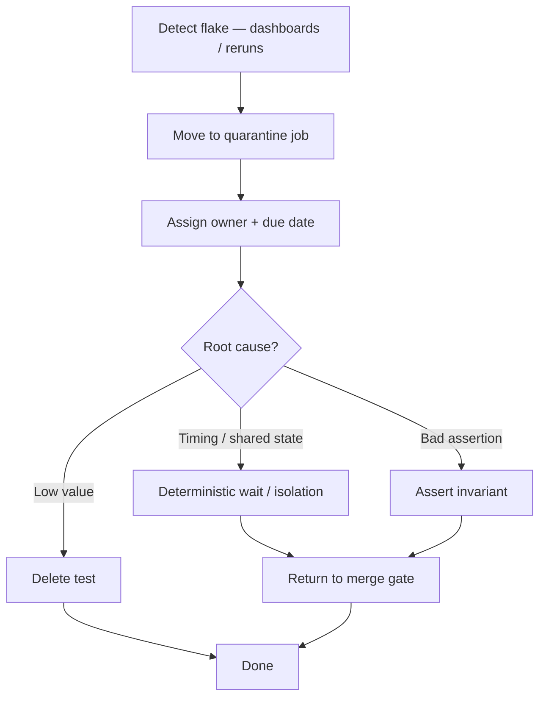

# Flaky Test Management

Flakes destroy trust in CI(Continuous Integration). Treat them as **incidents against the quality system**, not background noise.

> **Related:** What not to automate → [§2](02-what-not-to-automate.md) · Gates → [§7](07-quality-gates.md) · Integration isolation → [§4](04-integration-and-e2e.md)

---

## At a glance

| Signal | Action |
|--------|--------|
| Same test fails intermittently > N times / week | Quarantine + owner |
| Suite pass rate < team threshold | Stop adding tests; fix hygiene |
| “Retry 3×” hides real bugs | Ban silent retries on merge gate |
| Flake older than SLA(Service Level Agreement) | Auto-fail build or delete test |

**Rule of thumb:** A flaky test is a **failing test**. Quarantine is temporary; the default end state is **fix or delete**.

---

## Lifecycle

| Stage | Policy |
|-------|--------|
| **Detect** | Track flake rate per suite; alert TL weekly |
| **Quarantine** | Non-blocking job; still runs and reports |
| **SLA** | e.g. 5 business days to fix or delete |
| **Re-enable** | Requires 20+ consecutive greens or equivalent |

---

## Root-cause patterns

| Cause | Fix |
|-------|-----|
| Shared mutable DB rows | Unique keys / transactions / containers |
| Wall clock / timezone | Inject clock |
| Async without await | Poll with timeout; never fixed sleep alone |
| Order-dependent tests | Forbid shared static state |
| Parallel workers collide | Shard by tenant or port |
| External network | Stub; never hit live SaaS(Software as a Service) in gate |

---

## Metrics to watch

| Metric | Healthy |
|--------|---------|
| Merge-gate flake rate | Near 0%; alert if rising |
| Quarantine count | Trending down |
| Median time-to-fix flake | Within SLA |
| Silent retry usage | Disallowed on critical jobs |

---

## Pros and cons

| Tactic | Pros | Cons |
|--------|------|------|
| Quarantine | Keeps main green | Can rot if no SLA |
| Delete aggressively | Restores trust | May lose weak coverage — replace intentionally |
| Retry in CI | Short-term unblock | Masks bugs — avoid on gate |

---

## Common mistakes

| Mistake | Fix |
|---------|-----|
| Ignoring flakes because “rerun works” | Quarantine policy |
| Quarantine forever | Age-out delete |
| Blaming infrastructure only | Fix isolation in tests first |
| Disabling entire suite | Surgical quarantine of offenders |