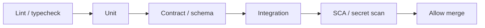

# Quality Gates

CI(Continuous Integration) definition of done: what must be green before merge and before promote.

> **Related:** Pipeline design → [cicd-and-environments §1](../../cicd-and-environments/includes/01-ci-pipeline-design.md) · Contract tooling → [api-design §15](../../api-design-and-protection/includes/15-contract-and-schema-testing.md) · Flakes → [§6](06-flaky-test-management.md) · Deploy SLO(Service Level Objective) rollback → [deployment-strategies §13](../../deployment-strategies/includes/13-slo-rollback-triggers.md)

---

## At a glance

| Gate | Blocks | Typical checks |
|------|--------|----------------|
| **PR / merge** | Merge to main | Lint, unit, contract, integration, security scan |
| **Release candidate** | Promote to staging/prod | E2E smoke, migration dry-run, artifact signature |
| **Production promote** | Traffic shift | Canary SLOs, synthetics, change ticket |

**Rule of thumb:** Merge gates are **fast and deterministic**. Expensive suites gate **promotion**, not every commit.

---

## Definition of done (engineering)

A change is done when:

- [ ] Required PR checks green (no quarantined critical suites)
- [ ] New behavior covered at the **correct pyramid layer**
- [ ] No new flake introduced (or owned quarantine ticket)
- [ ] Schema/OpenAPI/event contract updated if public surface changed
- [ ] Observability: metrics/logs/traces for new failure modes
- [ ] Runbook / flag / rollback note if operational risk

Product “done” may add UX/a11y — keep engineering gates explicit.

---

## Suggested PR pipeline

| Check | Fail if |
|-------|---------|
| Lint/types | Style or type errors |
| Unit | Assertion failure |
| Contract | Breaking diff or Pact verify fail — [§15](../../api-design-and-protection/includes/15-contract-and-schema-testing.md) |
| Integration | Container suite red |
| Security | High CVE / secret detected — see enterprise-security guide |

Wire stages in [CI pipeline design](../../cicd-and-environments/includes/01-ci-pipeline-design.md).

---

## Promotion gates

| Stage | Extra gates |
|-------|-------------|
| Staging | E2E smoke, config parity check |
| Prod canary | Error rate / latency vs baseline — [§8](08-production-verification.md) |
| Full prod | Synthetics green; error budget not exhausted |

---

## Exceptions

| Exception | Controls |
|-----------|----------|
| Hotfix | Smaller suite + mandatory post-verify + owner |
| Docs-only | Path filters skip heavy jobs |
| Experimental flag | Flag default off; contract documents both paths |

Document exceptions in the PR template; do not silent-skip.

---

## Common mistakes

| Mistake | Fix |
|---------|-----|
| Optional “nice” checks that everyone ignores | Required or remove |
| 40-minute merge gate | Split PR vs promote |
| Coverage % as only gate | Prefer risk-based suites + contracts |
| No owner for red main | Page on-call for main breakage |