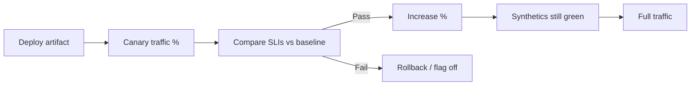

# Production Verification

After deploy, prove the system still works for users — canaries, synthetics, and post-change checks.

> **Related:** Canary mechanics → [deployment-strategies §4](../../deployment-strategies/includes/04-canary.md) · SLO(Service Level Objective) rollback → [deployment-strategies §13](../../deployment-strategies/includes/13-slo-rollback-triggers.md) · Synthetics practice → [sre-and-incidents §10](../../sre-and-incidents/includes/10-synthetic-monitoring.md) · Quality gates → [§7](07-quality-gates.md) · Load vs live → [§5](05-load-soak-resilience-tests.md)

---

## At a glance

| Technique | Proves | When |
|-----------|--------|------|
| **Canary / progressive** | New version healthy under real traffic | Every risky prod deploy |
| **Synthetics** | Critical journeys from outside | Continuous + post-deploy |
| **Shadow** | Behavior parity without user impact | Rewrites / major versions |
| **Feature flag ramp** | Behavior toggle independent of binary | Decoupled release |

**Rule of thumb:** CI(Continuous Integration) green is necessary, not sufficient. **Live SLIs** decide rollback.

---

## Verification loop

| Signal | Source |
|--------|--------|
| Error rate, latency | RED(Rate, Errors, Duration) metrics tagged by version |
| Saturation | USE(Utilization, Saturation, Errors) — pools, CPU, queue |
| Journey success | Synthetics — [SRE §10](../../sre-and-incidents/includes/10-synthetic-monitoring.md) |
| Business KPI | Optional secondary (checkout rate) |

Canary traffic shifting → [deployment §4](../../deployment-strategies/includes/04-canary.md). Automatic abort → [§13](../../deployment-strategies/includes/13-slo-rollback-triggers.md).

---

## Synthetic design (testing lens)

| Property | Guidance |
|----------|----------|
| **Paths** | Same 3–5 journeys as E2E budget |
| **Isolation** | Synthetic accounts / tenants |
| **Alerting** | Page on sustained fail, not single blip |
| **Deploy hook** | Block full ramp if synthetic fails |

Ops ownership and tooling depth → [SRE synthetics](../../sre-and-incidents/includes/10-synthetic-monitoring.md). This section owns **how verification fits the test strategy**.

---

## Post-change checklist

- [ ] Version/build ID on metrics and traces
- [ ] Canary window observed (minutes, not seconds)
- [ ] Synthetics green in all critical regions
- [ ] Error budget not already exhausted
- [ ] Rollback command rehearsed / one-click

---

## Pros and cons

| Approach | Pros | Cons |
|----------|------|------|
| Canary | Real users, small blast | Needs good metrics hygiene |
| Synthetics | Always-on outside-in | Misses rare tenant-specific bugs |
| Shadow | Safe parity | Infra cost; write side careful |

---

## Common mistakes

| Mistake | Fix |
|---------|-----|
| Canary without version tags | Tag metrics/traces |
| Synthetics only hit `/health` | Exercise money/auth paths |
| Ramp to 100% in one step | Progressive % + gates |
| No link from verify fail to rollback | Wire SLO abort — deployment §13 |
| Treating prod verify as replacement for pyramid | Keep pre-merge tests |