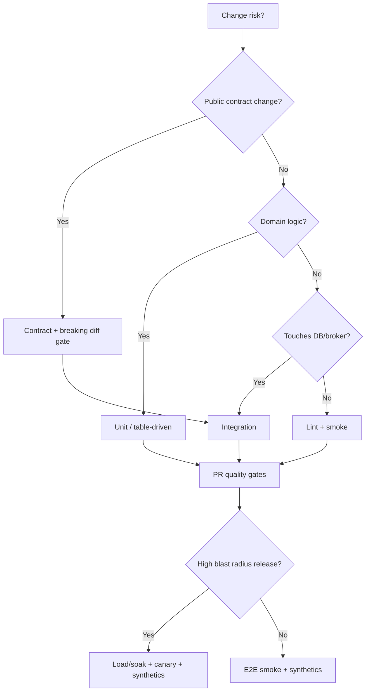

# Decision Guide

Pick test investments by risk, coupling, and release style — then avoid the usual traps.

> **Related:** Overview → [§0](00-overview.md) · Pyramid → [§1](01-test-pyramid-and-diamond.md) · Contracts → [§3](03-contract-testing-boundaries.md) · Gates → [§7](07-quality-gates.md) · CI(Continuous Integration) wiring → [cicd-and-environments](../../cicd-and-environments/README.md)

---

## Quick picker

| Situation | Invest in |
|-----------|-----------|
| Rich domain rules | Unit / aggregate tests — [ES §9](../../event-sourcing-and-cqrs/includes/09-testing-and-verification.md) if event-sourced |
| Multi-team HTTP(Hypertext Transfer Protocol)/events | Contracts — strategy [§3](03-contract-testing-boundaries.md), tooling [api §15](../../api-design-and-protection/includes/15-contract-and-schema-testing.md) |
| DB/broker wiring risk | Integration + Testcontainers — [§4](04-integration-and-e2e.md) |
| Thin UI over many backends | Diamond: integration-heavy |
| Peak traffic season | Load + soak — [§5](05-load-soak-resilience-tests.md) + [SRE capacity](../../sre-and-incidents/includes/03-capacity-and-load-testing.md) |
| Dependency outages likely | Resilience tests + [resilience-patterns](../../resilience-patterns/README.md) |
| CI trust collapsing | Flake program — [§6](06-flaky-test-management.md) |
| Escaped prod defects | Synthetics + canary — [§8](08-production-verification.md) |

---

## Master flow

---

## Portfolio checklist

- [ ] Pyramid/diamond documented for the service
- [ ] E2E journey count capped and owned
- [ ] Contract policy for external boundaries
- [ ] Flake quarantine + SLA(Service Level Agreement)
- [ ] PR vs promote gates split
- [ ] Production verification linked to rollback
- [ ] Non-func suites scheduled (not ignored)

---

## Common mistakes

| Mistake | Why it hurts | Fix |
|---------|--------------|-----|
| E2E-only strategy | Slow, flaky, late signal | Push rules down — [§1](01-test-pyramid-and-diamond.md) |
| Contracts without verify in CI | False confidence | api-design §15 gates |
| Load on health only | Miss bottlenecks | Real paths — [§5](05-load-soak-resilience-tests.md) |
| Infinite retries in CI | Masks defects | Flake policy — [§6](06-flaky-test-management.md) |
| No production verify | Silent bad deploys | Canary + synthetics — [§8](08-production-verification.md) |
| Automating everything | Noise and cost | Decline list — [§2](02-what-not-to-automate.md) |
| Copying another org’s suite counts | Wrong coupling | Decision flow above |

---

## Other guides in this repo

| Guide | Use when |
|-------|----------|
| [cicd-and-environments](../../cicd-and-environments/README.md) | Wiring gates into pipelines |
| [deployment-strategies](../../deployment-strategies/README.md) | Canary and rollback mechanics |
| [sre-and-incidents](../../sre-and-incidents/README.md) | Capacity, synthetics, error budgets |
| [resilience-patterns](../../resilience-patterns/README.md) | What failure tests should assert |
| [tech-lead-practice](../../tech-lead-practice/README.md) | Enforcing DoD and review bar |