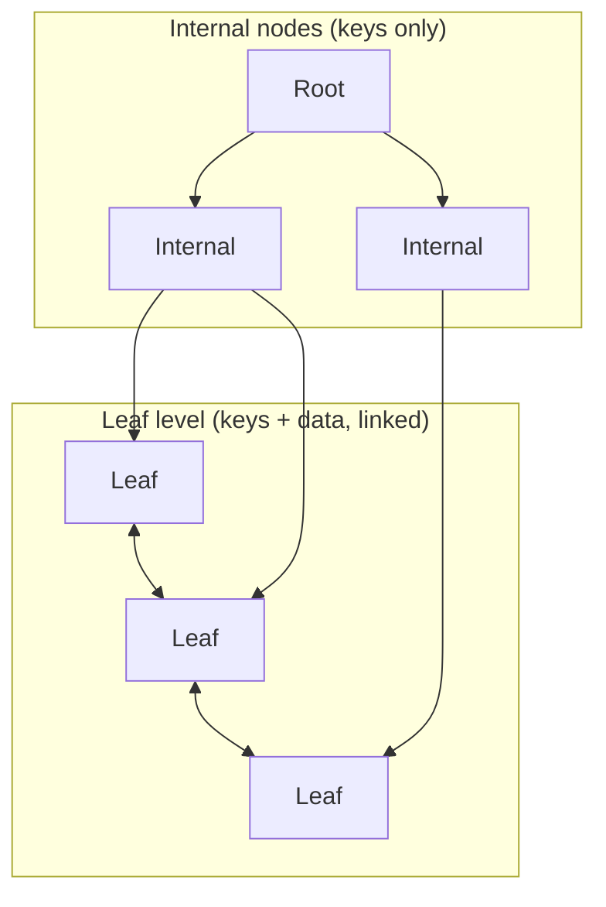
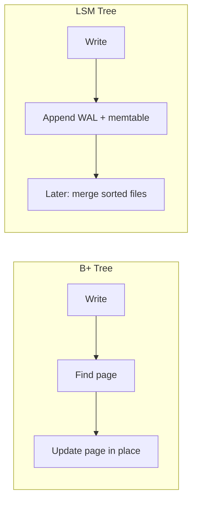
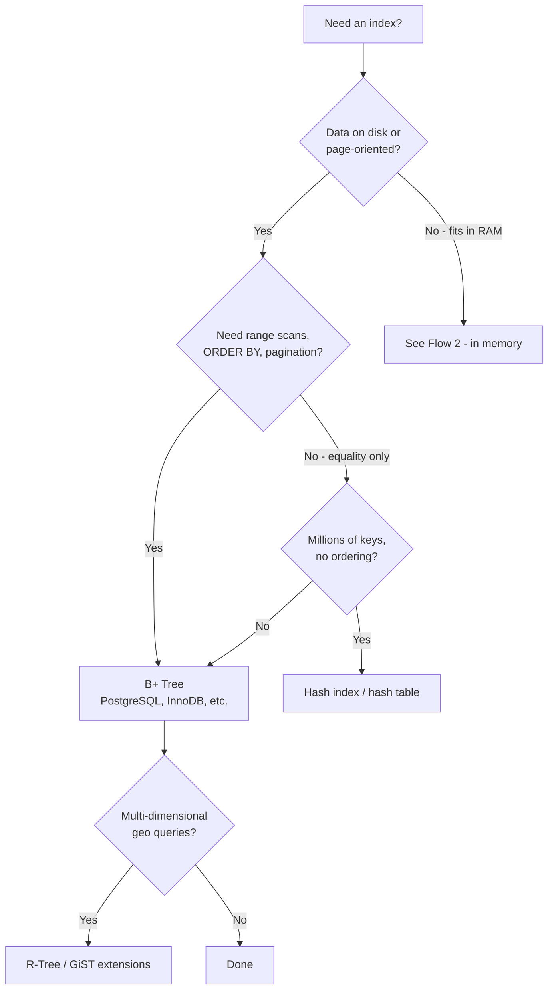
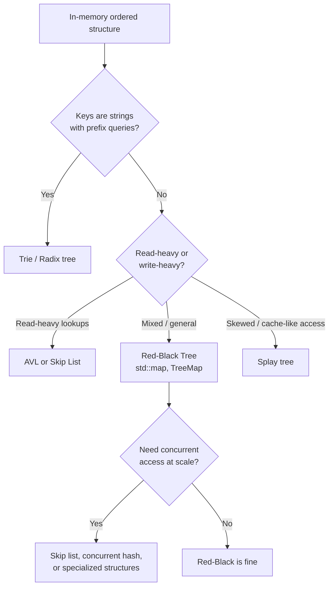
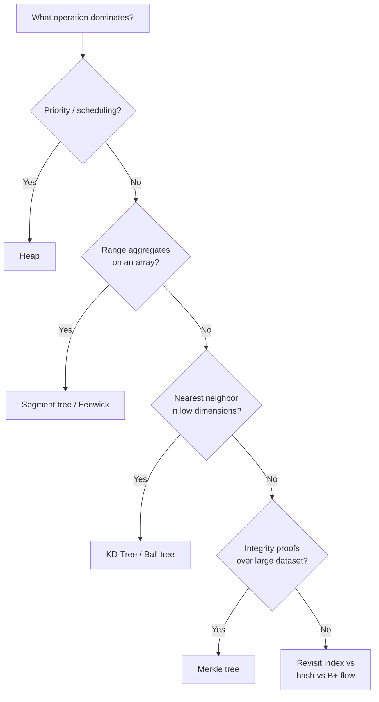
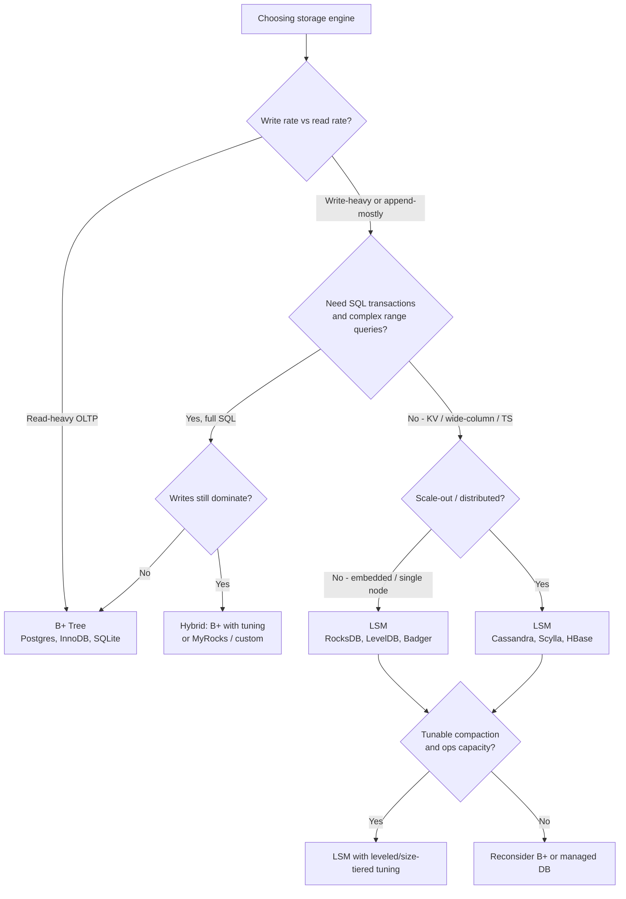
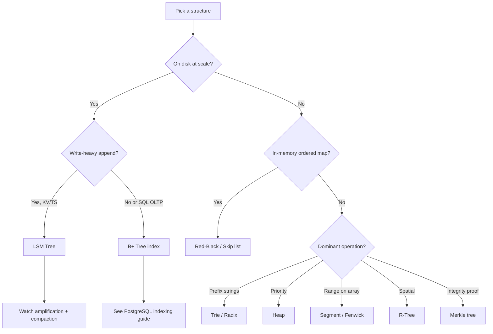

# Trees and Index Structures Guide (Full)

> Combined view of all sections. Modular sources live in `includes/`.

---

# Overview — Trees and Index Structures

Trees organize data hierarchically. The right structure depends on **access pattern**, **memory hierarchy**, **mutation rate**, and **query types** — not on which name sounds most impressive.

> **Related:**
> - PostgreSQL index types (B-tree, GIN, GiST, BRIN) → [postgresql-performance/includes/02-indexing.md](../postgresql-performance/includes/02-indexing.md)
> - Amplification, complexity, glossary → [06-amplification-and-related-topics.md](06-amplification-and-related-topics.md)

## Tree families at a glance

| Tree family | Core idea | Sweet spot |
|-------------|-----------|------------|
| **BST variants** | In-memory, pointer-heavy, O(log n) search | RAM, moderate size |
| **B-Tree / B+ Tree** | Wide nodes, few disk seeks | Databases, file systems, SSDs |
| **LSM Tree** | Append + merge sorted files | Write-heavy KV, time-series, distributed DBs |
| **Trie / Radix** | Prefix on edges | Strings, IPs, routing |
| **Heap** | Parent ≥/≤ children | Priority queues, top-K |
| **Segment / Fenwick** | Range aggregates | Range sum/min on arrays |
| **R-Tree / KD-Tree** | Spatial partitioning | Maps, nearest neighbor |

## Two big storage-engine camps

Most production storage falls into one of two designs:

| | **B+ Tree** | **LSM Tree** |
|--|-------------|--------------|
| **Write model** | Update pages in place | Append to WAL + memtable; merge later |
| **Read model** | Few page lookups | Memtable + filters + possibly many files |
| **Range scans** | Excellent (linked leaves) | Good with leveled compaction; weaker at L0 |
| **Typical home** | PostgreSQL, InnoDB, SQLite | RocksDB, Cassandra, Scylla, HBase |

## Default recommendations

| Need | Start here |
|------|------------|
| SQL index, pagination, `BETWEEN` | **B+ Tree** |
| Only `WHERE id = ?`, no sort | **Hash index** (if engine supports it) |
| In-app ordered map | **Red-Black Tree** (default) or **AVL** (lookup-critical) |
| Autocomplete / IP longest prefix | **Trie** or **Radix tree** |
| Job scheduler / event queue | **Heap** |
| Range sum on an array index | **Fenwick** or **Segment tree** |
| Points in a map rectangle | **R-Tree** |
| Closest point in 2D/3D | **KD-Tree** |
| Verify content without full download | **Merkle tree** |
| Write-heavy logs, metrics, KV at scale | **LSM Tree** |

## Document map

| # | Topic | File |
|---|-------|------|
| 1 | B-Trees and B+ Trees | [01-b-trees-and-b-plus.md](01-b-trees-and-b-plus.md) |
| 2 | In-memory balanced trees | [02-in-memory-trees.md](02-in-memory-trees.md) |
| 3 | Specialized trees | [03-specialized-trees.md](03-specialized-trees.md) |
| 4 | LSM Trees | [04-lsm-trees.md](04-lsm-trees.md) |
| 5 | Decision guides and cheat sheets | [05-decision-guides.md](05-decision-guides.md) |
| 6 | Amplification, complexity, related topics | [06-amplification-and-related-topics.md](06-amplification-and-related-topics.md) |

## Common mistakes

| Mistake | Fix |
|---------|-----|
| Pick LSM for read-heavy OLTP SQL | B+ tree (PostgreSQL, InnoDB) |
| Use B+ tree for in-app ordered map in RAM | Red-black / AVL |
| Trie for numeric primary-key lookups | B+ tree or hash |
| Ignore read/write amplification trade-offs | See [§6](06-amplification-and-related-topics.md) |
| Choose structure by name, not access pattern | Use [§5 decision guides](05-decision-guides.md) |

---

# B-Trees and B+ Trees

B-Trees (and especially **B+ Trees**) are the default index structure for on-disk and page-oriented storage. They optimize for **minimal I/O** and **ordered range access**.

> **Related:** PostgreSQL B-tree, partial, and covering indexes → [postgresql-performance/includes/02-indexing.md](../postgresql-performance/includes/02-indexing.md)

---

## B-Tree

- Each node holds **keys + child pointers** (and often values in leaf/internal nodes).
- All leaves at the same depth; nodes are **wide** (hundreds/thousands of keys) to match **page size** (4–16 KB).
- Minimum fill ~50% after splits; height stays **O(log n)** with a **large branching factor**.

## B+ Tree (what most databases use)

- **Keys only in internal nodes**; **all data in leaves**.
- Leaves linked in a **doubly linked list** → efficient range scans.
- Internal nodes are smaller (keys only) → **higher fanout**, **shallower tree**.

---

## Pros

| Advantage | Why it matters |
|-----------|----------------|
| **Minimal I/O** | One node ≈ one disk/SSD page → few seeks per lookup |
| **Predictable performance** | Rebalancing on insert/delete; no degenerate linked-list shape |
| **Range scans (B+)** | Walk leaf chain instead of re-descending the tree |
| **Cache-friendly** | Node size aligned with page/block size |

## Cons

| Disadvantage | Why it matters |
|--------------|----------------|
| **Complex implementation** | Splits, merges, rebalancing, concurrency, WAL |
| **Poor for tiny datasets in RAM** | Pointer + page overhead |
| **Not ideal for prefix search** | Use trie/radix for string prefixes |
| **Point lookups are O(log n)** | Not O(1) like a hash table |

---

## When to use

- **On-disk or page-oriented storage**: PostgreSQL, MySQL InnoDB, SQLite, MongoDB indexes.
- **Ordered data + range queries**: `WHERE id BETWEEN ...`, `ORDER BY`, pagination.
- **Secondary indexes** where sorting and scanning matter.

---

## B+ Tree vs hash index

| | B+ Tree | Hash |
|--|---------|------|
| Point lookup | O(log n) I/O | O(1) average |
| Range / ORDER BY | ✅ | ❌ |
| Prefix search | Partial (by key order) | ❌ |
| On-disk friendly | ✅ | Harder |

**Use hash** for equality-only lookups. **Use B+** when order and ranges matter.

---

## Why B+ trees dominate databases

Disks and SSDs read in **blocks/pages**, not single keys. A B+ tree with fanout 500 and height 3 can index **~125 million keys** with at most **3 random I/Os** per lookup. A binary tree would need ~27 levels for the same count — unusable on disk. Linking leaves makes **range scans** (reports, indexes on `(timestamp, id)`) cheap.

**Rule of thumb:** If one node ≈ one I/O unit → **B+ Tree**.

---

## Clustered vs secondary index

In engines like **InnoDB**, the **clustered index** leaf stores the full row; **secondary indexes** store index keys plus a pointer to the clustered key — often **two tree lookups** per read.

- Choose primary keys deliberately — they define physical order.
- Prefer **covering indexes** when a secondary index serves hot read queries.
- Avoid many wide secondary indexes on write-heavy tables.

## Common mistakes

| Mistake | Fix |
|---------|-----|
| Hash index when queries need `ORDER BY` | B+ tree for range and sort |
| B+ tree for equality-only at huge scale | Consider hash where engine supports it |
| Ignore clustered index choice (InnoDB) | Primary key defines physical order |
| Secondary index without covering columns | Extra heap lookups on hot reads |
| Wrong structure for write-heavy KV at scale | See [§4 LSM trees](04-lsm-trees.md) |

Full detail → [06-amplification-and-related-topics.md](06-amplification-and-related-topics.md#clustered-vs-secondary-index-b-tree-engines)

---

# In-Memory Balanced Trees

When data lives entirely in RAM and you need ordered maps or sets, binary tree variants — not B-Trees — are the usual choice. They optimize for **CPU cache** and **pointer navigation**, not disk pages.

> **Related:** Disk indexes → [§1 B-Trees and B+ Trees](01-b-trees-and-b-plus.md) · Decision flows → [§5 Decision guides](05-decision-guides.md)

---

## Binary Search Tree (BST)

| | |
|--|--|
| **Pros** | Simple; O(log n) average search/insert |
| **Cons** | Degenerates to O(n) on sorted input (linked-list shape) |
| **Use when** | Teaching, tiny sets, or when worst case is acceptable |

---

## AVL Tree

| | |
|--|--|
| **Pros** | Strict balance (heights differ ≤ 1); **fastest lookups** among balanced BSTs |
| **Cons** | More rotations on insert/delete than red-black |
| **Use when** | Read-heavy workloads; lookup latency matters more than write rate |

---

## Red-Black Tree

| | |
|--|--|
| **Pros** | Looser balance → **fewer rotations** on write; still O(log n). Used in `std::map`, Java `TreeMap`, Linux `rbtree` |
| **Cons** | Slightly deeper than AVL → marginally slower lookups |
| **Use when** | **General-purpose ordered map/set** with mixed read/write — default in many standard libraries |

---

## Splay Tree

| | |
|--|--|
| **Pros** | No extra balance fields; **recently accessed nodes move to root** (good for skewed access) |
| **Cons** | Amortized O(log n) but **worst single op can be O(n)**; poor for hard real-time guarantees |
| **Use when** | Caches, temporal locality, some network algorithms |

---

## Skip List

| | |
|--|--|
| **Pros** | O(log n) average search/insert; **easier concurrent updates** than rebalancing BSTs; used in LSM memtables |
| **Cons** | More memory than BST (forward pointers); randomness or deterministic levels add complexity |
| **Use when** | Concurrent ordered maps, LevelDB/RocksDB memtables, Redis sorted sets (implementation detail) |

See complexity table → [06-amplification-and-related-topics.md](06-amplification-and-related-topics.md#complexity-cheat-sheet)

---

## B+ Tree vs in-memory balanced BST

| Aspect | B-Tree / B+ | Red-Black / AVL |
|--------|-------------|-----------------|
| Node width | Many keys per node | 1–3 keys typical |
| Optimized for | **Disk pages**, sequential leaf scan | **CPU cache**, pointers |
| Height | Very shallow (fanout 100–1000) | Deeper (fanout 2) |
| Range scan | Excellent (B+ leaf chain) | In-order traversal, more cache misses |
| Implementation cost | High (storage engine) | Moderate (stdlib) |
| Typical home | DB, filesystem | Language runtime, applications |

**Rule of thumb:** Everything in RAM and you need `map`/`set` → **Red-Black or AVL**.

## Common mistakes

| Mistake | Fix |
|---------|-----|
| B+ tree for in-memory ordered map | Red-black / AVL / skip list |
| AVL when write-heavy | Red-black for fewer rotations |
| Splay tree for hard real-time | Bounded worst-case structure |
| BST without balancing | Always use balanced variant |
| Skip list when memory is tight | Red-black unless concurrency requires skip list |

---

# Specialized Trees

Not every problem is “sorted key lookup.” These structures optimize for prefixes, priorities, ranges, space, or integrity proofs.

> **Related:** B+ / LSM storage → [§1](01-b-trees-and-b-plus.md), [§4](04-lsm-trees.md) · Decision guide → [§5](05-decision-guides.md)

---

## Trie (Prefix Tree)

| | |
|--|--|
| **Pros** | O(key length) lookup; natural **prefix search**, autocomplete, longest prefix match |
| **Cons** | Memory-heavy (many nodes); poor for dense random keys unless compressed |
| **Use when** | Dictionaries, IP routing, URL/path matching, autocomplete |

---

## Radix Tree / Patricia Trie

| | |
|--|--|
| **Pros** | **Compressed trie** — fewer nodes for sparse/long keys |
| **Cons** | More complex; still key-length dependent |
| **Use when** | Linux kernel routing, memory-efficient string indexes |

---

## Heap (Binary / Binomial / Fibonacci)

| | |
|--|--|
| **Pros** | O(1) min/max; O(log n) insert/extract; simple array layout |
| **Cons** | Not a search structure — no arbitrary key lookup |
| **Use when** | Priority queues, schedulers, Dijkstra, top-K streaming |

---

## Segment Tree / Fenwick Tree (BIT)

| | |
|--|--|
| **Pros** | Range query + point/range update in O(log n) |
| **Cons** | Fixed underlying array; not a general key-value store |
| **Use when** | Range sum/min/max, competitive programming, time-series rollups |

---

## R-Tree (and variants)

| | |
|--|--|
| **Pros** | Indexes **multi-dimensional bounding boxes**; good for spatial queries |
| **Cons** | Heuristic splits; quality depends on data distribution |
| **Use when** | GIS, PostGIS, game spatial indexes, “find objects in this rectangle” |

---

## KD-Tree / Ball Tree

| | |
|--|--|
| **Pros** | Nearest-neighbor and range search in k dimensions |
| **Cons** | Degrades in high dimensions (“curse of dimensionality”) |
| **Use when** | Low-dimensional NN search, ML (small k), point clouds |

---

## Merkle Tree

| | |
|--|--|
| **Pros** | O(log n) proof that a leaf belongs to a root hash |
| **Cons** | Not for general lookup; built for integrity |
| **Use when** | Git, blockchains, distributed sync, content-addressed storage |

---

## Quick reference

| Operation dominates | Structure |
|---------------------|-----------|
| Priority / scheduling | Heap |
| Range aggregates on an array | Segment tree / Fenwick |
| Nearest neighbor (low dim) | KD-Tree / Ball tree |
| Integrity proofs | Merkle tree |
| String prefix / longest match | Trie / Radix |

## Production signals (when to pick this)

| Structure | Typical production use | Usually not in your DB layer |
|-----------|------------------------|------------------------------|
| Trie / Radix | IP routing tables, URL/path routers, autocomplete indexes | PostgreSQL default indexes |
| Heap | Job schedulers, priority queues inside workers | General row lookup |
| Segment / Fenwick | In-process range aggregates on bounded arrays | Disk-backed analytics at scale |
| KD / Ball tree | ML nearest-neighbor (Faiss, scikit pipelines) | SQL `ORDER BY distance` on millions of rows |
| R-tree | GIS (`PostGIS`), spatial indexes on maps | Plain B+ on scalar columns |
| Merkle tree | Git, blockchains, content-addressed sync proofs | Application CRUD indexes |

**Rule of thumb:** Default to **B+ (PostgreSQL)** or **LSM (Cassandra, RocksDB)** for persistence. Specialized trees appear in **libraries, gateways, or search/ML services** — see [§5 Decision guides](05-decision-guides.md).

## Common mistakes

| Mistake | Fix |
|---------|-----|
| B+ tree for autocomplete prefix search | Trie or radix tree |
| Heap when you need arbitrary key lookup | Ordered map (red-black) or hash |
| R-tree for 1D sorted keys | B+ tree |
| KD-tree in high dimensions | Different ANN approach or dimension reduction |
| Merkle tree for general indexing | Use for integrity proofs only |

---

# LSM Trees (Log-Structured Merge Trees)

LSM trees are the main alternative to **B+ trees** for **write-heavy, append-friendly** storage. They trade **write amplification and read complexity** for **fast sequential writes** and high **ingest throughput**.

> **Related:** Read/write/space amplification → [06-amplification-and-related-topics.md](06-amplification-and-related-topics.md#amplification-framework-b-vs-lsm)

---

## What an LSM tree is

An LSM tree is not one tree in memory — it is a **tiered system**:

1. **Write-ahead log (WAL)** — durability before the write is accepted
2. **Memtable** — in-memory sorted structure (often a **skip list** or red-black tree)
3. **Immutable SSTables** — sorted **S**orted **S**tring **Table** files on disk, organized in **levels**
4. **Compaction** — background merge of SSTables to limit file count and reclaim space

### Write path

### Read path

Check memtable → older memtables → L0 SSTables → deeper levels. **Bloom filters** and **sparse indexes** skip files that cannot contain the key.

---

## Core components

| Component | Role |
|-----------|------|
| **Memtable** | Absorbs writes in RAM; sorted for flush |
| **WAL** | Crash recovery if memtable not yet flushed |
| **SSTable** | Immutable on-disk sorted runs; no in-place updates |
| **Bloom filter** | “Key probably not in this file” → skip I/O |
| **Compaction** | Merge overlapping files; drop deleted/tombstoned keys |

---

## Updates and deletes

LSM stores are **append-only**:

- **Update** = new entry with same key (newer wins by sequence/timestamp)
- **Delete** = **tombstone** marker; removed during compaction when older versions merge away

No random disk writes to change a page — the main win vs B+ trees.

---

## Compaction strategies

| Strategy | Idea | Tradeoff |
|----------|------|----------|
| **Size-tiered (STCS)** | Merge similar-sized files | Write-friendly; more read amplification |
| **Leveled (LCS)** | Non-overlapping key ranges per level | Better reads; more write amplification |
| **Universal / hybrid** | Mix of both | Tunable (RocksDB, Cassandra options) |

---

## Pros

| Advantage | Why |
|-----------|-----|
| **Fast writes** | Sequential WAL + memtable; flush is sequential I/O |
| **High ingest** | Logs, metrics, time-series, event streams |
| **SSD-friendly** | Large sequential writes; less random in-place mutation |
| **Natural versioning** | Same key, multiple versions (MVCC-style stores) |
| **Horizontal scale** | Immutable SSTables replicate and ship cleanly |

## Cons

| Disadvantage | Why |
|--------------|-----|
| **Read amplification** | May check memtable + many SSTables + Bloom false positives |
| **Write amplification** | Compaction rewrites data multiple times |
| **Space amplification** | Overlapping L0 files, tombstones, duplicates until compaction |
| **Compaction stalls** | Heavy compaction → latency spikes if not tuned |
| **Delayed space reclaim** | Deletes visible only after compaction |
| **Range scan cost** | Worse than B+ leaf chain unless leveled + well compacted |
| **Operational tuning** | Memtable size, level ratios, compaction threads matter |

---

## LSM vs B+ Tree

| Dimension | B+ Tree (InnoDB, Postgres) | LSM Tree (RocksDB, Cassandra) |
|-----------|----------------------------|--------------------------------|
| **Random write** | Updates pages in place → random I/O | Append → sequential |
| **Point read** | O(log n) pages, predictable | Memtable + filters + maybe many files |
| **Range scan** | Strong (linked leaves) | OK with leveled compaction; weaker at L0 |
| **Write throughput** | Moderate | Very high |
| **Read latency (steady)** | Usually lower, stable | Can spike (compaction, L0 overlap) |
| **Space after delete** | Faster reclaim (VACUUM, etc.) | Delayed until compaction |
| **Transactions / SQL** | Native fit | Often KV or wide-column layer on top |
| **Flash wear** | More random writes | More total bytes written (amplification) |

---

## When to use LSM

**Good fits:**

- **Write-heavy workloads** — IoT, metrics, logs, clickstreams
- **Key-value / wide-column at scale** — Cassandra, Scylla, HBase
- **Embedded engines** — RocksDB, LevelDB (MyRocks, Kafka Streams state, etc.)
- **Time-series** — append + TTL + compaction (often with time partitioning)
- **Cloud/distributed** — immutable SSTables replicate cleanly

**Poor fits:**

- **Read-heavy, latency-sensitive** point + range with few writes — B+ often wins
- **Heavy UPDATE same row** — versions/tombstones increase amplification
- **Immediate delete + space reclaim** — needs compaction policy + monitoring
- **Full SQL with ad-hoc range joins** — B+ tree engines remain the default

---

## Where you see LSM in the wild

| System | Role |
|--------|------|
| **RocksDB** | Library; leveled/universal compaction |
| **LevelDB** | Google's original embedded LSM |
| **Cassandra / Scylla** | SSTables + compaction (STCS/LCS) |
| **HBase** | SSTables on HDFS |
| **Badger** | Go KV (LSM + value log) |
| **MyRocks** | MySQL on RocksDB instead of InnoDB |

B+ tree systems: **PostgreSQL**, **MySQL InnoDB**, **SQLite**, most traditional RDBMS indexes.

---

## Mental model: B+ vs LSM

- **B+ tree:** optimize **read + ordered scan** with minimal layers
- **LSM:** optimize **write throughput** by **batching sort + merge** in the background

---

## Tuning levers

- Memtable size and count
- Compaction strategy (leveled vs size-tiered)
- Bloom filter bits per key
- Block cache and OS page cache
- Time partitioning for TTL (drop whole SSTables)
- Rate limits on compaction to avoid latency spikes

## Common mistakes

| Mistake | Fix |
|---------|-----|
| LSM for read-heavy OLTP with range queries | B+ tree engine (PostgreSQL, InnoDB) |
| Ignore compaction stall alerts | Tune threads; rate-limit compaction |
| Tiny memtable on write-heavy ingest | Increase memtable size; monitor L0 |
| Deletes expected to free space immediately | Plan compaction + tombstone policy |
| Single-node RocksDB without backup plan | Snapshot + replication strategy |

---

# Decision Guides and Cheat Sheets

Practical flows for choosing tree and index structures by workload.

> **Related:** Amplification & complexity → [§6](06-amplification-and-related-topics.md) · PostgreSQL indexes → [postgresql-performance §2](../postgresql-performance/includes/02-indexing.md) · Write-heavy workloads → [§4 LSM](04-lsm-trees.md)

---

## Scenario cheat sheet

| Scenario | Recommended structure |
|----------|----------------------|
| SQL index, pagination, `BETWEEN` | B+ Tree |
| Only `WHERE id = ?`, no sort | Hash index / hash table |
| In-app ordered map | Red-Black Tree (default) or AVL (lookup-critical) |
| Autocomplete / IP longest prefix | Trie or Radix tree |
| Job scheduler / event queue | Heap |
| Sum of values in index `[L..R]` | Fenwick or Segment tree |
| Points in a map rectangle | R-Tree |
| Closest point in 2D/3D | KD-Tree |
| Verify file/block without full download | Merkle tree |
| Filesystem directory metadata | B-Tree variants (ext4, NTFS) |
| Write-heavy logs, metrics, KV at scale | LSM Tree |
| Read-heavy OLTP with complex queries | B+ Tree |

---

## Flow 1 — Storage layer (disk / database index)

---

## Flow 2 — In-memory ordered map

---

## Flow 3 — Query type (specialized structures)

---

## Flow 4 — LSM vs B+ Tree (storage engine)

---

## Master comparison — storage indexes

| Dimension | B+ Tree | LSM Tree | Hash |
|-----------|---------|----------|------|
| Point lookup | O(log n) I/O | Memtable + files | O(1) avg |
| Range scan | Excellent | Good (leveled) | None |
| Write throughput | Moderate | Very high | High (in memory) |
| Read predictability | High | Can vary | High (avg) |
| On-disk fit | Native | Native | Harder |
| SQL OLTP default | ✅ | Rarely primary | Equality only |

---

## Rule-of-thumb summary

1. **One node ≈ one I/O unit** → B+ Tree
2. **Everything in RAM, need ordered map** → Red-Black or AVL
3. **Append-mostly, write-heavy, KV/TS at scale** → LSM Tree
4. **Equality only, no ordering** → Hash
5. **Prefix on strings** → Trie / Radix
6. **Spatial bounding boxes** → R-Tree
7. **Min/max or scheduling** → Heap

## Common mistakes

| Mistake | Fix |
|---------|-----|
| LSM for small read-heavy SQL app | B+ tree (default RDBMS) |
| B+ tree for append-only metrics at scale | LSM (RocksDB, Cassandra) |
| Red-black tree persisted to disk as primary index | B+ tree storage engine |
| Hash index when `ORDER BY` required | B+ tree |
| Skip decision guide and pick trendy engine | Match structure to access pattern |

---

## See also

- Common mistakes and when NOT to use → [06-amplification-and-related-topics.md](06-amplification-and-related-topics.md)
- PostgreSQL-specific index types → [postgresql-performance/includes/02-indexing.md](../postgresql-performance/includes/02-indexing.md)

---

# Amplification, Complexity, and Related Topics

Storage-engine metrics, clustered indexes, complexity reference, common mistakes, and links to deeper guides elsewhere in this repo.

> **Related:**
> - PostgreSQL index types and when to use each → [postgresql-performance/includes/02-indexing.md](../postgresql-performance/includes/02-indexing.md)
> - PostgreSQL decision guide → [postgresql-performance/includes/13-decision-guide-and-common-mistakes.md](../postgresql-performance/includes/13-decision-guide-and-common-mistakes.md)
> - Database access and credentials → [database-connection-and-security/GUIDE.md](../database-connection-and-security/GUIDE.md)

---

## Amplification framework (B+ vs LSM)

Storage engineers compare engines with three metrics. Lower is better for each — but you rarely get all three low at once.

| Metric | What it means | B+ Tree | LSM Tree |
|--------|---------------|---------|----------|
| **Read amplification** | Bytes (or I/Os) read per logical read | Low — ~tree height page reads | Higher — memtable + multiple SSTables + Bloom false positives |
| **Write amplification** | Bytes written to disk per logical write | Moderate — page splits, WAL | High — compaction rewrites data repeatedly |
| **Space amplification** | Extra disk vs logical data size | Moderate — page fill, bloat until VACUUM | Higher until compaction — tombstones, L0 overlap, old versions |

**Takeaway:** B+ trees optimize **steady reads and range scans**. LSM trees optimize **write ingest** and accept higher read/write/space amplification unless compaction is tuned.

See also → [04-lsm-trees.md](04-lsm-trees.md) (LSM pros/cons), [01-b-trees-and-b-plus.md](01-b-trees-and-b-plus.md) (B+ on disk).

---

## Clustered vs secondary index (B+ tree engines)

In **InnoDB**, **SQL Server clustered index**, and similar engines:

| Type | Leaf contains | Lookup cost |
|------|---------------|-------------|
| **Clustered index** | Full row data (table sorted by PK) | One B+ tree descent |
| **Secondary index** | Index key + pointer to clustered key | Two descents — index tree, then clustered tree |

**Implications:**

- Primary key choice matters — it is the physical row order.
- Wide secondary indexes on write-heavy tables multiply B+ write cost.
- Covering indexes (index-only scans) avoid the second lookup when all columns are in the index — see [PostgreSQL covering indexes](../postgresql-performance/includes/02-indexing.md).

---

## Complexity cheat sheet

| Structure | Search | Insert | Delete | Range scan |
|-----------|--------|--------|--------|------------|
| **B+ Tree** (disk) | O(log n) I/O | O(log n) I/O | O(log n) I/O | Excellent (leaf chain) |
| **LSM Tree** | O(log n) + files | O(1) amortized append | Tombstone + compaction | Good (leveled) |
| **Hash index** | O(1) avg | O(1) avg | O(1) avg | None |
| **Red-Black / AVL** | O(log n) | O(log n) | O(log n) | In-order O(n) |
| **Skip list** | O(log n) avg | O(log n) avg | O(log n) avg | Sorted iteration O(n) |
| **Trie / Radix** | O(key length) | O(key length) | O(key length) | Prefix O(prefix + matches) |
| **Heap** | — (not keyed) | O(log n) | O(log n) | Not ordered by key |
| **Segment / Fenwick** | Range O(log n) | Point O(log n) | Point O(log n) | By design |

---

## When NOT to use

| Structure | Skip when |
|-----------|-----------|
| **B+ Tree index** | Table is tiny (seq scan wins); equality-only with no sort (hash may win); write-heavy with many redundant indexes |
| **Hash index** | You need `ORDER BY`, `BETWEEN`, or prefix search |
| **LSM engine** | Read-heavy OLTP with complex SQL; heavy in-place UPDATE on same keys; you cannot tune compaction |
| **Trie** | Keys are dense random strings (UUIDs) with no prefix locality — use hash or B+ |
| **Red-Black / AVL in app** | Data is on disk at scale — use the DB’s B+ index instead of loading into memory |
| **R-Tree alone** | High-dimensional vectors (k > ~10) — consider specialized ANN indexes |
| **Segment tree** | You need a general mutable key-value store — wrong tool |

---

## Common mistakes

| Mistake | Why it fails | Do instead |
|--------------|--------------|------------|
| Hash index when queries need `ORDER BY` | Hash has no ordering | B+ tree (or sort in app with small sets) |
| LSM for read-heavy OLTP without compaction tuning | Read amplification, latency spikes | Default B+ RDBMS; or leveled LSM + monitoring |
| Trie for random UUID keys | Huge node count, no prefix benefit | B+ or hash on UUID |
| B+ mental model for in-RAM `std::map` | Optimizes pages, not cache lines | Red-Black / AVL / skip list in process |
| Too many secondary indexes on hot write path | Every INSERT/UPDATE touches each index | Index only proven query patterns; partial indexes — [PostgreSQL indexing](../postgresql-performance/includes/02-indexing.md) |
| Choosing LSM for “fast deletes” | Space not reclaimed until compaction | Plan TTL + compaction; or B+ with routine maintenance |
| Using heap for keyed lookup | Heaps are not search trees | Map/set or DB index |
| GiST/R-Tree for non-spatial JSON | Wrong index family | GIN for JSONB — [PostgreSQL indexing](../postgresql-performance/includes/02-indexing.md) |
| Ignoring clustered vs secondary cost | Hidden double lookup on wide secondaries | Covering index, narrower secondary keys, or PK redesign |

---

## PostgreSQL index type map (tree-adjacent)

PostgreSQL uses several index access methods. Not all are B-trees:

| PG type | Underlying idea | When to use |
|---------|-----------------|-------------|
| **B-tree** (default) | B+ style | Equality, ranges, sort, most FKs |
| **Hash** | Hash table | Equality only; rare in practice |
| **GIN** | Inverted index | JSONB `@>`, full-text, arrays |
| **GiST / SP-GiST** | Generalized search trees | PostGIS, ranges, NN |
| **BRIN** | Block range summaries | Very large, naturally ordered columns |

Full detail → [postgresql-performance/includes/02-indexing.md](../postgresql-performance/includes/02-indexing.md)

---

## Priority checklist

If you only remember five things:

1. **On disk, ordered access** → B+ tree (or engine default B-tree index)
2. **Equality only, no sort** → hash (if supported)
3. **Write-heavy append / KV at scale** → LSM — but plan compaction
4. **In RAM ordered map** → Red-Black (default) or skip list (concurrency)
5. **Measure before adding indexes** → [PostgreSQL measurement](../postgresql-performance/includes/01-measurement.md)

---

## Glossary

| Term | Meaning |
|------|---------|
| **Fanout** | Number of children or keys per node; higher → shallower tree |
| **SSTable** | Immutable sorted file on disk (LSM) |
| **Memtable** | In-memory write buffer flushed to SSTables |
| **Tombstone** | Delete marker in LSM; removed at compaction |
| **Compaction** | Background merge of LSM SSTables |
| **Read / write / space amplification** | Extra I/O or disk vs logical operation size |
| **Clustered index** | Index whose leaves store full row data |
| **Covering index** | Index containing all columns a query needs (index-only scan) |
| **Bloom filter** | Probabilistic “definitely not in file” shortcut (LSM reads) |

---

## Master decision overview

---

---

## See also

| Guide | Topics |
|-------|--------|
| [postgresql-performance](../postgresql-performance/README.md) | B-tree, GIN, partial, and covering indexes in practice |
| [high-throughput-systems](../high-throughput-systems/README.md) | Database throughput layer, when to consider LSM engines |
| [api-design-and-protection](../api-design-and-protection/README.md) | API caching and read-path design |
| [event-sourcing-and-cqrs](../event-sourcing-and-cqrs/README.md) | Event store and append-heavy write paths |
| [database-connection-and-security](../database-connection-and-security/README.md) | Connection security is independent of index choice |
| [api-rate-limiting](../api-rate-limiting/README.md) | Overload protection when storage read path saturates |
| [deployment-strategies](../deployment-strategies/README.md) | Deploy when changing index strategy at scale |
